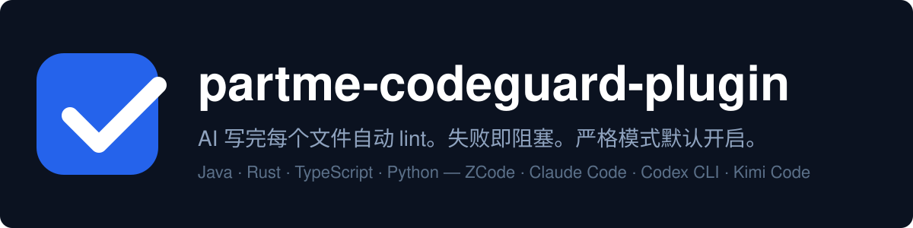

# partme-codeguard-plugin 插件

> 结构对齐：`README.md` 与 `README.zh-CN.md` 必须保持结构一致（标题层级、本地链接、版本串）——由 `tests/test_readme_parity.py` 门禁守护；结构性修改须同 commit 镜像到两份文件。

<p align="center">
  
</p>

<p align="center">
  <strong>AI 写完每个文件自动 lint。失败即阻塞。严格模式默认开启。</strong><br>
  面向 AI 编程助手的跨语言代码规范强制门禁：Java / Rust / TypeScript / Python。
</p>

<p align="center">
  <a href="README.md">English</a> ·
  <a href="README.zh-CN.md">简体中文</a> ·
  <a href="docs/partme-codeguard-plugin-Architecture.zh_CN.md">架构文档</a> ·
  <a href="docs/technical-roadmap.zh_CN.md">技术方案</a>
</p>

---

## 定位

`partme-codeguard-plugin` 让 AI 编程助手（ZCode、Claude Code、Codex CLI、Kimi Code）**第一次写出的代码就能通过 linter**。传统模式下你只能在 commit 时才发现 AI 漏写了 Javadoc 标签或者用了 `unwrap()`；本插件在 AI 写完文件的那一刻就跑对应 linter，**不通过则阻塞 AI 继续**。

它不是生产力插件，是**约束型插件**——它自己不产代码，而是对 AI 产出的代码执行规范。

### 适合谁

- **Java 后端工程师**：AI 写 Java 但漏 Javadoc 标签。
- **Rust 团队**：`cargo clippy` 不容商量，但 AI 习惯用 `unwrap()`。
- **TS / 前端团队**：受够了 AI 写 `any` 类型和未使用的 import。
- **Python 团队**：希望 AI 写出的代码也守 `ruff` 规范。
- **Tech Lead**：希望在 AI「思考模式」内就给反馈，而不是 PR review 时才发现。

### 解决什么问题

| 问题 | 本插件提供 | 可验证入口 |
|---|---|---|
| AI 漏 Javadoc，`mvn install` 时才报 | PostToolUse 钩子在每个 `.java` 写完自动跑 `mvn javadoc:jar` | `hooks/post_tool_lint.py`，[架构文档 §3.2](docs/partme-codeguard-plugin-Architecture.zh_CN.md) |
| AI 在 Rust 业务代码用 `unwrap()` | `cargo clippy -- -D warnings` 跑每个 `.rs` 文件 | [架构文档 §2.1](docs/partme-codeguard-plugin-Architecture.zh_CN.md) |
| AI 写 `any` 和未用变量 | `eslint --max-warnings 0` 阻塞 AI | `linters/eslint/recommended.cjs` |
| 每次会话都要手工问「过 lint 了吗？」 | Stop 钩子自动总结本会话 lint 通过/失败次数 | `hooks/stop_summary.py` |
| pre-commit / CI 发现时 AI 已切走，修复率 <30% | **三层防御**：钩子（<2s）→ pre-commit（30s）→ CI（5min） | [技术方案 §1](docs/technical-roadmap.zh_CN.md) |

## 一览

```text
AI 写文件
   │
   ▼
┌──────────────────────────────────────────────────────────┐
│ partme-codeguard-plugin                                    │
│  ① detect  检测项目语言（java / rust / ts / python）     │
│  ② lint    对文件跑对应原生 linter                       │
│  ③ auto-fix spotless / cargo fmt / eslint --fix / ruff    │
│  ④ block   仍失败则退出码 2（严格模式默认开启）          │
│  ⑤ summary 会话结束总结本轮 lint 通过/失败次数           │
└──────────────────────────────────────────────────────────┘
   │
   ▼
AI 一次写出就过 lint 的代码
```

| 属性 | 值 |
|---|---|
| 插件 ID | `partme-codeguard-plugin` |
| 宿主 | ZCode、Claude Code、Codex CLI、Kimi Code |
| 当前版本 | `0.8.0` |
| ZCode manifest | `.zcode-plugin/plugin.json` |
| Codex manifest | `.codex-plugin/plugin.json` |
| MCP 服务 | 已发布：官方 SDK stdio 服务（`check_code_style` / `auto_fix` / `list_languages`）；见快速开始 |
| 主要语言 | Python 3.10+（钩子）、YAML/JSON（配置） |
| 协议 | Apache-2.0 |

## 支持的语言

**53 种语言 Stable（默认强制）+ 4 种 Planned（依赖平台内置诊断）**——同类代码治理插件中最广的覆盖面。每种注册语言都有独立 SKILL；完整逐语言表格见 [docs/LANGUAGES.md](docs/LANGUAGES.md)。

| 状态 | 语言 |
|---|---|
| **Stable**（53 种，默认强制） | Java、Rust、TypeScript/JavaScript、Python、Go、C#、Kotlin、Swift、PHP、Ruby、Scala、Shell、Dockerfile、YAML、Elixir、CSS/SCSS、Markdown、SQL、TOML、HTML、Protobuf、Terraform/OpenTofu、Nix、Dart、Solidity、Ansible、Perl、Groovy、Clojure、PowerShell、Zig、Nim、Crystal、Julia（仅格式化）、Pascal（仅格式化）、Elm、Lua、Luau、C++（clang-tidy）、Objective-C、CUDA、GraphQL、VB.NET、Erlang、R、CFML 等，详见 LANGUAGES.md |

> **Markdown / YAML 接入语义**：二者声明了 `requiresConfig`——项目根没有对应 linter 配置
> （如 `.markdownlint-cli2.jsonc` / `.yamllint`）时视为**未接入**，安全跳过、不阻塞提交，
> 不会被工具默认规则全仓报错。Markdown 门禁为 advisory（告警进 skipped，不拦截）；
> 此前其 lint 命令缺 glob、恒以用法错误退出，现已返回真实结论。`codeguard init` 会拷入宽松配置模板。
| **Planned**（4 种，无独立 CLI linter） | Metal、ArkTS（HarmonyOS）、COBOL、Liquid（theme-check 待接通） |

## 治理技能（Git 与安全）

### 外部技能来源

68 个可复用技能统一在 [full-stack-skills/codeguard-skills](https://github.com/full-stack-skills/codeguard-skills) 编写，插件不再维护一份独立手写副本。为保证插件安装后离线可用，本仓库 vendor 了完整的 `v0.1.2` 快照：

- `skills.lock.json` 固定上游仓库、不可变 tag、解析后的 commit、受管技能清单与逐技能 SHA-256。
- `python3 scripts/vendor/skill_vendor.py update` 只刷新 lock 中列出的技能。
- `python3 scripts/vendor/skill_vendor.py check --offline` 校验插件内快照；去掉 `--offline` 还会校验上游 ref 与内容。
- 不得直接修改 lock 管理的技能目录。应先在 `codeguard-skills` 修改并发布，再更新 lock ref 并执行 vendor update。
- 只有插件内部定制技能可以直接保留在 `skills/`，且必须明确不列入 `skills.lock.json`、显式登记到 `plugin-local-skills.json`；vendor 会保留已声明目录并拒绝未声明例外。

Hooks、linters、commands、MCP 接线和可执行脚本仍由插件仓负责。作者编写规范见 [docs/CODEGUARD_SKILLS_SPEC.md](docs/CODEGUARD_SKILLS_SPEC.md)。

## 能力与边界

### 已支持

| 能力 | 输入 | 输出 | 限制 | 状态 |
|---|---|---|---|---|
| 按文件检测语言 | 钩子 payload 中的 file_path | 语言字符串（`java`/`rust`/`typescript`/`python`） | — | Stable |
| 语言专属 lint | `mvn javadoc:jar` / `cargo clippy` / `npx eslint` / `ruff check` | 退出码 + stderr | 超时可配置（默认 120s） | Stable |
| 自动修复失败 | `mvn spotless:apply` / `cargo fmt` / `eslint --fix` / `ruff --fix` | 重跑 lint | 尽力修复，不改业务代码 | Stable |
| commit/push 门禁 | 用户 prompt 含 "commit" / "push" / "deploy" 关键词 | 全量 lint + 退出码 2（失败时） | — | Stable |
| 一行项目接入 | `/init` slash 命令 | 拷贝 linter 配置 + `.pre-commit-config.yaml` + AGENTS.md 片段 | — | Stable |
| 会话结束总结 | Stop 钩子 | 表格化 lint 通过/失败/自动修复次数 | — | Stable |

### 三层防御

本插件**不**取代 pre-commit 和 CI——它在它们前面加一个**更快**的层。

| 层 | 延迟 | 强制力 | 作用 |
|---|---|---|---|
| **PostToolUse 钩子（本插件）** | <2s | 阻塞 AI 继续 | AI 还在「立刻修」的模式时就抓住错误 |
| pre-commit | 30s | 阻塞 git commit | 用户准备提交时再次拦截 |
| CI | 分钟级 | 阻塞 PR merge | 最后兜底 |

PostToolUse 是 **最高 ROI** 的层，因为 AI 在它「还在乎这个问题」时收到反馈。

### 不做的事

- **不执行**你的代码。本插件只 lint，不运行。
- **不生产**代码。本插件强制 AI 产出的代码遵守规范。
- **不取代** code review。linter 抓机械错误，code review 抓设计错误。
- **不接**云端 linter 服务。本插件**严格客户端运行**（见 [PRIVACY.md](./PRIVACY.md)）。
- **尚未启用 linter 的语言**（Planned 层，见上文——文件可被识别，但钩子会安全跳过）。

## 快速开始

### CLI（codeguard）

`bin/codeguard` 是 bash 分发器：每个子命令（`check` / `fix` / `cve` / `dockerfile` / `detect`）都路由到对应的 `scripts/*.py` 实现。

```bash
# 安装 CLI（可选）：放到 PATH 后任意目录直接用
ln -s $PWD/bin/codeguard /usr/local/bin/codeguard

codeguard check                     # 跑多语言 lint 门禁
codeguard fix                       # 自动修复 lint 问题
codeguard cve                       # CVE 依赖漏洞扫描（Maven/npm/Python/Rust + universal trivy 兜底）
codeguard cve --fix                 # 扫描并自动修复（npm audit fix）
codeguard cve --severity MEDIUM     # 「该级别及以上」：MEDIUM/HIGH/CRITICAL 都算失败
codeguard cve --ecosystem java      # maven 的别名；未声明生态在任何扫描前退出码 3 拒绝
codeguard detect                    # 检测项目语言
```

CVE 退出码：`0` 通过 / `1` 无法验证（工具缺失或无可扫描生态） / `2` 存在漏洞 / `3` 参数错误。
未被原生扫描器覆盖的语言自动落 `trivy fs --scanners vuln` 通用兜底；原生工具缺失时保持「无法验证」，不用兜底顶替。`--severity` 在所有扫描器上都是「阈值及以上」（maven 按 CVSS 档位下界换算：HIGH⇒7）。

Maven 项目 CVE 扫描使用 OWASP dependency-check（pom 配置模板见
`linters/maven/dependency-check-pom-snippet.xml`；`CVSS>=7 构建失败`）。
**检查出来了得修**：报告会附带每个生态的修复命令（升级依赖 / 登记误报），npm 支持 `audit fix` 自动修复。

### 作为用户

```bash
# 第一步：安装（按你用的平台选其一）
ln -s $PWD ~/.zcode/plugins/partme-codeguard-plugin
ln -s $PWD ~/.codex/plugins/partme-codeguard-plugin
ln -s $PWD ~/.kimi/plugins/partme-codeguard-plugin

# 第二步：在任何项目里对 AI 说：
/init    # 拷贝 linter 配置 + .pre-commit + AGENTS.md
/check   # 跑全量 lint + 报告
/fix     # 自动修复
```

### 作为 AI

插件激活后，**你不需要**任何手动操作：

- 你写的每个文件会被立刻 lint
- lint 失败且无法自动修复时，你会看到错误，**必须修复才能继续**
- 用户说「commit」时，你会受到「所有 linter 必须通过」的最后门禁
- 会话结束时会看到本会话 lint 通过/失败的总结

### MCP 服务器

`run_check.py --mcp` 启动 stdio MCP 服务（官方 `mcp` SDK；先用
`pip install -r requirements.txt` 安装依赖），暴露三个工具：

| 工具 | 用途 |
|---|---|
| `check_code_style` | 跑 lint，返回逐语言信封与 `stderr_path`、`log_path` |
| `auto_fix` | 先跑 formatter 链再复检 lint（嵌入 check 信封） |
| `list_languages` | 列出语言 id 与显示名（不含内部命令） |

```bash
python3 scripts/run_check.py --mcp .
```

失败时完整输出落盘到 `<项目根>/out/.codeguard-last.log`（与工具信封及 CLI
摘要行里的路径一致；`--quiet` 可关闭）。

## 配置

`~/.zcode/settings.local.yaml`（ZCode）或各平台对应文件：

```yaml
codeguard:
  enabled_languages: auto      # 或 [java, rust, typescript, python]
  strict_mode: true            # PostToolUse 失败时退出码 2（阻塞 AI）
  auto_fix_on_save: true       # 先试 spotless/cargo fmt/eslint --fix/ruff --fix
  lint_timeout_seconds: 120
```

| 键 | 默认 | 作用 |
|---|---|---|
| `enabled_languages` | `auto`（自动检测） | 限定只跑哪些语言的 linter |
| `strict_mode` | `true` | lint 失败时是否阻塞 AI |
| `auto_fix_on_save` | `true` | 是否在报错前先尝试自动修复 |
| `lint_timeout_seconds` | `120` | 每次 linter 调用的超时秒数 |

## 仓库结构

```
partme-codeguard-plugin/
├── .zcode-plugin/plugin.json     # ZCode manifest（主）
├── .codex-plugin/plugin.json    # Codex CLI manifest
├── hooks/
│   ├── hooks.json                # 4 类钩子定义
│   ├── env_check.py              # SessionStart：检测语言 + 注入规则
│   ├── post_tool_lint.py         # PostToolUse：核心强制钩子
│   ├── user_prompt_validator.py  # UserPromptSubmit：commit 门禁
│   └── stop_summary.py           # Stop：会话总结
├── scripts/
│   ├── detect_lang.py            # 语言检测 + linter 命令表（共享）
│   ├── run_check.py              # 主 CLI：检测 + 跑全量 + 报告
│   ├── fix.py                    # 自动修复 CLI
│   └── vendor/skill_vendor.py    # lock 驱动的外部技能 vendor/check
├── skills.lock.json              # 上游 tag/commit + 受管技能 + SHA-256
├── plugin-local-skills.json      # 插件专属技能显式例外清单（当前为空）
├── skills/                       # 从 codeguard-skills v0.1.2 vendor 的 68 个技能
│   ├── codeguard/                # 主入口
│   ├── codeguard-init/           # 一行接入
│   ├── codeguard-{java,rust,typescript,python}/
│   ├── codeguard-{go,csharp,kotlin,swift,php,ruby,scala}/   # V0.2 语言
│   ├── codeguard-git-{branch,commit}/                      # 分支与提交规范
│   └── codeguard-security-{code,api,data}/                 # 安全规范
├── commands/                     # 3 个斜杠命令（/check /fix /init）
│   ├── check.json
│   ├── fix.json
│   └── init.json
├── bin/codeguard                 # CLI 入口（check / fix / cve / detect / init）
├── linters/                      # 各语言配置模板（拷贝即用）
│   ├── checkstyle/               # 阿里 P3C + 强制 javadoc
│   ├── clippy/                   # deny warnings + 禁 unwrap/expect/panic
│   ├── eslint/                   # recommended + TS 规则
│   ├── ruff/                     # [tool.ruff] 块
│   ├── maven/                     # OWASP dependency-check pom 片段
│   └── git/                        # commit-msg 门禁脚本
│   └── pre-commit/               # .pre-commit-config.template.yaml
├── docs/
│   ├── partme-codeguard-plugin-Architecture.zh_CN.md
│   └── technical-roadmap.zh_CN.md
├── README.md                     # 本文件（英文）
├── README.zh-CN.md               # 本文件（中文）
├── LICENSE                       # Apache-2.0
├── PRIVACY.md                    # 零数据收集承诺
└── TERMS.md
```

## 三端兼容性

| 平台 | 插件 manifest | 安装路径 | 状态 |
|---|---|---|---|
| **ZCode** | `.zcode-plugin/plugin.json` | `~/.zcode/cli/plugins/cache/<marketplace>/codeguard/<version>/` | ✅ V0.5.4 已验证 |
| **Codex CLI** | `.codex-plugin/plugin.json` | `~/.codex/plugins/cache/<marketplace>/codeguard/<version>/` | ✅ V0.5.4 已验证 |
| **Claude Code** | （复用 Codex manifest，经 marketplace 安装） | `~/.claude/plugins/partme-codeguard-plugin/` | 🔧 V0.2 |
| **Kimi Code** | `kimi.plugin.json` | `~/.kimi-code/plugins/managed/codeguard/` | ✅ V0.5.4 已验证 |

钩子、脚本、linter、skills 在所有平台**共享**——只有 manifest 不同。

## 验证

装好后，在任何项目里跑烟雾测试：

```bash
# 应输出 ["java"]（或类似）并退出码 0
python3 scripts/detect_lang.py /path/to/java-project

# 应输出表格化的通过/失败报告
python3 scripts/run_check.py --timeout 60

# 应自动修复能修的并重跑 lint
python3 scripts/fix.py --dry-run   # 看会改什么
python3 scripts/fix.py             # 实际改
```

在任何 AI 会话里，写完一个 `.java` 文件后，AI 日志里应看到：

```
[codeguard] lint java: src/main/java/Foo.java
[codeguard] ❌ java lint failed for src/main/java/Foo.java
[codeguard] fix with: mvn -q spotless:apply
```

严格模式下退出码 2（AI 必须修）；非严格模式下退出码 0 仅警告。

## 相关资源

- **[full-stack-doc](https://github.com/partme-ai/skills/tree/main/full-stack-doc)** — 本插件 `docs/` 遵循的文档规范
- **partme-blender-plugin** — 同范式的兄弟插件（hooks/manifest/skills 模式）

## 协议

Apache-2.0 — 见 [LICENSE](./LICENSE)。
