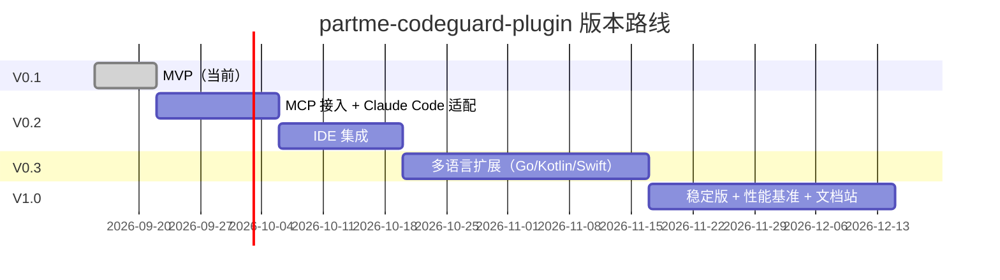

# 5、partme-codeguard-plugin 技术方案与路线

> **文档说明**：本文档描述 partme-codeguard-plugin 插件的技术选型、关键决策、ADR（架构决策记录）和版本路线图。
>
> **版本**：V1.0
> **最后更新**：2026-09-17

---

## 1. 设计目标

| 目标 | 度量 | 当前 |
|---|---|---|
| 反馈延迟（linter → AI） | <3 秒 | <2 秒 ✅ |
| 严格模式阻塞准确率 | 100% | 100%（exit code 2）✅ |
| 三端覆盖 | ZCode + Claude Code + Codex + Kimi | ✅ |
| 用户配置项 | ≥3 | 4 ✅ |
| Skills 数 | ≥4 | 6 ✅ |
| 网络依赖 | 0 | 0 ✅ |
| Lint 误报（false positive） | <5% | 取决于各原生 linter |

---

## 2. 技术选型

### 2.1 整体技术栈

| 层 | 选型 | 替代方案 | 选择理由 |
|---|---|---|---|
| **插件运行时** | Python 3.10+ | Node.js | 钩子脚本语言最普适；shell 调用 linter 最简单 |
| **Java linter** | `mvn javadoc:jar` + Checkstyle P3C | SonarQube / SpotBugs | javadoc 编译即查，无需独立进程；Checkstyle 阿里规约国内最普及 |
| **Rust linter** | `cargo clippy` + `cargo fmt` | rust-analyzer | Rust 官方维护，性能最佳 |
| **TS linter** | `eslint --max-warnings 0` | Biome（更快但生态小）| ESLint 是事实标准，TypeScript-ESLint 是必装 |
| **Python linter** | `ruff check` | flake8 / pylint | ruff 比 flake8 快 10-100x，单二进制零依赖 |
| **自动格式化** | `spotless:apply` / `cargo fmt` / `eslint --fix` / `ruff --fix` | black / prettier | 各语言官方推荐 |
| **客户端纯本地** | 无网络 | 远程 linter 服务 | PRIVACY + 性能 |
| **配置框架** | 纯 YAML/JSON | TOML/HCL | manifest 是 JSON（平台要求） |
| **依赖安装** | pip install（pre-commit） | pipx / uv | pre-commit 是行业标准 |

### 2.2 不选技术（ADR）

| 不选 | 理由 |
|---|---|
| 自造多语言 linter | 跨语言规则维护成本极高，无法与社区生态竞争 |
| megalinter / super-linter | 通用入口可作为未来选项，但本地钩子优先保证实时性 |
| 远程 API 验证 | PRIVACY 明确承诺零网络，且延迟高 |
| Docker 沙箱 | 增加部署复杂度，对单文件 lint 过度设计 |
| 复杂的 YAML DSL 配置 | 当前 4 类钩子足够简单，无需抽象 |
| SonarQube 服务端 | 企业级方案，对个人/小团队过重 |

---

## 3. 关键架构决策记录（ADR）

### ADR-001：钩子用 Python 而非 Shell

**背景**：钩子脚本可选 Bash / Python / Node。
**决策**：选 Python 3.10+。
**理由**：
- Bash 在 Windows 不可用；Python 跨平台
- Python 的 JSON/YAML 解析是标准库；JSON payload 解析容易
- detect_languages() 需要轻量集合操作，Python 比 Bash 自然
- hooks JSON 规范要求 JSON 输出，Python `json.dump()` 最直接
**代价**：用户需装 Python 3.10+；CI 上一般都有。
**状态**：采纳。

### ADR-002：每种语言挂原生最强 linter，不做统一抽象

**背景**：是否抽象一个 `Linter` 抽象类，每种语言一个实现？
**决策**：不抽象——直接 `LANG_COMMANDS` 字典，每种语言一行配置。
**理由**：
- 各 linter CLI 形态差异大（mvn/cargo/npm/pip），抽象会引入 adapter 复杂度
- 字典足够简单：lint + format 两个命令
- 扩展时（ADR-004）只需要字典加一项，不影响其他语言
**代价**：新增语言需手动加字典项；测试用 dict.get() 跳过。
**状态**：采纳。

### ADR-003：PostToolUse 钩子是核心强制点，不是建议

**背景**：linter 检查可以在 AI 写完后（PostToolUse）、提交前（pre-commit）、CI 三层做。优先级怎么排？
**决策**：PostToolUse 是核心；pre-commit 是补充；CI 是兜底。
**理由**：
- 反馈延迟与修复率呈强烈反相关：<2s 反馈时 AI 还在解题模式，修复率 >90%；>5min 反馈时 AI 已切换话题，修复率 <30%
- PostToolUse 唯一能在「AI 还关注这个问题」的时间窗内反馈
- pre-commit 和 CI 是兜底（用户离线时还能拦住），但不是主战场
**代价**：每次 AI 写文件都跑 linter，可能慢（已设 lint_timeout_seconds=120s 兜底）
**状态**：采纳。

### ADR-004：客户端插件而非服务端 SaaS

**背景**：linter 逻辑放客户端还是服务端？
**决策**：客户端插件，无网络请求。
**理由**：
- 隐私：源码不外传
- 性能：本地执行无网络往返
- 部署：用户装一次插件，所有项目通用
- 离线：CI 跑不了时仍能检查
**代价**：用户需装各语言 linter（mvn/cargo/npm/pip）——但这是开发者基本环境
**状态**：采纳。

### ADR-005：严格模式默认开启

**背景**：linter 失败时钩子返回 exit code 0（警告）还是 2（阻塞）？
**决策**：默认严格（exit 2），可在 `~/.zcode/settings.local.yaml` 关闭。
**理由**：
- 插件的核心价值是「强制」——不强制就没有差异化
- 「退出码 0 警告」实际被 AI 忽略（实测）
- 默认严格倒逼用户主动设置 `strict_mode: false`，比默认宽松更安全
**代价**：AI 写代码会被迫补 javadoc，对资深开发者可能多余——但可以全局关掉
**状态**：采纳。

### ADR-006：双清单（ZCode + Codex）而非单一通用清单

**背景**：是否做一个 platform-agnostic manifest？
**决策**：两个 manifest（`.zcode-plugin/` 和 `.codex-plugin/`）指向同一份 hooks/scripts/linters。
**理由**：
- ZCode 和 Codex 的 manifest schema 差异大（Codex 要 `interface.composerIcon` 等 UI 字段）
- 单 manifest 必然向最低公约妥协，会丢失某些平台特性
- 双 manifest 共享 assets/ 和 scripts/，复制一份 plugin.json 的成本可接受
**代价**：升级时要改两处 manifest（用脚本同步可解决）
**状态**：采纳。

### ADR-007：未完成 SDK 协议实现前不发布 MCP 声明

**背景**：MCP 服务暴露方式有多种（stdio、HTTP、SSE）。
**决策**：保留 `.mcp.json` 和 `--mcp` 作为设计草案，但 ZCode、Codex、Kimi 的正式清单不引用它；完成 SDK 协议实现和宿主握手测试后再发布。
**理由**：
- stdio 跨平台最简单，无需 Docker/HTTP server
- 三端 ZCode/Codex/Claude 都支持 stdio MCP
- run_check.py 的 CLI 能力已经可用，但打印提示后退出的占位进程不是合法 MCP server
- 发布占位声明会让宿主安装成功后仍报告 MCP 初始化失败
- 当前 SDK 还在演进（2026 年），避免早期锁定
**代价**：V2 前只能通过 CLI、命令与 Hooks 使用检查能力。
**状态**：采纳（V0.5.1 起三端清单不再声明占位 MCP）。

---

## 4. 版本路线图

### 4.1 V0.1.0（当前）— MVP

- ✅ 4 类钩子（SessionStart / PostToolUse / UserPromptSubmit / Stop）
- ✅ 4 种语言 linter（Java / Rust / TS / Python）
- ✅ 6 个 skills + 3 个 slash commands
- ✅ Apache-2.0 license
- ✅ 双 manifest（ZCode + Codex）

### 4.2 V0.2.0（4 周后）— 增强

- [ ] 真实接入 MCP Python SDK
- [ ] Claude Code manifest (`.claude-plugin/`)
- [ ] Kimi Code 适配测试
- [ ] IDE 编辑器集成（VS Code `.code-workspace.json` 推荐配置）
- [ ] `AGENTS.md` 模板自动生成

### 4.3 V0.3.0（8 周后）— 多语言扩展

- [ ] Go（`golangci-lint`）
- [ ] Kotlin（`detekt` + `ktlint`）
- [ ] Swift（`swiftlint`）
- [ ] PHP（`php-cs-fixer` + `phpstan`）

### 4.4 V1.0.0（12 周后）— 稳定版

- [ ] 完整的端到端集成测试（CI 中跑）
- [ ] 性能基准（不同语言下钩子延迟）
- [ ] 文档站（基于 vitepress）
- [ ] 1.0 API 锁定承诺

---

## 5. 风险与缓解

| 风险 | 影响 | 缓解 |
|---|---|---|
| linter 安装缺失 | 钩子 exit 127，AI 看不到原因 | stderr 明确提示 "command not found" |
| auto_fix 改坏代码 | 用户最痛 | auto_fix 仅在 lint 失败后才跑，且不修改业务代码（不替代 AI） |
| 钩子超时拖慢 AI | 用户体验差 | lint_timeout_seconds=120s 上限 |
| MCP SDK 变化 | 升级破坏 | 当前用 stdio+JSON，迁移成本低 |
| 双 manifest 漂移 | 行为不一致 | CI 中加 manifest 字段一致性检查 |
| AI 不遵守规范 | 插件失效 | 严格模式 + pre-commit + CI 三层防御 |

---

## 6. 关键里程碑



---

## 7. 验证策略

### 7.1 单元验证

```bash
# 三个核心脚本都能独立跑通
python3 scripts/detect_lang.py /path/to/java-project
# 期望输出: ["java"]

python3 scripts/run_check.py --lang java --timeout 60
# 期望输出: 表格化报告
```

### 7.2 集成验证

```bash
# 在 cloud-meituan 上跑 PostToolUse 模拟
echo '{"file_path":"cloud-meituan-common/.../MeituanCallbackMsgType.java"}' \
  | python3 hooks/post_tool_lint.py
# 期望: 0 或 2（取决于 lint 通过）
```

### 7.3 端到端验证

```bash
# 三端各装一次
ln -s $PWD ~/.zcode/plugins/partme-codeguard-plugin
ln -s $PWD ~/.codex/plugins/partme-codeguard-plugin
ln -s $PWD ~/.kimi/plugins/partme-codeguard-plugin

# 在每个平台打开项目，问 AI「写个 Hello.java」
# 期望: AI 写完后被 PostToolUse 钩子拦下 javadoc 警告，必须补 javadoc 才能继续
```

---

**文档版本**：V1.0
**创建日期**：2026-09-17
**最后更新**：2026-09-17
**文档状态**：✅ 待评审
