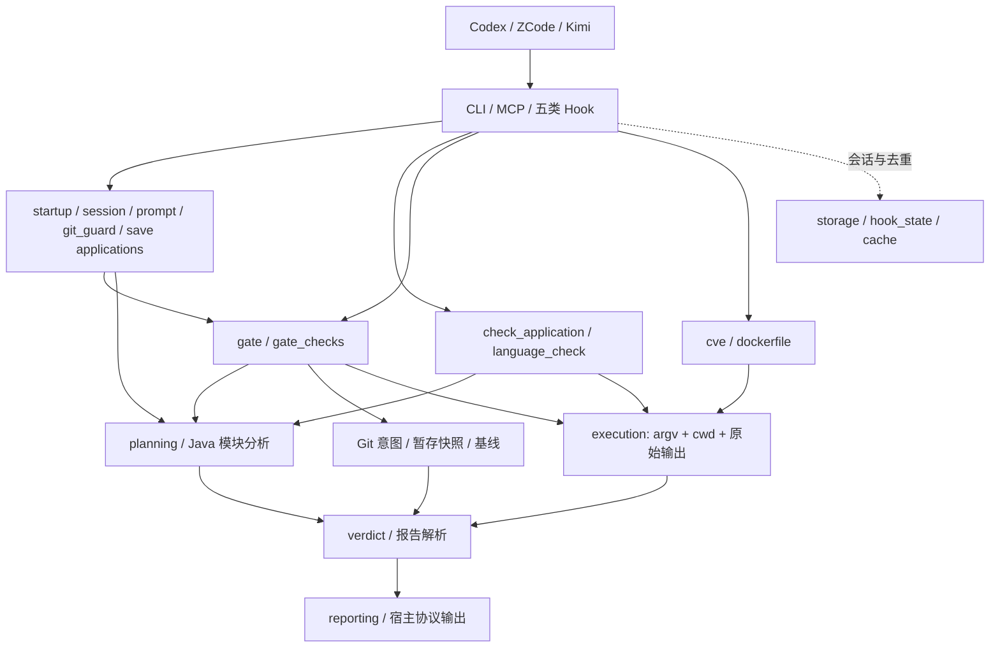

# CodeGuard 当前架构与扩展指南

本文描述当前工作树的职责边界。发布版本以 `.zcode-plugin/plugin.json` 及其它生成清单为准；历史设计、计划和测试数量不能替代运行证据。

## 请求到结论



检查作用域默认忽略项目根下任一以 `.` 开头的目录与文件（PostToolUse 保存面、delta 门禁面、语言发现面与全量扫描的 ruff/`find` 型通道；项目根本身位于点前缀父目录下不构成命中）；入库安全检查与 linter 配置发现不受此影响——密钥模式照拦，点前缀配置文件照常判定接入。
`execution` 只记录进程证据，不把非零退出自动认定为代码违规；stdout/stderr 合计按默认 16 MiB 捕获预算并发读取，超限终止执行、保留预算内诊断且返回 `output_limit`/UNVERIFIED，不把片段当成完整日志。`verdict`、CVE 与 Dockerfile 报告解析决定 PASS、FAIL 或 UNVERIFIED；入口仅按各自协议呈现和聚合退出码。Git 提交检查使用 index 或预测暂存快照，推送检查使用 HEAD；保存钩子只给反馈。计划、未执行和未验证不能宣传为通过。
Git 准确快照复用统一执行器的原始字节模式：路径列表默认最多捕获 16 MiB，`cat-file --batch-check` 按对象数分配响应预算；通过大小响应确认对象总量不超过 256 MiB 后，`--batch` 才按总 blob 大小和逐项头部预算读取。stdout/stderr 合计超限时及时终止 Git，抛出 `SnapshotError`，不交付截断内容。预测暂存的工作树覆盖层只列举一次，并以同一集合决定 `changed` 和物化内容；最多 20,000 项、单文件 32 MiB、实际复制总量 256 MiB，以 64 KiB 块流式读取。打开时使用非阻塞与不跟随末级链接的可用平台标志，避免类型检查后变成 FIFO 时卡住。特殊文件、读取期间变化和超限不交付临时树，文件↔目录转换按父路径先处理。随后严格解析 index/HEAD 对象列表的 NUL 帧、模式、ID、类型/阶段和唯一文件名，并与独立路径列举核对；`cat-file` 两阶段响应再逐项核对 ID、blob 类型、大小与边界，按 SHA-1/SHA-256 blob 对象格式复算内容哈希。缺项、截断、尾部脏数据或同长度内容替换均不交付临时树，而是明确标记 Git UNVERIFIED。原始 index 不在观察过程中改写。该校验不是恶意 Git 进程沙箱或完整 Git/Shell 模拟。
临时树交付前及检查器返回后，会复核 index/HEAD 路径、模式、对象 ID 和 HEAD 提交 ID。提交模式的 HEAD 是暂存差异基线，推送模式的 HEAD 决定待推送范围；同名文件重新暂存、同树空提交或首次提交在检查期间发生时，该次结论为 Git UNVERIFIED。复核不能消除两次观察之间的竞态，也不构成原子 Git/工作树快照。
`language_check` 将 `PlanExecution` 的实际命令依序映射为应用层有界 `execution_trace`（检查、修复、复检阶段）；`check_application` 将其进一步压成 MCP 安全元数据，不回显原始 argv、环境覆盖或捕获输出。MCP `auto_fix` 以 `fingerprint.file_content` 对仓内改动文件在修复前、formatter 后、复检后分别采集有总量预算的流式身份，仓外路径、符号链接或读取故障不启动 formatter；顶层 `fixed` 只归因于 formatter 且复检后仍保留的变化。公开 `fix_results` 将命令成功 `formatter_succeeded` 与逐项修复确认 `fixed` 分离；只有唯一成功执行的 formatter 且内容变化可验证时才把全局变化归给该项，多 formatter 执行不猜测归属。后续身份不可采集、formatter 失败后仍有内容变化或检查器改写目标文件时，保留实际执行证据、整体标为 UNVERIFIED，不把未知副作用声称为已确认修复。`fix_results` 只公开状态与安全元数据；formatter stderr 尾部写入私有 `.codeguard-fix.log` 后只公开路径，日志不可用时不退回公开原文。失败日志保留各已执行检查在捕获预算内的输出；输出超限时日志只含片段，不能称为完整诊断，且可能含敏感文本，应排除出版本控制。项目日志、门禁与保存 Hook 的截断诊断日志共用 `storage.write_private_text` 的私有原子落盘；预置日志文件链接不被跟随，默认 `out` 目录为链接或不可写时不返回虚假日志路径，也不覆盖检查结论。终止命令仍决定既有状态、退出码和旧字段；未运行的计划命令不进入证据。
`run_fix` 的历史 `fixed` 字段仍表示 formatter 命令以 0 退出，供旧调用方决定是否复检；它本身不是内容变化证明。CLI `fix` 因而只报告 formatter 执行成功与文件变化未验证，不再把退出码 0 呈现为已确认修复。
Git 命令的仓库定位与拟暂存解析共用入口传入的 cwd；显式 `cd`/`git -C` 无法绑定 Git 工作树时，硬门禁给出目标未验证并阻断，不退回到调用者仓或无关子仓。未给出显式目标且调用目录非仓时仍保留 workspace 子仓兜底。静态命令解析不等于完整 Shell 执行模拟。
workspace 兜底产生的每个子仓是合成目标，暂存观察也绑定该子仓根目录；不能继续以非 Git 的 workspace cwd 解析，从而把脏子仓的已知违规变成未知放行。
一条命令链中的 Git 副作用先绑定为仓库与操作的有序对，再按仓库聚合检查面：纯 push 不读取该仓未提交的 index，同仓 commit→push 则保留已有 HEAD 与拟提交内容的并集。仓库级、内联及链式 `skipGate` 均按目标仓与操作顺序生效，但**只覆盖语言门禁**——入库内容安全扫描不被任何代理可控豁免覆盖，只有进程环境变量 `CODEGUARD_SKIP_GATE`（1/true/yes）可完整放行；已存在的仓库配置也可被同链先行 `git config --unset` 取消。链式设置跨 `||`、`;` 或换行时无法证明生效，门禁要求拆分命令；写入其它文件的 config 设置也不构成本仓豁免。语法、仓库归属、间接脚本与拟暂存分析共用引号/转义感知切分；参数文本中的控制符不能合成豁免。解析能力仍限于受支持的静态 Shell 形态。
一层 `bash`/`sh`/`zsh` 的 `-c`（含组合短选项）及可读脚本现在携带调用目录与正文进入同一 Git 操作计划；脚本内的 `git add` 可进入拟暂存范围，外层和内层 Git 操作按仓分别检查。识别到无法建模的间接 Git 操作、脚本内 `skipGate` 配置变更或跨解释器的暂存/提交关系时，明确以 Git 意图 UNVERIFIED 阻断，不借用调用者仓的检查结果。动态脚本、任意控制流及 Python/Node 中构造的 subprocess 仍未建模。
不含脚本或命令替换的直接静态命令链，暂存事件先按目标仓和执行次序记录，再投影到该仓最后一次 commit：其后的 add 不会倒算到先前提交或随后的 push；两个 commit 之间的 add 仍进入检查面。带一层间接脚本或 `$(...)`/反引号命令替换的链仍保守合并暂存意图，不声称已经建立跨层事件时钟。
直接 Git 命令、解释器入口及 `skipGate` 状态/内联豁免解析共用裸前缀归一化；可解析的环境赋值、`env FOO=1`、`command` 和无参数 `sudo` 不会遮蔽后面的 Shell 提交或豁免取消。带值 wrapper 参数和运行时生成命令仍不在静态保证范围内。

## 模块所有权

| 位置 | 责任 | 扩展边界 |
|---|---|---|
| `bin/codeguard`、`scripts/run_check.py`、`scripts/fix.py` | CLI 参数、输出与 MCP stdio 注册 | 不复制扫描器或判定逻辑 |
| `hooks/` | 宿主 JSON、会话事件、通知与退出协议 | 五类 Hook 将检查编排委托应用服务；入口保留旧导入兼容面及 fail-open 协议 |
| `scripts/codeguard/check_application.py`、`language_check.py` | 语言选择、检查与修复请求、MCP 工具分发 | 不导入 MCP SDK；修复结果公开投影不复制内部原始命令/输出；旧 `run_per_language.py` 仅再导出 |
| `startup_application.py`、`session_application.py`、`prompt_application.py`、`git_guard_application.py`、`save_application.py` | 五类 Hook 的盘点、状态消费、软提示、Git 守卫及保存反馈编排 | 返回结构化结果，不打印或调用宿主通知；Hook 控制输出、通知与 fail-open。Stop、软提示与保存反馈在 stdout 刷新后确认状态；Git 已知拦截在输出故障时仍拦截但不缓存。并发或交付重试可能重复反馈，不得丢掉未交付记录 |
| `gate.py`、`gate_checks.py`、`repository_policy.py`、`baseline.py` | Git 门禁、单语言结果、安全规则及有证据的存量比较 | 单个语言 worker 异常只标该语言 UNVERIFIED，保留其它结论；安全路径快照失败明确报告未验证，不能抹掉已确认拦截。只有准确基线失败且逐条诊断的文件归属、内容及次数覆盖当前结果才可豁免；入库内容安全扫描恒执行，不受 skipGate 类代理可控豁免覆盖 |
| `java_build.py`、`java_impact.py`、`java_planning.py` 等 | 构建读取、纯影响闭包、命令选择与环境观察 | 默认保留跳过测试的行为；复杂构建保守扩大检查范围 |
| `cve_reports.py`、`cve_policy.py`、`cve_scanners.py`、`cve.py` | 漏洞报告、阈值、进程适配与复扫编排 | 无有效结构化报告就没有安全通过结论 |
| `dockerfile_reports.py`、`dockerfile.py` | hadolint/Trivy 结构化证据与逐文件扫描 | `dockerfile_security.py` 只解析参数和呈现报告 |
| `execution.py`、`git_staging.py`、`git_snapshot.py`、`storage.py` | 外部进程、Git 内容面、原子状态读改写 | Git blob 走有界原始字节通道、不经文本解码；准确快照必须核对批量对象协议与内容身份 |
| `registry.py`、`registry_schema.py`、`discovery.py`、`config.py` | 已校验的语言表、发现与配置 | `languages.json` 是语言清单的事实源 |

这些是源代码层的边界。`scripts/check_architecture.py` 对第一方静态导入和环做门禁；动态加载、进程副作用和宿主行为仍需测试。

## 添加或修改能力

1. 先在现有 OpenSpec change 中描述用户可观察行为、失败和未验证场景，确定归属模块。新的入口只做参数与协议转换；应用服务编排，纯策略解析证据，执行器保留原始进程结果。
2. 添加语言时修改 `scripts/languages.json`，跑 schema 与文档生成/一致性测试。稳定项必须有明确检查命令、探活、项目配置前提及范围规则；`{file}` 命令需要项目级 gate 或明确返回 UNVERIFIED。
3. 添加扫描器时先定义有效报告结构、非零返回语义与阈值，再实现进程适配。缺工具、超时、坏报告、修复后复扫失败均要保留为未验证；不得从空 stdout 推断安全。
4. 添加 Git 命令形态时在 `git_syntax` 解释意图，在 `git_staging` 绑定真实仓和 pathspec，在快照层保留字节；用临时 Git 仓验证实际 index 不被修改。
5. 更新 `scripts/check_architecture.py` 的依赖白名单，并用反例测试证明逆向依赖或环会被拒绝。保留 CLI 路径、MCP 工具名、五类 hook JSON/退出协议及旧 Python 导入接口，除非有单独的兼容性变更。

## 本地验证与未覆盖面

```bash
python3 -m unittest discover -s tests -q
python3 tests/run_all.py
ruff check hooks scripts tests
python3 scripts/check_architecture.py
python3 scripts/validate_languages_json.py
python3 scripts/vendor/skill_vendor.py check --offline
python3 scripts/vendor/skill_vendor.py check
openspec validate refactor-codeguard-architecture --strict
```

真实 Maven/Gradle 大型项目、联网漏洞数据库、57 种工具链、Windows 与三宿主已安装运行均需要独立证据。临时 Git 快照不是执行沙箱；构建和扫描命令以当前用户权限运行。当前重构的任务进度和各阶段发布证据见 `openspec/changes/refactor-codeguard-architecture/verification.md`；不能以某一阶段的源码、CI、tag、Release 或市场记录替代后续改动的发布与宿主验收。
