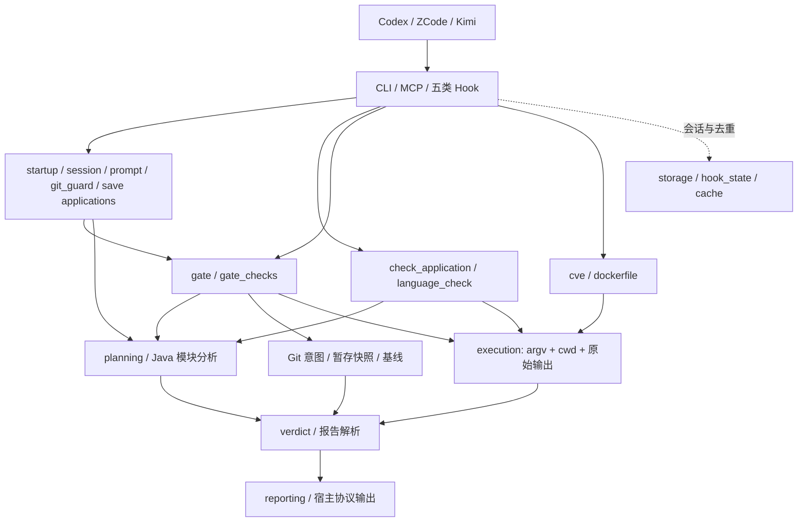

# CodeGuard 当前架构与扩展指南

本文描述当前工作树的职责边界。发布版本以 `.zcode-plugin/plugin.json` 及其它生成清单为准；历史设计、计划和测试数量不能替代运行证据。

## 请求到结论



`execution` 只记录进程证据，不把非零退出自动认定为代码违规。`verdict`、CVE 与 Dockerfile 报告解析决定 PASS、FAIL 或 UNVERIFIED；入口仅按各自协议呈现和聚合退出码。Git 提交检查使用 index 或预测暂存快照，推送检查使用 HEAD；保存钩子只给反馈。计划、未执行和未验证不能宣传为通过。

## 模块所有权

| 位置 | 责任 | 扩展边界 |
|---|---|---|
| `bin/codeguard`、`scripts/run_check.py`、`scripts/fix.py` | CLI 参数、输出与 MCP stdio 注册 | 不复制扫描器或判定逻辑 |
| `hooks/` | 宿主 JSON、会话事件、通知与退出协议 | 五类 Hook 将检查编排委托应用服务；入口保留旧导入兼容面及 fail-open 协议 |
| `scripts/codeguard/check_application.py`、`language_check.py` | 语言选择、检查与修复请求、MCP 工具分发 | 不导入 MCP SDK；旧 `run_per_language.py` 仅再导出 |
| `startup_application.py`、`session_application.py`、`prompt_application.py`、`git_guard_application.py`、`save_application.py` | 五类 Hook 的盘点、状态消费、软提示、Git 守卫及保存反馈编排 | 返回结构化结果，不打印或调用宿主通知；Hook 控制输出、通知与 fail-open。软/硬提示与保存统计在成功输出后确认；Stop 的状态消费仍先于 stdout，输出故障时可能丢失总结 |
| `gate.py`、`gate_checks.py`、`repository_policy.py`、`baseline.py` | Git 门禁、单语言结果、安全规则及有证据的存量比较 | 只有准确基线失败且每条诊断及次数覆盖当前结果才可豁免 |
| `java_build.py`、`java_impact.py`、`java_planning.py` 等 | 构建读取、纯影响闭包、命令选择与环境观察 | 默认保留跳过测试的行为；复杂构建保守扩大检查范围 |
| `cve_reports.py`、`cve_policy.py`、`cve_scanners.py`、`cve.py` | 漏洞报告、阈值、进程适配与复扫编排 | 无有效结构化报告就没有安全通过结论 |
| `dockerfile_reports.py`、`dockerfile.py` | hadolint/Trivy 结构化证据与逐文件扫描 | `dockerfile_security.py` 只解析参数和呈现报告 |
| `execution.py`、`git_staging.py`、`git_snapshot.py`、`storage.py` | 外部进程、Git 内容面、原子状态读改写 | Git blob 保持字节，不经过文本检查执行器 |
| `registry.py`、`registry_schema.py`、`discovery.py`、`config.py` | 已校验的语言表、发现与配置 | `languages.json` 是语言清单的事实源 |

这些是源代码层的边界。`scripts/check_architecture.py` 对第一方静态导入和环做门禁；动态加载、进程副作用和宿主行为仍需测试。

## 添加或修改能力

1. 先在现有 OpenSpec change 中描述用户可观察行为、失败和未验证场景，确定归属模块。新的入口只做参数与协议转换；应用服务编排，纯策略解析证据，执行器保留原始进程结果。
2. 添加语言时修改 `scripts/languages.json`，跑 schema 与文档生成/一致性测试。稳定项必须有明确检查命令、探活、项目配置前提及范围规则；`{file}` 命令需要项目级 gate 或明确返回 UNVERIFIED。
3. 添加扫描器时先定义有效报告结构、非零返回语义与阈值，再实现进程适配。缺工具、超时、坏报告、修复后复扫失败均要保留为未验证；不得从空 stdout 推断安全。
4. 添加 Git 命令形态时在 `git_syntax` 解释意图，在 `git_staging` 绑定真实仓和 pathspec，在快照层保留字节；用临时 Git 仓验证实际 index 不被修改。
5. 更新 `scripts/check_architecture.py` 的依赖白名单，并用反例测试证明逆向依赖或环会被拒绝。保留 CLI 路径、MCP 工具名、五类 hook JSON/退出协议及旧 Python 导入接口，除非有单独的兼容性变更。

## 本地验证与未覆盖面

```bash
python3 -m unittest discover -s tests -q
python3 tests/run_all.py
ruff check hooks scripts tests
python3 scripts/check_architecture.py
python3 scripts/validate_languages_json.py
python3 scripts/vendor/skill_vendor.py check --offline
python3 scripts/vendor/skill_vendor.py check
openspec validate refactor-codeguard-architecture --strict
```

真实 Maven/Gradle 大型项目、联网漏洞数据库、57 种工具链、Windows 与三宿主已安装运行均需要独立证据。临时 Git 快照不是执行沙箱；构建和扫描命令以当前用户权限运行。当前重构的任务进度和本地证据见 `openspec/changes/refactor-codeguard-architecture/verification.md`。v0.13.0 的源码、CI、tag、Release 和市场已核对；其后工作树变更仍需独立发布，宿主安装运行尚未验收。
