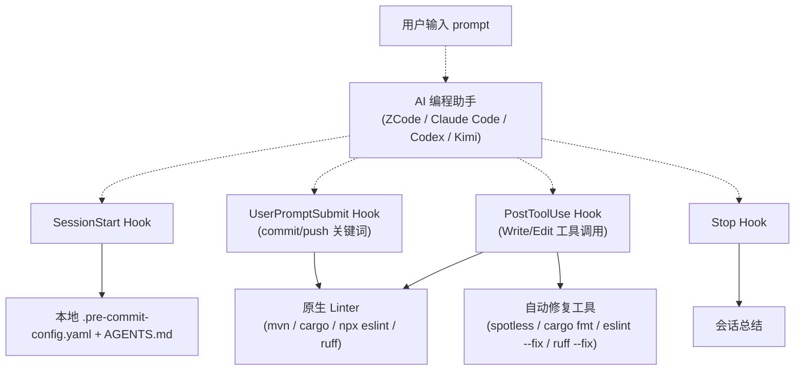
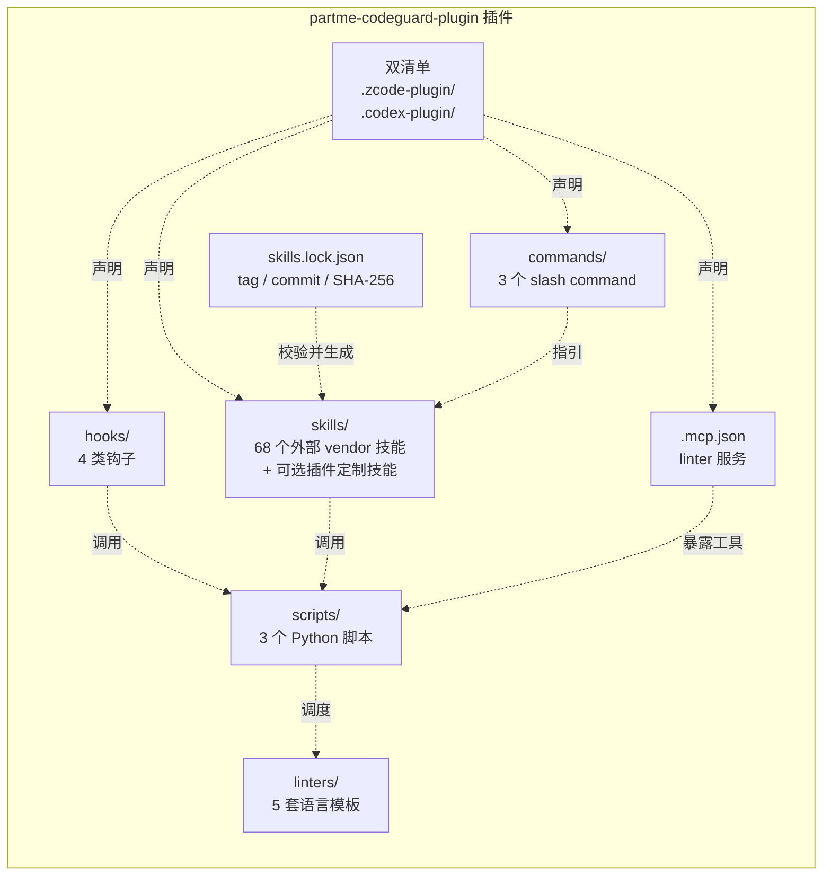
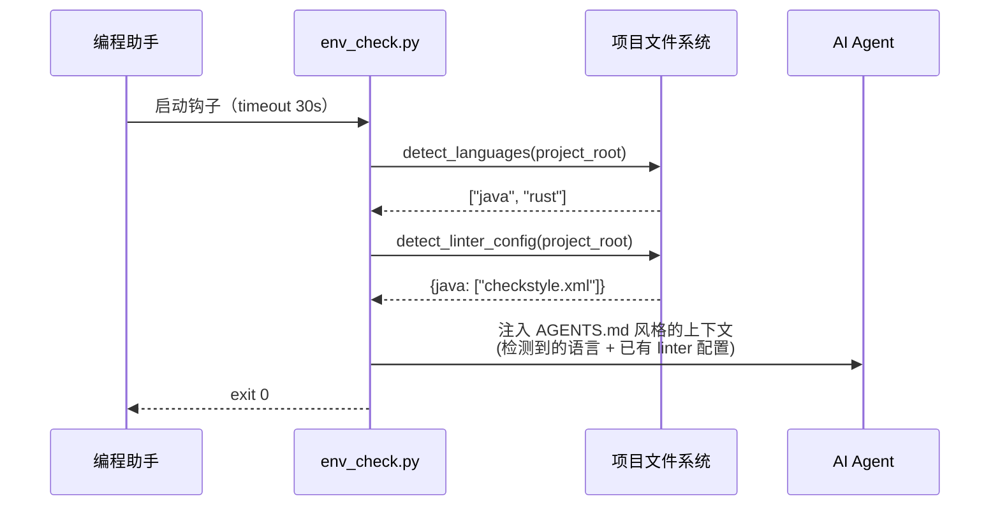
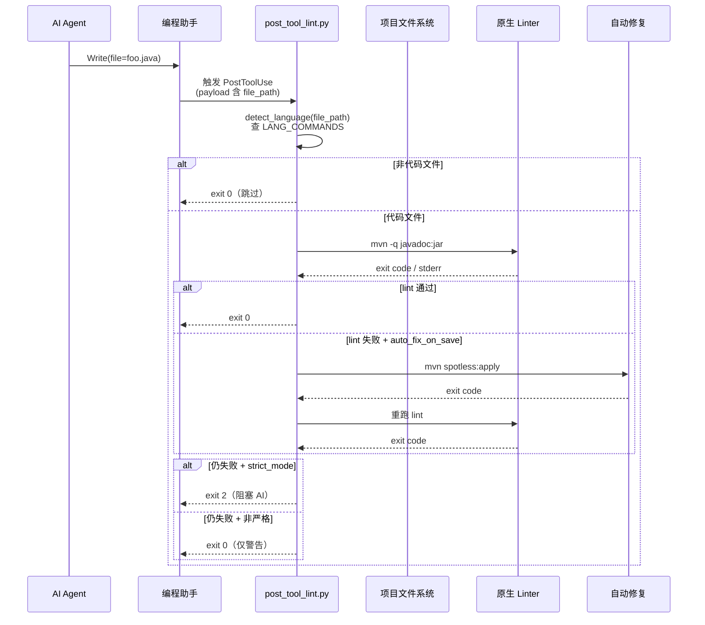
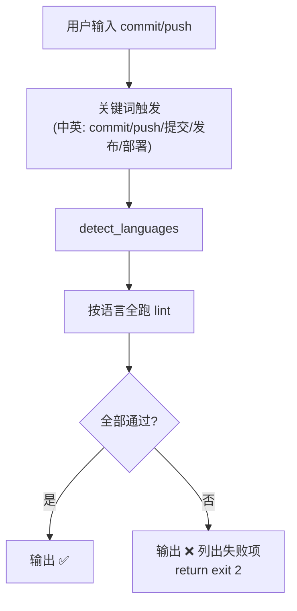
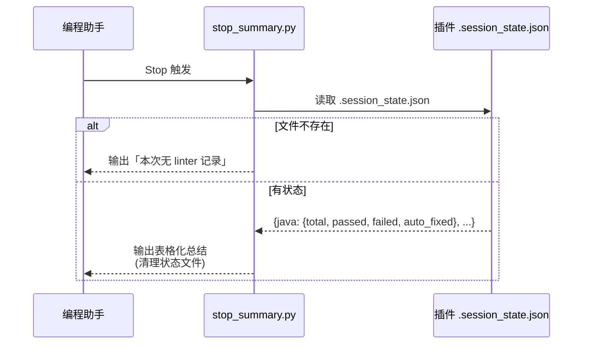

# partme-codeguard-plugin 系统架构设计

> **历史设计，不作为当前行为证明**：下文保存早期架构思路，其中 PostToolUse 阻断、javadoc 默认命令、延迟和“全覆盖”等叙述已不适用。当前 0.12.0 实现以[判定与 Java 架构](verdict-java-architecture.md)、[钩子协议](../hooks/__protocol__.md)及 OpenSpec 为准；历史图表中的指标不是本次实测。

> **文档说明**：本架构文档描述 partme-codeguard-plugin 插件的内部结构、模块划分、数据流与三端适配设计。
>
> **版本**：V1.1
> **最后更新**：2026-09-19

---

## 1. 架构总览

partme-codeguard-plugin 是一类**约束型 AI 插件**——它不生产代码，而是在 AI 助手写代码的过程中**强制执行代码规范**。其核心创新点是把「linter 检查」从「提交/CI 阶段」**前移**到「AI 写完文件的瞬间」。

### 1.1 顶层数据流



### 1.2 设计原则

| 原则 | 说明 |
|---|---|
| **按语言用原生 linter** | Java/Checkstyle、Rust/clippy、TS/ESLint、Python/ruff——不重造轮子 |
| **PostToolUse 是核心** | 反馈延迟 <2s，远快于 pre-commit（30s）或 CI（分钟级） |
| **严格模式默认开启** | linter 失败 → exit code 2 → 阻塞 AI 继续 |
| **客户端纯本地** | 无网络请求、无遥测、无认证——PRIVACY.md 明确承诺 |
| **三端同源双清单** | `.zcode-plugin/` + `.codex-plugin/` 共享同一 hooks/scripts/linters |

---

## 2. 模块划分



### 2.1 各模块职责

| 模块 | 文件 | 职责 | 调用方 |
|---|---|---|---|
| **manifest** | `.zcode-plugin/plugin.json`<br/>`.codex-plugin/plugin.json`<br/>`.mcp.json` | 插件元数据声明：名称、版本、skills/commands/hooks 路径、用户配置项 | 三端加载器 |
| **hooks** | `hooks/hooks.json`<br/>4 个 Python 脚本 | 4 类事件触发：会话开始/用户输入/AI 写文件/会话结束 | 编程助手运行时 |
| **skills** | `skills/codeguard-*/SKILL.md` | 外部 `codeguard-skills` 的受管离线快照；未列入 lock 的目录才是插件内部定制技能 | 用户 slash command 或 AI 自动调用 |
| **skill vendor** | `skills.lock.json`<br/>`scripts/vendor/skill_vendor.py` | 固定上游 tag/commit 与逐技能摘要；更新、离线校验、在线校验，同时保留未受管本地技能 | 开发者 + CI |
| **commands** | `commands/{check,fix,init}.json` | 斜杠命令的 prompt 模板 | 编程助手 slash 解析器 |
| **scripts** | `scripts/{detect_lang,run_check,fix}.py` | 跨语言调度的纯 Python 实现 | hooks + skills |
| **linters** | `linters/{checkstyle,clippy,eslint,ruff,pre-commit}/` | 各语言的配置文件模板，拷贝即用 | `scripts/` + 用户 |

### 2.2 关键依赖关系

```
manifest ──> 声明 hooks/scripts/skills/commands 路径
   │
skills.lock.json ──> vendor/check 受管 skills/，保留未列入 lock 的插件定制技能
hooks ──> 调用 scripts/（跨语言 linter 调度）
skills ──> 调用 scripts/（按需 lint）
commands ──> 引用 skills 的 prompt
scripts ──> 不依赖 manifest
linters ──> 被 scripts 调用、用户拷贝到目标仓库
MCP (.mcp.json) ──> 把 scripts/ 暴露成 MCP 工具
```

---

## 3. Hook 时序

### 3.1 SessionStart——会话开始



### 3.2 PostToolUse——AI 写文件



### 3.3 UserPromptSubmit——commit/push 门禁



### 3.4 Stop——会话结束



---

## 4. 数据结构

### 4.1 linter 命令表（`scripts/detect_lang.py` 内部）

```python
LANG_COMMANDS = {
    "java": {
        "lint":   ["mvn", "-q", "javadoc:jar", "-DskipTests"],
        "format": ["mvn", "-q", "spotless:apply"],
    },
    "rust": {
        "lint":   ["cargo", "clippy", "--all-targets", "--", "-D", "warnings"],
        "format": ["cargo", "fmt"],
    },
    "typescript": {
        "lint":   ["npx", "eslint", ".", "--max-warnings", "0"],
        "format": ["npx", "eslint", ".", "--fix"],
    },
    "python": {
        "lint":   ["ruff", "check", "."],
        "format": ["ruff", "check", ".", "--fix"],
    },
}
```

### 4.2 用户配置（`~/.zcode/settings.local.yaml`）

```yaml
codeguard:
  enabled_languages: auto      # 或 [java, rust, typescript, python]
  strict_mode: true            # linter 失败 → exit 2 阻塞 AI
  auto_fix_on_save: true       # 先试自动修复
  lint_timeout_seconds: 120    # 单次 linter 超时
```

### 4.3 会话状态（`.session_state.json`）

```json
{
  "java":     {"total": 5, "passed": 4, "failed": 1, "auto_fixed": 0},
  "rust":     {"total": 3, "passed": 3, "failed": 0, "auto_fixed": 0},
  "typescript": {"total": 0, "passed": 0, "failed": 0, "auto_fixed": 0}
}
```

---

## 5. 三端适配

### 5.1 三端差异

| 平台 | manifest 位置 | hooks 调用 | MCP | skills | commands |
|---|---|---|---|---|---|
| **ZCode** | `.zcode-plugin/plugin.json` | `hooks/hooks.json` | `.mcp.json` | `skills/*/SKILL.md` | `commands/*.json` |
| **Codex CLI** | `.codex-plugin/plugin.json` | 通过 `interface` 字段 | 同上（共享 MCP） | 同上 | 同上 |
| **Claude Code** | `.claude-plugin/manifest.json`（可后置） | 同上 | 同上 | 同上 | 同上 |
| **Kimi Code** | 通过 plugin loader | 同上 | 同上 | 同上 | 同上 |

**核心：hooks/scripts/linters 完全共享**——三端只是 manifest 形态不同。

### 5.2 安装路径

| 平台 | 安装方式 |
|---|---|
| ZCode | 软链或复制 `~/.zcode/plugins/partme-codeguard-plugin/` |
| Codex CLI | `~/.codex/plugins/` 或 marketplace install |
| Claude Code | 软链或复制 `~/.claude/plugins/partme-codeguard-plugin/` |
| Kimi Code | 软链或复制 `~/.kimi/plugins/partme-codeguard-plugin/` |

---

## 6. 错误处理与降级策略

| 失败场景 | 处理策略 | 是否阻塞 AI |
|---|---|---|
| linter 命令不存在（如未装 cargo） | 返回 127 + stderr 说明，**不当作 linter 失败** | 否 |
| linter 超时（>lint_timeout_seconds） | 返回 124 + 提示 | 否（建议人工查） |
| 配置缺失（项目无 .pre-commit-config.yaml） | 直接调 linter 命令 | 否 |
| auto_fix 失败 | 提示用户手动修，给出修复命令 | 是（仍视为 linter 失败） |
| 检测不到项目语言 | exit 0 安静跳过 | 否 |
| AI 写的是非代码文件（.md/.json/.txt） | 跳过 linter | 否 |

---

## 7. 安全与隔离

| 维度 | 实现 |
|---|---|
| 网络 | 零网络请求，所有 linter 是本地二进制 |
| 数据 | 不上传源码、不收集遥测 |
| 权限 | linter 进程用 AI 进程同等权限运行（不要 sudo） |
| 配置篡改 | 检测到 `.pre-commit-config.yaml` 已存在时**不覆盖** |
| AGENTS.md 覆盖 | **只追加不覆盖**已有内容 |
| 危险修复 | auto_fix 仅在 lint 失败后才尝试，不主动修改业务代码 |

---

## 8. 可扩展性

### 8.1 添加新语言

在 `scripts/detect_lang.py` 加 3 处：
```python
EXT_LANG_MAP[".kt"] = "kotlin"
PROJECT_MARKERS["build.gradle.kts"] = "kotlin"
LANG_COMMANDS["kotlin"] = {
    "lint":   ["./gradlew", "detekt"],
    "format": ["./gradlew", "ktlintFormat"],
}
```

并在 `linters/` 加对应配置目录。

### 8.2 添加新钩子事件

平台支持的话，编辑 `hooks/hooks.json` 加新数组即可。

---

**文档版本**：V1.0
**创建日期**：2026-09-17
**最后更新**：2026-09-17
**文档状态**：✅ 待评审
