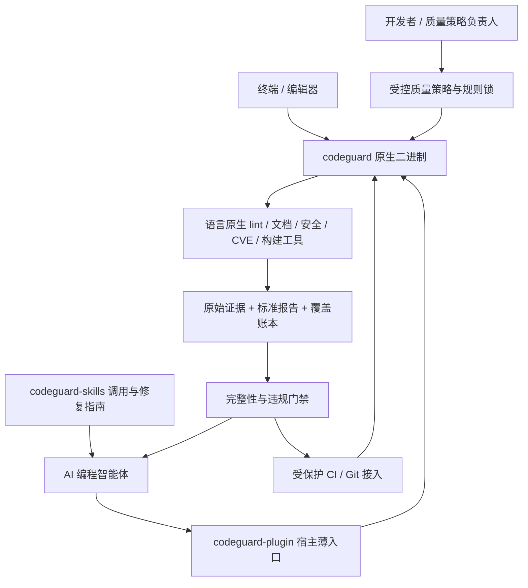
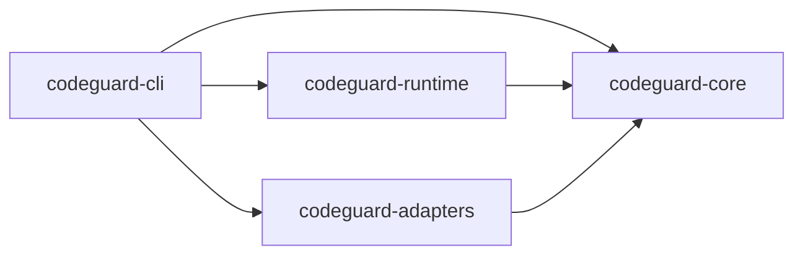
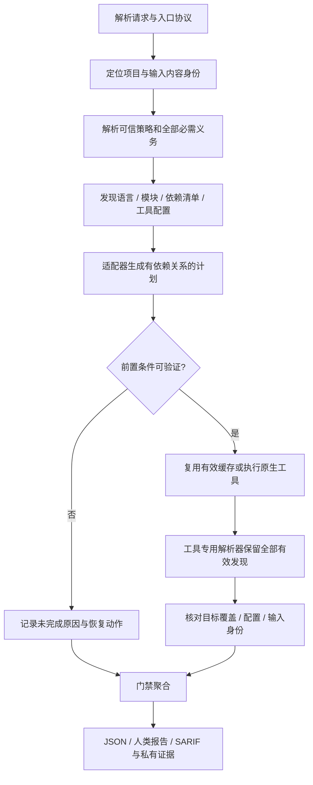
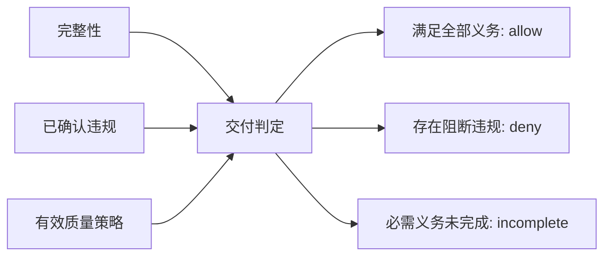
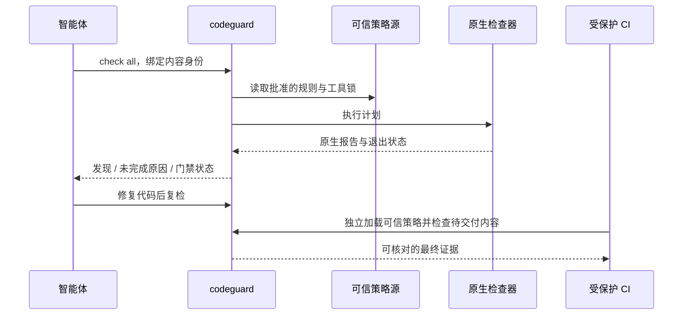

# Codeguard Rust CLI 架构设计

本方案把 Codeguard 恢复为传统静态工具驱动的多语言代码质量守卫。统一入口是 Rust 二进制 `codeguard`，智能体负责调用、解释和修复，检查事实来自工具，门禁要求来自受控策略。

状态：待实现设计。规范性要求见 [OpenSpec change](../../openspec/changes/introduce-rust-codeguard-cli/proposal.md)。实现细节见 [技术方案](technical-design.zh-CN.md)，能力与测试见 [迁移验收](coverage-and-acceptance.zh-CN.md)。

项目内新增 `./codeguard/` 持久工作区，保存脱敏问题、任务和修复事件；本地报告、日志、缓存默认 Git 忽略。智能体以 `next` 获取可推进任务，以 `task verify` 完成真实复检。完整设计见 [修复工作流](remediation-workflow.zh-CN.md)。

## 1. 产品目标与不可变约束

1. 覆盖已支持语言的 lint、注释规范、CVE、安全规范及构建检查；每类检查都必须有明确适用性、执行能力和结果。
2. 优先复用语言生态的成熟工具和项目配置。Rust 统一编排与证据，不重新实现各语言编译器和静态分析器。
3. 低误报来自准确的工具版本、规则、语言方言、构建上下文和报告解析。不能靠关闭规则、减少检查范围或默认忽略旧问题改善数字。
4. 代码违规与执行故障分别呈现；必需检查未完成时交付门禁不通过。
5. AI 无权自行降低质量要求。修代码、修适配器、修工具配置的过程均留下可复核的变化与复检证据。
6. 一次检查结论绑定实际内容、有效配置、工具与规则版本。不能借用工作树的通过替代 index 或待推送内容。
7. 单语言、单类别命令的通过只代表该请求完成；全项目交付需要完整 contract 的证据。

“所有语言”是可扩展的适配器体系和明确的覆盖承诺，不是任何文件后缀都会自动拥有完整分析器。当前 57 个注册条目是迁移输入；对于没有可用检查器的类别，必须报告缺口，不能生成空适配器充数。

## 2. 当前实现证据与设计纠偏

以下为 `03ebb24` 的静态观察，不是对当前误报率的统计，也不替代实机复现。

| 当前证据 | 影响 | 新设计 |
|---|---|---|
| [入口](../../bin/codeguard) 是 Bash 转发 Python；语言、CVE、Dockerfile 有不同协议 | 调用方容易把不同退出码当成相同状态 | Rust 统一报告；旧数字经版本化兼容层映射 |
| [verdict.py](../../scripts/codeguard/verdict.py) 有通用 rc=1/cargo=101 和环境文本归类 | 进程失败与工具发现仍可能混淆 | 每个工具版本具有专用结果契约，不在通用执行器判断违规 |
| [gate_checks.py](../../scripts/codeguard/gate_checks.py) 在最多 50 个文件时走 delta，并调用基线豁免 | 性能分支改变语义，历史发现可消失 | 全部必需义务保持不变；分批、缓存、基线只优化或分类 |
| [hook-protocol](../../openspec/specs/hook-protocol/spec.md) 规定 fail-open 与 skipGate | 未完成检查可能不阻止交付动作 | 迁移后交付入口要求完整；普通保存反馈仍不冒充交付门禁 |
| [语言表](../../scripts/languages.json) 有 54 stable、3 planned，Julia/Pascal 的 lint 为空 | 语言标签不能证明真实检测能力 | 按语言 × 类别 × 工具 × 平台验收 |
| [本地规则文件](../../linters/checkstyle/p3c-javadoc-enforced.xml) 是 Checkstyle XML | 文件名不能证明已执行官方 P3C | 官方 P3C/PMD 与 Checkstyle/Javadoc 分开建模与取证 |
| [执行内核](../../scripts/codeguard/execution.py)、Git 快照、Java 影响分析已有专门模块 | 有价值的行为与回归样本可迁移 | 迁移证据和正确性约束，不逐行翻译全部历史策略 |

旧版本的 fail-open、默认 delta、基线豁免是本次明确要改变的行为；不能用“兼容旧行为”把它们重新带入新门禁。兼容层只在显式旧协议范围内存在，并标明不能提供新交付认证。

## 3. 系统边界



| 交付物 | 所有权 | 不承担的职责 |
|---|---|---|
| `codeguard-cli` | Rust 内核、适配器、rulepack、schema、二进制发布 | 宿主专用提示词和市场目录 |
| `codeguard-plugin` | 三宿主入口、hook 事件映射、运行时版本/摘要绑定 | 复制检查逻辑、另写 verdict、默默 fallback |
| `codeguard-skills` | 使用、诊断、修复步骤的技能事实源 | 生成比工具证据更高优先级的门禁结论 |
| 项目/组织策略 | 规则、适用性、阈值、豁免审批、受保护 CI | 依赖智能体自觉执行作为唯一约束 |

现有受管技能仍从独立技能仓经 lock/vendor 同步；不直接修改本插件受管副本。新 Rust 仓的远程地址、发布签名身份及平台 ABI 在实施任务中确定，本次不虚构已有仓库或二进制。

## 4. Rust workspace 与依赖方向

```text
codeguard-cli/
├── Cargo.toml
├── crates/
│   ├── codeguard-cli/
│   ├── codeguard-core/
│   ├── codeguard-runtime/
│   └── codeguard-adapters/
├── rulepacks/
├── schemas/
└── tests/
    ├── fixtures/
    ├── integration/
    └── acceptance/
```

仓库、crate 目录和 Cargo package 使用上面的 kebab-case；模块与 `.rs` 文件使用 snake_case；类型使用 PascalCase；二进制名 `codeguard`。一类主要职责一个文件，`mod.rs` 只组织和重导出；不以 `compat.rs` 堆积领域对象，不提交 `todo!()` 适配器作为完成项。新原生实现没有 Java 对应物时，中文 doc 注释说明用途，不伪造 Java 来源。



这是编译依赖图，不是进程调用图。禁止 core 导入 runtime/adapters/宿主 SDK；禁止 adapters 导入 runtime。core 定义 `ExecutionPort`、`SnapshotPort`、`EvidenceStore` 等接口，runtime 实现；CLI 组合运行时与适配器并调用 core 的协调服务。

| crate | 主要模块 | 关键责任 |
|---|---|---|
| cli | args、commands、render、mcp、compat | 参数、入口协议、stdout/stderr、终端报告、退出码映射 |
| core | model、policy、planning、coverage、gate、remediation、ports | 检查义务、任务 DAG、结果聚合、覆盖证明、问题生命周期与修复任务；尽量纯函数 |
| runtime | process、snapshot、toolchain、cache、storage、workspace、telemetry | 操作系统进程、Git/文件观察、工具解析、有界资源、持久记录与租约 |
| adapters | java、rust、python、node、shell、… | 专用工具探测、计划、报告解析、覆盖核对、修复计划 |

初版采用编译期适配器注册。任意脚本、动态库插件或远程规则执行不是默认扩展入口，避免将字符串命令表原样升级为新的执行系统。

## 5. 一次检查的完整路径



解析、规划、执行、报告各阶段都可失败；失败必须产生具体原因及未完成义务。某个检查失败不抹掉其他已确认发现。可独立执行的任务继续；依赖失败的任务标为依赖未满足，不能被删掉。

`check all` 建立项目全部适用类别的义务；`lint java` 只选择 Java lint。项目没有使用某语言与某语言检查器缺失是不同事实，后者不能伪装成不适用。

## 6. 结果与门禁的分离

单个检查结果至少包含三个维度：

- 执行完整性：`complete / incomplete / not_applicable`。
- 发现：零条或多条带规则、位置、工具证据的 finding；不随执行失败清空。
- 门禁影响：由有效策略判定，而不是工具退出码或模型的主观置信度决定。



`incomplete` 与 `deny` 都不满足交付要求，但反馈不同：前者修工具链、配置或证据，后者修代码或依赖。混合情况报告全部发现，顶层优先显示未完成，不能暗示“只是工具故障，没有问题”。

注释检查不能被格式化检查替代；`cargo fmt --check` 不等于 `clippy`；CVE 扫描不等于源代码安全检查；Maven `verify` 成功不证明未绑定的 P3C/Checkstyle/Javadoc 已执行。Maven 生命周期通过插件绑定具体目标，必须验证实际执行项。[Maven 官方生命周期说明](https://maven.apache.org/guides/introduction/introduction-to-the-lifecycle.html)

## 7. 低误报机制

| 误报来源 | 工程控制 | 必需证据 |
|---|---|---|
| Java/Python/SQL/Shell 方言和版本错误 | 读取项目目标版本及构建上下文，验证工具支持矩阵 | 解析依据、工具版本、命令与配置摘要 |
| 工具自身崩溃被当成代码问题 | 工具专用退出码与结构化报告契约 | 原始 rc、故障类型、有效报告片段 |
| 风格默认值与项目约定冲突 | 显式选择版本化 rulepack，解释规则来源 | effective config、规则差异及策略权威 |
| 子模块、生成代码、依赖目录误入 | 模块图、源集、批准排除与覆盖核对 | 义务清单、排除理由、扫描目标集合 |
| 重复或历史发现误处理 | 按稳定规则/位置/内容去重，基线只标 new/existing | 不消失的原始发现及归并映射 |
| CVE 包匹配或严重度不确定 | 真实解析依赖版本、来源与漏洞库元数据 | package identity、依赖路径、advisory、时间与摘要 |
| 正则对注释和安全语义误判 | 优先语言工具/AST 和可测试规则 | 正反例；无证据的语义猜测不成为确定违规 |

无法确定的检测仍是待解决的覆盖或证据问题，不能通过“低置信度就删除”降低误报率。规则是否阻断由事先确认的策略决定，运行时不动态调低阈值。

注释的语法、公共 API 文档存在性、参数/返回值对应关系可用确定性工具检查；“注释是否真正解释业务动机”不能无证据宣称已验证。明确的中文注释要求可作为专用规则，但必须处理专有名词、代码片段、继承文档与生成代码，不能按单字符语言判断粗暴拦截。

## 8. 性能与正确性

Rust 可减少启动和编排开销，但总耗时通常受外部工具、构建和漏洞库影响；“性能最高”必须通过同范围、同规则、同缓存条件的测量验证。

性能手段是复用构建结果、任务 DAG、有界并发、精确缓存和合并相同扫描。增量执行必须证明未重跑义务的输入与配置没有变化，且适配器支持这种复用；证明不了就扩大扫描。文件数从 50 到 51 只能改变调度方式，不能改变问题是否阻断。

同一个 target/build 目录和不可并发工具使用资源锁。超时、输出上限、网络状态或缓存故障均不得变成 PASS。保存事件采用较短预算只提供反馈，交付入口使用完整预算；二者结果不能不加区分复用。

## 9. 权威与安全边界



不能从 agent 的“用户已经同意”文本、环境变量、Git config 或可修改的本地 JSON 得出政策授权。策略调整是独立、可审查的变更；合并后的可信修订才作为 CI 的有效版本。例外必须绑定规则、范围、内容身份、原因、批准身份和到期时间，保留原始违规与非通过检查状态；外部系统可记录“经批准例外交付”，不得显示普通 PASS。

CLI 与用户同权限，无法防止用户替换二进制、绕过本地 hook 或修改磁盘。完整约束依赖受保护的 CI、可信策略来源及受控状态检查。进程隔离快照不等于系统沙箱；运行项目构建脚本有实际执行能力。

受保护 CI 还必须隔离可信验证端与被测项目的执行区：项目脚本不能改写可信策略、工具锁、验证器或最终状态凭据。执行产物是待核验输入；可信端验证输入/规则/覆盖并独立签发结果，不能直接上传项目脚本生成的绿色收据。无法提供这种隔离的环境不宣传不可自降级保证。

## 10. 迁移原则

先固定契约与真实样本，再逐工具实现适配；先对照验证，再切换宿主；所有原 stable 条目都完成验收后，才宣布全量迁移。迁移对照必须区分“旧实现 bug 修正”和“新实现回归”，不能要求复制旧豁免结果。

保存、提示等反馈事件不承担完整交付认证。真正的 Git pre-commit/pre-push 和 CI 优先绑定真实输入；宿主 Shell 预测仅作有边界的前置检查，不重新建造完整 Shell 解释器。

现有点前缀忽略策略保持：普通扫描不检查、不逐文件报告点前缀路径；入库安全和配置发现例外不变。报告只记录生效策略及汇总覆盖，不把已排除路径重新变成告警。若未来要检测 `.github/workflows` 等内容，需要单独确认策略变更。

新增持久工作区只精确排除生成器拥有的运行/记录文件，改由工作区 schema 与脱敏校验；不会把整个 `codeguard/` 变成免检目录，入库安全仍覆盖这些文件。任务文件只是投影，删除任务、勾选完成或编辑历史都不能替代真实 gate。

所有实施任务和待验证项统一维护在 [tasks.md](../../openspec/changes/introduce-rust-codeguard-cli/tasks.md)。
