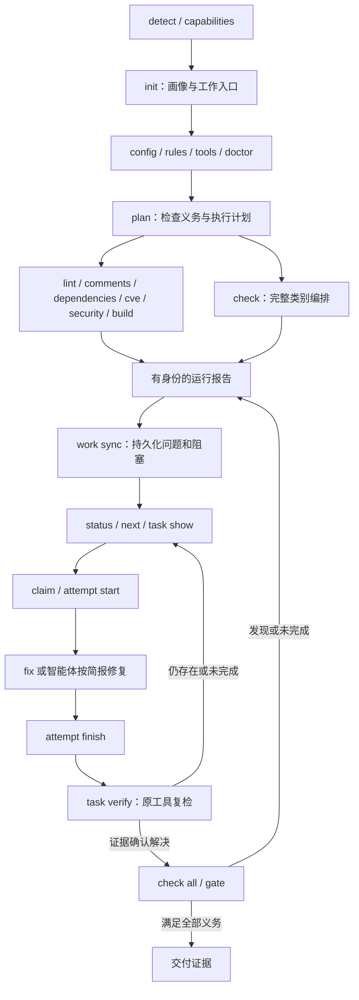
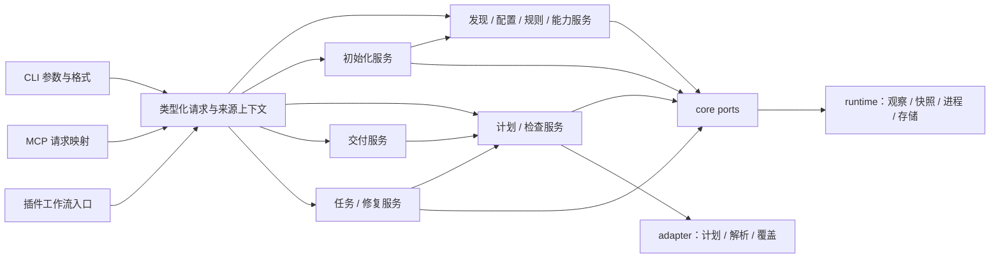
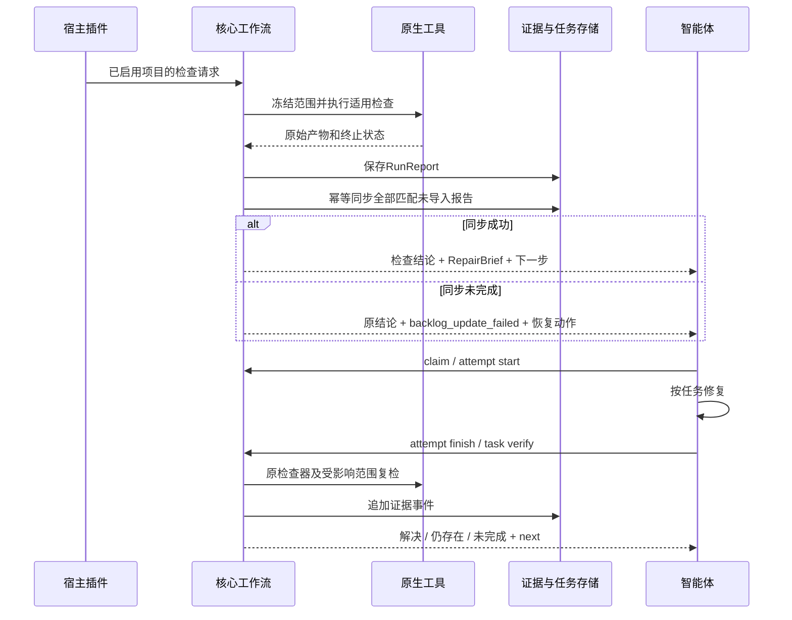

# Codeguard 命令架构：职责、价值与执行契约

状态：待实现设计，2026-09-24。本文逐项细化统一 Rust 二进制的目标命令，**不是当前 Python CLI 的使用手册**。规范事实源仍是 [现有 OpenSpec change](../../openspec/changes/introduce-rust-codeguard-cli/proposal.md)，不建立第二份实现任务清单。

读者是 CLI/适配器实现者、插件接入者和使用 Codeguard 修复项目的智能体。每条命令必须回答：为什么存在、选择什么对象、读写什么、输出什么证据、如何处理失败、下一步是什么。原生工具决定检查事实，批准策略决定检查义务，智能体依据证据修复。

## 1. 命令体系与协作路线



这是流程协作图，不表示每条命令在内部自动执行所有后继命令。独立 CLI 的 `check` 保存报告，`work sync` 更新任务；已启用插件在一次工作流中串起保存、同步和简报。`fix --apply` 与 `task verify` 内含必要复检；两者不是不受控的无限修复循环。

### 1.1 命令目录

下表 C01–C36 是文档追踪编号，不是对外子命令。每项在后文有独立契约。

| ID | 入口 | 用户获得的价值 |
|---|---|---|
| C01 | `help` / `--help` | 查询确实支持的参数和行为，避免智能体猜命令 |
| C02 | `--version` | 确认实际二进制身份和协议兼容范围 |
| C03 | `detect` | 观察项目语言、构建根与版本来源 |
| C04 | `capabilities` | 了解此发行版能适配的检查器；项目是否配置由 doctor/check 探测 |
| C05 | `init` | 建立项目画像、AGENTS 入口及持久修复工作区 |
| C06 | `plan` | 在执行前看清检查义务、范围、工具和缺口 |
| C07 | `doctor` | 将工具链和环境故障定位成可恢复的前置问题 |
| C08 | `rules list` | 查清实际规则的依据、来源与适用性 |
| C09 | `config validate` | 验证配置结构、引用和策略一致性 |
| C10 | `config explain` | 解释每项生效配置为何生效以及来自哪里 |
| C11 | `tools list` | 查看工具库存与项目所需工具 |
| C12 | `tools verify` | 检验实际工具制品是否符合锁定身份 |
| C13 | `tools install` | 将精确锁定的工具安装到受管位置 |
| C14 | `lint` | 检查编码规范与适用的静态质量规则 |
| C15 | `comments` | 检查可确定验证的注释与文档契约 |
| C16 | `cve` | 检查目标依赖图中的已知漏洞 |
| C17 | `security` | 检查源码、配置、敏感内容及入库安全规则 |
| C18 | `build` | 验证编译、构建一致性及策略要求的测试等级 |
| C19 | `check` | 编排指定语言的全部适用质量类别 |
| C20 | `gate pre-commit` | 检查这次实际将提交的 index 内容 |
| C21 | `gate pre-push` | 检查本次所有实际推送 ref 的内容 |
| C22 | `gate ci` | 对明确的不可变交付内容执行可信完整门禁 |
| C23 | `work sync` | 将全部未导入报告归并成稳定问题和修复任务 |
| C24 | `status` | 显示准备、检查、任务与证据新鲜度的分离状态 |
| C25 | `next` | 返回一个可推进动作及完整修复简报 |
| C26 | `task show` | 查看某项任务的证据、允许范围和历史 |
| C27 | `task claim` | 在同工作区取得有期限的任务租约 |
| C28 | `task heartbeat` | 续租并证明执行者仍持有当前租约 |
| C29 | `task release` | 释放协作占用，保留问题和历史 |
| C30 | `task attempt start` | 在修改前登记一次可追溯修复尝试 |
| C31 | `task attempt finish` | 记录实际变化、失败或无进展，防止无穷重试 |
| C32 | `fix` | 执行有界原生修复并复检结果 |
| C33 | `task verify` | 用证据判断任务是否满足关闭条件 |
| C34 | `mcp serve` | 向智能体提供同一核心能力的结构化入口 |
| C35 | `compat legacy-v1` | 显式承接旧调用协议，隔离旧语义 |
| C36 | `dependencies` | 识别依赖检查配置，运行已配置工具并反馈结果 |

### 1.2 容易混淆的边界

| 对比 | 职责区别 |
|---|---|
| detect / init | detect 返回观察结果；init 将画像、受管摘要和工作流配置形成可预览、可应用的产物 |
| capabilities / doctor / check | capabilities 回答发行版能适配什么；doctor 探测项目配置和工具条件；check 调用已配置工具并返回本次结果 |
| tools verify / doctor | 前者验证制品身份与兼容元数据；后者执行有界诊断，定位运行条件 |

`doctor [path] [--ruff-tool ABS_PATH] [--timeout DURATION] [--format human|json]` 已接入局部配置与 Ruff 版本诊断。默认不选工具；显式 Ruff 才在私有临时 cwd/日志中以固定版本参数、清空环境和共享截止时间运行，单探测最多 10s。脚本入口缺隔离时启动前拒绝。成功仅 observed_untrusted，readiness unknown、交付 not_evaluated，不安装、不扫描或写工作区；报告 doctor_observation 0.1 明确 persistence=not_saved。其它工具、可信前置映射及正式 PrerequisiteReport 持久化/同步仍待完成。

当前已接入 `tools verify [path] [--tool-lock-candidate FILE] [--managed-cache ABS_PATH] [--runtime ID=ABS_PATH] [--format human|json]` 的静态候选核验：逐项反馈入口/运行时/目录包的摘要及可执行位状态、issue 和恢复方向，不启动或安装工具。锁来源未核验，固定 incomplete、readiness=unknown、gate_effect=none；匹配仅 matched_untrusted，锁声明版本不代表本机启动观察。完整可信工具库存、兼容元数据、doctor 原生诊断及准备报告接线尚未完成。
| plan / check | plan 给出执行计划和未知项；check 执行计划并取得检查证据 |
| lint / build | 编码规范与编译构建分别有义务；构建成功不证明 P3C 等规则实际运行 |
| check / gate | check 默认冻结工作树；gate 冻结 index/ref/CI 指定内容，并执行交付上下文要求 |
| status / next / task show | 分别是全局概况、下一步选择、指定任务详情；都不自动领取或修复 |
| fix / task verify | fix 可以改源码并附带复检；verify 不改源码，只根据复检追加任务状态 |
| attempt finish / task verify | finish 记录尝试结束；只有符合证据条件的 verify/同步才能确认解决 |

## 2. 统一命令协议

### 2.1 参数与选择范围

- `[path]` 默认当前目录；先解析指定项目与构建根，不擅自扩大到上层工作区。共享目标发现与既有点路径政策，入库安全和配置发现例外保持。
- 检查类的 `<language|all>` 必填，接受注册表 canonical ID 与显式别名。`all` 是全部适用义务，不是安装所有语言工具；缺适配器不能删除义务。
- 查询/管理类支持 `--format human|json`；检查类另支持 `sarif` 与 `--output PATH`。不支持的格式在启动子进程前返回用法错误。
- 检查执行预算使用 `--jobs N`、`--timeout DURATION`、`--offline`；这些选项不改变质量要求。具体支持矩阵由同一命令 schema 生成，不能让无执行职责的命令接受后悄悄忽略。
- 不自动把 `audit`、`scan`、`repair` 等近义词解析成别的操作。初版没有独立 `test` 指令；策略要求的测试属于 build 义务，报告明确其等级。
- 命令解析只接受结构化参数；原生进程使用字面 argv。项目文本、诊断和任务 Markdown 不成为 Shell 模板或授权来源。

### 2.2 输出类型与退出语义

共用 `schema_version`、`report_type`、`operation`、`request_id`、`command_status`、`exit_code`、`warnings`、`next_actions`。检查报告继续使用既有 RunReport 顶层字段，如 `run_id/request/results/delivery_gate`，不为统一外壳丢失逐项证据。查询、计划、安装、修复及任务结果采用各自类型；不要求每个查询伪造空 findings。

`command_status=complete|incomplete|error|cancelled` 描述命令操作。一次检查发现违规仍可是 complete；报告另存 `completion`、findings 与 gate。`request_id` 标识请求，`run_id` 标识检查或诊断的证据生产运行，`task_id/attempt_id/lease_token` 标识协作对象；不能混用。

RunReport 与 doctor 的 PrerequisiteReport 均携带唯一 run_id、report_type、workspace/content/policy/tool 身份、观察范围及 freshness。导入幂等键为 workspace_id + run_id，另校验报告摘要；同键同摘要不重复写入，同键不同摘要拒绝并保留冲突。重新运行doctor产生新run_id，同一环境阻塞仍按稳定blocker身份合并，不制造第二张任务。

| 命令性质 | exit 0 的含义 | 典型非零 |
|---|---|---|
| 信息查询、plan、status、next | 请求的视图或计划已完整返回；允许明确含 unknown、待办和历史失败 | 无法读取必要来源为 3；坏参数为 2 |
| init | 计划或受管写入完成；readiness 可仍 incomplete | 写入冲突/部分落盘为 3 |
| doctor、config validate、tools verify | 本次所选验证条件满足；不是代码质量通过 | 必需条件缺失、配置无效或制品不匹配为 3 |
| 检查、gate、task verify | 选中义务完整且无阻断违规 | 违规 1，必需检查未完成 3 |
| sync、租约、attempt、安装 | 指定状态操作完成；尚有问题不改变此成功含义 | 存储、租约或安装未完成为 3 |
| fix --dry-run | 完成修复预览，不证明修复成功 | 无法得到可信预览为 3 |
| fix --apply | 应用流程和规定复检完成且无阻断违规 | 仍有违规 1，应用/复检未完成 3 |

全部操作保留 2 用法错误、4 内部故障、130 取消。执行后优先级：取消 > 内部故障 > 未完成 > 违规 > 成功；原生 raw_exit_code 独立保存。查询无法形成可信结果时不能以“已经输出错误信息”为由 exit 0。

只有 `check all` 与 `gate` 可以评估整份交付 contract。`check all` 的 allow 只绑定工作树快照，不能当作 index/ref/CI 收据。其它命令顶层不签发交付 allow；status 可展示带来源、身份、时间的历史决策，必须另示当前 freshness。无适用对象不能生成 allow。

JSON stdout 恰好一个完整文档；日志进 stderr/私有证据。MCP stdio stdout 则保留给协议消息，不直接打印 CLI JSON。公开记录脱敏；结构化 `next_actions` 带作用、前提和 argv，不将诊断原文直接升级为建议执行的命令。

### 2.3 副作用分级

| 类别 | 命令 | 允许的副作用 |
|---|---|---|
| 静态观察 | help/version、detect、capabilities、plan、rules、config、tools list/verify、status/next/show | 读取允许范围；不执行项目脚本、扫描或安装 |
| 初始化 | init dry-run / apply | dry-run 不写工作树；apply 精确写计划内画像、AGENTS 受管块、工作流记录 |
| 运行诊断 | doctor | 有界探测、私有诊断；不安装、不执行完整构建/扫描 |
| 证据执行 | 六类检查、三个 gate、task verify | 物化快照、运行工具、保存报告与缓存；verify 还追加任务事件 |
| 工作区协作 | sync、claim/heartbeat/release、attempt | sync/attempt 更新事实与投影；正常租约仅写本地 state，过期恢复另记abandoned事件，不修改源码/策略 |
| 显式安装 | tools install | 只写工具锁指定且授权的受管工具位置 |
| 受控修复 | fix dry-run / apply | dry-run 可在私有隔离副本运行修复器；apply 校验身份后修改允许文件并记录尝试 |
| 协议入口 | mcp serve、compat | 调用被映射操作；协议启动成功不等于检查成功 |

原生构建/扫描可能执行项目插件，普通本地隔离目录不等于安全沙箱；网络和可信 CI 边界遵循 [执行内核设计](technical-design.zh-CN.md)。未初始化时允许执行检查并保存私有报告，不静默创建 tracked 工作区。要求持久任务的命令须明确报告 workspace_not_initialized。

### 2.4 执行预算与默认值

以下为初版设计默认值，实施时必须随命令schema/version固化，并通过真实项目测量验证；不宣称适合所有项目。运行参数优先级为 CLI > 已登记环境变量 > 项目运行默认 > 发行内置默认，报告记录最终值和来源。未知环境变量不成为隐式开关。

当前 Rust 局部检查入口已登记 `CODEGUARD_TIMEOUT`，与 `--timeout` 使用相同的 ms/s/m/h 格式及 1ms–24h 边界。项目可选 `.codeguard/runtime.json` 作为更低优先级的运行默认值；文件必须是非链接的有界普通 JSON，只接受以下版本化结构，不由 `init` 自动创建，也不能写质量排除或批准字段：

```json
{"schema_version":"1.0","document_type":"codeguard_runtime_options","timeout":"5m"}
```

`check all` 已扩展并行预算：`--jobs N`、登记的 `CODEGUARD_JOBS` 或 `.codeguard/runtime.json` 1.1 中可选的 `jobs` 取值为 1–64；默认 `min(4, max(1, 可用CPU并行度))`。1.0 文件仅有 `timeout`，保持原含义；1.1 文件仍要求 `timeout`，可附 `jobs`。每个字段按 CLI > 登记环境变量 > 项目运行默认 > 内置默认选取。任一字段需要项目默认值时，一次读取并严格校验整份文件；两个字段均有较高优先级来源时不读取项目文件。选中的非法值、坏协议、额外字段、链接或过大文件在原生执行前拒绝。公开反馈分别记录 timeout/jobs 的值与来源、并行上限、可执行原生任务数和真正启动数。混合 Python/Rust/Go/Java 项目可调度对应的独立原生节点；Go 工具通过 `--go-tool ABS_PATH` 显式选择；Java 当前只运行已配置的 P3C 十规则集声明的隔离单文件探针，不能代表完整 lint。真实并发与跨进程资源互斥尚待专项验收，全部 I/O 硬截止时间仍待实现。

| 运行类别 | 整次操作默认timeout | 默认并行度 / 可覆盖选项 |
|---|---|---|
| 六类检查、三个gate | 30分钟 | `min(4, max(1, 可用CPU并行度))`；支持 `--jobs`、`--timeout`、`--offline` |
| doctor | 2分钟；单个探测上限10秒且受剩余总预算约束 | 1；支持 `--timeout`，不隐式发起联网探测 |
| fix（预览或应用）、task verify | 30分钟，含规定复检 | 修复写入串行，验证沿检查并发配置；支持 `--timeout`、`--offline` |
| tools install | 10分钟 | 安装制品串行；支持 `--timeout`、`--offline`，离线只能使用已验证本地制品 |

timeout包含等待资源锁、快照、探测、执行、解析、持久化和清理预算；子任务/重试继承剩余deadline，不能每次重新获得30分钟。取消/超时触发进程树终止与回收；强制清理预留在总预算内，操作系统无法按时回收时明确cleanup_pending，不伪称完成。后台服务mcp serve本身无检查deadline，但每个请求必须按同一类别有界。

`--timeout`接受正数及ms/s/m/h单位，`--jobs`接受正整数；0、负数、未知单位或不支持的选项为2。不得以无限timeout隐藏无进展，也不得因缩短预算改变必需义务。工作区租约默认5分钟，插件建议每60秒heartbeat；长运行的FixService/验证服务负责内部续租，失租停止应用与状态提交。续租不能重置attempt预算。

## 3. 发现与准备命令

### C01 — help / --help

- **语法与价值**：`codeguard help [command...]` 或命令末尾 `--help`；提供参数、默认值、格式、退出码及最小示例，减少猜测调用。
- **行为与输出**：由命令 schema 生成静态帮助，不要求项目有效、工具已安装或网络可用。JSON 帮助如未在 schema 提供，明确拒绝，不能伪装支持。
- **失败与后继**：未知命令返回 2，列出合法入口；帮助成功不创建画像、不启动检查。

### C02 — --version

- **语法与价值**：`codeguard --version [--format human|json]`；显示 CLI 版本、构建目标、构建身份、协议 major 和规则包兼容范围，定位插件实际绑定的二进制。
- **行为与输出**：读取嵌入的发行元数据，不能联网查询 latest 或自行更新。工具、适配器实际状态继续由 capabilities/tools 给出。
- **失败与后继**：合法版本查询正常 exit 0；版本相等不是文件完整性或真实工具验收证明，继续 tools verify/doctor。

### C03 — detect

- **语法与价值**：`codeguard detect [path] [--format human|json]`；快速观察语言、方言、多构建根、清单、声明版本与源集，供 init/plan 复用。
- **输入与结果**：读取批准范围中的清单、锁与源文件特征，返回 DiscoveryReport、证据位置、未知项和观察覆盖。不执行 wrapper 或读取整台机器的开发环境。
- **副作用与失败**：不写画像/AGENTS/任务。可完整回答“存在无法静态解析的条件”时 exit 0；权限错误导致必要发现范围不可读时 exit 3，并显示部分结果。
- **下一步**：需要持久接入用 init，需要知道规则能力用 capabilities，需要执行前计划用 plan。

### C04 — capabilities

- **语法与价值**：`codeguard capabilities [language] [--platform ID] [--category ID] [--format human|json]`；回答这个发行版在语言 × 类别 × 工具 × 平台上承诺什么。无筛选 JSON 返回完整能力矩阵；带筛选 JSON 返回发行版本和所选单元。
- **输入与结果**：读取发行注册表和适配器描述，返回支持/候选/计划状态、工具约束、输入粒度、报告与修复能力、已验证组合和缺口。尚未验证的工具约束或报告能力保持 gap/unknown，不从旧 lint 命令推断为已实现。
- **副作用与失败**：不探测项目、不安装工具；注册语言 planned 仍可查询成功，不能把 planned 写成已可运行。未知语言为 2；注册表损坏为 4。
- **下一步**：用 doctor 判断当前项目是否满足已实现能力的前置条件。没有实现的适配器不会因安装工具自动获得能力。

### C05 — init

- **语法与价值**：`codeguard init [path] [--dry-run|--apply] [--format human|json]`；省略模式为 dry-run，建立持久项目画像与智能体工作入口。
- **输入与结果**：复用 detect，生成带证据的语言/版本/构建/架构画像、分类型模块图、规则映射、准备任务、AGENTS 受管摘要和精确文件差异。MVC/DDD 等推断不自动成为强制约束。
- **副作用与失败**：apply 才写入自有工作区和受管摘要，保留人工文本；重复执行按输入身份刷新而不清空历史。冲突/部分写入为 3。dry-run 的任务只出现在计划里。
- **下一步**：返回 init_status 与独立 readiness；已授权插件继续 doctor/check/sync/next。完整契约见 [初始化设计](project-initialization.zh-CN.md)。

### C06 — plan

- **语法与价值**：`codeguard plan <lint|comments|dependencies|cve|security|build|check> <language|all> [path] [--format human|json]`；明确“应该检查什么、如何执行、哪些信息还缺失”。
- **输入与结果**：新鲜观察、可信策略、原生配置与工具锁形成全量义务，再选择适配器及任务 DAG。每项列目标、规则、工具身份、前置依赖、网络/资源需求、预计写入位置、缓存使用条件与未解析部分。
- **副作用与失败**：不运行检查器、解析构建模型的项目脚本、下载或安装；没有运行过就不给虚构耗时和命中率。完整返回含 blocker 的计划可以 exit 0；必要输入损坏、读不到可信策略为 3。
- **下一步**：doctor 恢复前置条件，再执行对应检查。执行时重新核对输入身份，不能直接使用过期计划。

当前相邻 Rust CLI 只实现 `plan_preview` 0.1：通过静态发现展示已观察的检查器配置、选中类别及待定候选；可信政策、工具锁与内容身份缺失时 `policy_identity=null`、`obligations=[]`，候选无执行命令，返回 3。它不是本节要求的正式计划或义务 DAG；见相邻 `codeguard-cli/tests/acceptance/plan-readonly-preview.md`。

### C07 — doctor

- **语法与价值**：`codeguard doctor [language|all] [path] [--format human|json]`；省略语言为 all，定位工具链、配置可加载性和执行环境问题。
- **输入与结果**：依据适用检查义务诊断必需运行时、制品、目标版本、权限、必要环境变量是否存在、漏洞库身份/时效及离线能力，返回 PrerequisiteReport 和结构化恢复动作。
- **副作用与失败**：只执行适配器声明、已解析身份、预算内的诊断命令；不得把任意项目 script 的 `--version` 当无副作用操作。需执行项目控制逻辑而缺少明确执行范围时标未完成，不隐式构建、安装或启动服务。默认不远程连通性探测、不读取凭据值。
- **下一步**：必需项缺失/未知为 3，可选工具缺失不误阻塞；生成可供 sync 消费的准备证据。恢复环境后重新 doctor，并运行原来被阻塞的检查；doctor 通过不证明源码质量通过。

当前局部实现：`doctor [path] --ruff-tool ABS_PATH` 仅支持显式 Ruff 版本诊断及静态配置观察。0.2 报告在已绑定工作区自动保存并同步环境调查任务；未选择工具不产生缺失任务，版本恢复不自动关闭原任务。落盘 queued 报告保持不可变，对话另显示同步状态。`task verify` 已接同一局部版本诊断和摘要绑定事件，`next` 能解释恢复但策略未核验；可信必需项/全工具准备报告及正式关闭仍未接通，不能将该切片当成上面的完整命令能力。

### C08 — rules list

- **语法与价值**：`codeguard rules list <language|all> [path] [--format human|json]`；显示此项目有效规则及解释，避免只看规则名称猜检查内容。
- **输入与结果**：读取 rulepack/工具锁、批准策略和原生配置，列出 Codeguard/native rule ID、来源版本、类别、严重度、适用条件、规则依据、修复指引、已批准 suppression/例外及原因。
- **副作用与失败**：只读。动态条件未解析时标候选；不能凭名称宣称已执行 P3C。关键规则包缺失或摘要错误为 3，完整视图可带不适用规则而 exit 0。
- **下一步**：config explain 解释来源冲突，plan 显示规则实际绑定的检查任务；本命令没有 enable/disable/approve 副作用。

当前局部实现：Rust `rules list <language|all> [path] --format human|json` 已复用静态发现，分别展示检查器配置声明、内置 Ruff F401/E501 候选映射的版本/来源/许可/摘要，以及逐语言六类规则目录缺口。Node 检查器明确归属旧登记中的 TypeScript 生态。即使 Ruff 配置为 configured，具体规则启用仍 unverified、执行 not_run、批准 unverified；动态 ESLint 配置不执行。项目内同名 rulepack 或 approved 字段不能替换内置映射。报告0.1固定 incomplete/退出3、gate_effect=none；不是完整项目有效规则集合。可信工具锁/政策、各生态完整目录、原生逐文件有效配置、suppression及已批准例外解释仍待接入，4.7保持未完成。

同属 C08 的 `codeguard rules whitelist list [path]`、`explain <decision-id> [path]` 为只读查询；`propose <finding-id> [path] --format json` 仅在本轮完整原生身份可核验时生成含精确身份、复现依据、期限建议的候选，不写有效政策或自批。当前 `propose` 0.3 只实现证据预览：从最新已同步且源码、配置仍匹配的 Ruff 报告显示本地观察到的工具/配置摘要、原生工具版本与 F401/E501 的候选规则映射摘要；报告未同步、损坏或原问题消失时不沿用旧证据。它返回原工具复检命令、仍缺的**已批准**规则包身份和 `candidate=null`，不能生成可审批文件。候选、已批准、过期、失配分别展示原因；批准引用及真实生效范围由 `config validate/explain` 核验。设计见 [误报白名单](false-positive-allowlist.zh-CN.md)。

### C09 — config validate

- **语法与价值**：`codeguard config validate [path] [--format human|json]`；在昂贵检查前发现配置错误和未经允许的策略弱化。
- **输入与结果**：校验 codeguard.json、lock、被引用的规则和原生配置的 schema、类型、引用身份、版本兼容及批准策略约束；返回逐路径/字段的诊断。
- **副作用与失败**：不修配置、不把旧未知字段静默丢弃、不运行构建；静态无法完成的动态配置验证明确未完成。无效配置、必要引用缺失或未获批准的覆盖为 3，不报告源码违规。
- **下一步**：根据 config explain 的来源定位修复。结构正确不证明策略修订已获批准，也不证明原生检查器确实加载规则。

### C10 — config explain

- **语法与价值**：`codeguard config explain [path] [--format human|json]`；回答“为什么这项规则或范围生效”。
- **输入与结果**：返回每项运行参数、质量策略、工具锁和原生配置值的来源、覆盖关系、批准依据、拒绝的覆盖及 suppression 差异。凭据值脱敏，只展示引用名称。
- **副作用与失败**：只读。无法解析某层时给出可用的部分来源及 3，不能把默认值冒充最终有效值；已完整解释现存待办不等于修改配置。
- **下一步**：修复错误配置或提交具体的政策变更需求；Codeguard 不让智能体通过改任务文件完成政策批准。

### C11 — tools list

- **语法与价值**：`codeguard tools list [path] [--format human|json]`；对照项目工具锁显示必需/可选工具、版本约束、受管缓存及项目/系统候选。
- **输入与结果**：静态读取锁和库存，区分声明、已找到、未找到、尚未验证。未初始化项目仍可读取合法 codeguard 配置；缺少锁就明确声明“仅候选库存”。
- **副作用与失败**：不执行候选二进制、不下载、不选择较宽松版本。库存完整显示缺工具可 exit 0；库存必要元数据不可读为 3。
- **下一步**：tools verify 证明制品身份，doctor 判断能否运行，tools install 安装明确锁定的缺项。

当前局部实现：`tools list [path] [--tool-lock-candidate FILE] [--managed-cache ABS_PATH] [--runtime ID=ABS_PATH] [--format human|json]` 复用静态制品核验，列出声明版本、适配器/规则来源、独立运行时/工具包及当前平台缺口。其它平台保留声明但不检查制品。输出固定 `inventory_scope=declared_lock_only`、`required_inventory=unverified`、`required_by_policy=null`、readiness unknown 与退出 3；不是完整受批准必需库存，不启动/安装/写工作区。

### C12 — tools verify

- **语法与价值**：`codeguard tools verify [path] [--format human|json]`；验证工具锁要求的实际制品、规则包及声明运行时身份，防止 PATH 漂移。
- **输入与结果**：逐项核验版本元数据、平台、摘要、允许来源和可信发行证明；返回匹配、缺失、不兼容或篡改证据。只核验代码字节和元数据，不执行待核验项目脚本。
- **副作用与失败**：不下载安装；必需锁缺失或任一必需项不匹配为 3。工具身份一致不证明工具可启动或规则实际执行。
- **下一步**：缺制品用 tools install，身份正确但运行条件不明用 doctor。不能静默降级到随机系统版本。

### C13 — tools install

- **语法与价值**：`codeguard tools install --lock PATH [--dry-run|--apply] [--format human|json]`；省略模式为 dry-run，统一补齐已选定且可校验的工具链。
- **输入与结果**：精确工具锁和实际平台生成下载/安装清单，包括来源、摘要、目标目录、预计副作用及不支持项；apply 返回逐工具安装及验证状态。
- **副作用与失败**：dry-run 不联网安装；apply 才下载至受管临时位置、校验后逐制品原子发布并再次验证。不能写全局 PATH、自动提权或通过任意安装脚本接管系统；需要特殊安装程序时返回单独准备动作。锁本身必须来源可信，任意 URL+自写摘要不是授权。
- **下一步**：部分失败为 3并保留已验证的安装结果；不得留下冒充可用的半成品。随后 doctor 确认项目可使用它们；check/doctor 不隐式调用此写入操作。

当前局部实现：`tools install --lock FILE [path] [--dry-run|--apply]` 共用声明库存/制品观察，默认预览。候选计划列出摘要、缺口、平台及恢复动作；可信锁/发行来源未绑定时 apply 返回 blocked_before_mutation、writes_performed=false 和退出 3，不调用发布 API。完整可信下载/发行包/正式 apply 尚未实现。

## 4. 原生质量检查命令

以下六条共享语法：`codeguard <command> <language|all> [path] [--format human|json|sarif] [--output PATH] [--jobs N] [--timeout DURATION] [--offline]`。共享执行链为：建立义务 → 冻结内容 → 核验政策/工具 → 执行 DAG → 专用解析与覆盖核验 → 报告。全程不修改真实源码或 index，不自动同步 tracked 任务。

### C14 — lint

- **价值与范围**：执行已批准的编码规范、格式检查及一般静态质量规则。例如 Java 官方 P3C/PMD 与 Checkstyle 分开登记；格式器只有经验证的只读 check/diff 模式才计入相应能力。
- **输入与输出**：依据语言版本、模块、source set 和原生配置选择兼容适配器；每条 finding 保留 native rule ID、位置、规则依据和证据。相同原生执行可供其它类别取证，但不能凭类似文案随意去重。
- **失败与后继**：违规为 1；缺配置、解析失败或工具崩溃为 3，不能让通用 error 字样决定违规。转 work sync/next；支持确定性原生修复时再 fix。

当前 Rust `lint python` 局部实现仍固定退出 3；已初始化项目在原生 Ruff 扫描后自动保存 0.8 本地报告、同步，再把 `next` 只读简报嵌入公开对话反馈 0.10。完整文件携本轮工具与配置摘要、逐文件原生设置、F401/E501 候选规则映射及 `--ignore-noqa` 对照观察。仅被源码注释抑制的文件标记 `suppressed`，不标普通 `passed`；对照差额独立于活动 finding，不会自成白名单或门禁。规则是否全局启用及逐文件配置忽略可见，但受批准规则集合与完整覆盖仍未核验，固定 `coverage_proven=false`。同步或简报读取失败分别标明状态，原生诊断仍展示。这不等于 C14 的完整类别门禁或插件宿主接线。验收见相邻 `codeguard-cli/tests/acceptance/{lint-python-auto-brief,ruff-observed-artifact-identity,ruff-rulepack-observation,ruff-effective-settings-observation,ruff-native-suppression-observation}.md`。

Rust CVE 局部入口 `codeguard cve rust [path] --cargo-audit-tool ABS_PATH --db ABS_PATH [--timeout 30s] --format json` 只调用显式原生 `cargo-audit` 与显式离线 RustSec 数据库，不隐式下载。它核对原生漏洞与本轮 `Cargo.lock` 的精确包名、解析版本、来源及校验和；私有来源只显示摘要。`check all [path] --cargo-audit-tool ABS_PATH --rustsec-db ABS_PATH` 现将同一局部观察作为独立的 `rust.cve` 节点，向 JSON、human 与 SARIF 反馈 advisory 和未完成原因。原生 JSON 即使报告零漏洞，若数据库提交/更新时间缺失或来源时效未经可信边界核验，反馈仍为 `database_freshness=unverified`、`not_evaluated`、退出 3。此入口尚未完成正式策略、全构建组合、稳定任务与复检、白名单生效；也不检查 yanked 包。验收见相邻 `codeguard-cli/tests/acceptance/cargo-audit-native-observation.md` 和 `check-all-cargo-audit.md`。

当前另有 `codeguard lint go [path] --go-tool ABS_PATH [--timeout DURATION] --format human|json` 的局部入口，显式调用 Go 1.23.4 原生 `go vet -json ./...`。Rust 清空继承环境并关闭模块网络/工具链自动下载，使用私有 Go 缓存，执行前后核对工具、`go.mod`、可选 `go.sum` 和已发现源码的内容摘要。对话反馈展示原生规则与行列，不把原生消息文本当作指令；原生 JSON 中违规即使退出 0 也不会被判为干净。工具缺失、版本不符、编译错误或坏报告保持未完成。所有结果固定退出 3、`delivery_decision=not_evaluated`、`coverage_proven=false`；已接入 `check all` 局部汇总；已自动保存并同步本地任务，next 提供 Go 环境/源码指引；task verify 已支持 Go 原工具局部复检；尚缺正式关闭/重开、受批准工具锁/策略和 Go 注释检测。见相邻 `codeguard-cli/tests/acceptance/go-vet-json-local-probe.md`。
当前局部入口逐一进入已发现的 Go Module 根运行 vet，并在 0.6 反馈中列出每模块状态；某模块失败时保持未完成，已完成模块的本轮 finding 仍显示。原生诊断若指向未纳入本轮源码发现的文件或归属别的模块，则该模块未完成；源码、各模块清单或工具在执行中变化则丢弃本轮 finding。多模块运行仍未证明 build tags、平台/CGO 组合或受批准的全项目覆盖。

当前 `check all/java` 增加 `--format sarif` 的局部输出：从同轮 `check_feedback` 或 `check_aborted` 读取已观察的原生 finding，保留未完成状态与非零退出码，公开结果只给散列身份和固定提示，不复制原生诊断文本、路径或证据。零 finding 仍为 `executionSuccessful=false`，不能视作通过；未归属 CVE advisory 和依赖图节点不伪装为已确认 finding。其 JSON/SARIF 局部报告也可使用 `--output PATH` 同目录暂存与原子写入；写入失败后 stdout 仍保留报告，并以受限原因码标明 `export.status=failed`，不会覆盖已有源码文件。成功文件与 stdout 均标记 `saved`；未请求导出标记 `not_requested`。当前局部反馈协议为 JSON 0.22/故障 0.4，SARIF 在 run 属性中保留同义导出状态。human 和其它检查类命令尚无导出入口。它不等于完整 RunReport 或可信交付认证，见相邻 `codeguard-cli/tests/acceptance/check-partial-sarif.md`。

当前另有 `codeguard lint java FILE --maven-tool ABS_PATH --java-home ABS_PATH --maven-repo ABS_PATH --repo-sha256 SHA256` 单文件局部入口。Rust 在私有临时项目离线调用 Maven PMD 3.11.0 与 P3C 2.1.1 的固定命名规则集；原生违规在 human/JSON 对话反馈中展示规则及位置，缺报告或执行故障不被解释为源码违规。干净 XML 没有文件覆盖证明，因此显示 `clean_scope_unproven` 而非 PASS；工具/策略批准和完整 Java 义务未绑定，固定退出 3。真实违规与干净样本见相邻 `codeguard-cli/tests/acceptance/java-p3c-cli-native-local.md`。这不是 C14 目标的目录/模块级执行，也不替代 Java Checkstyle、Javadoc、CVE 或安全检查。

### C15 — comments

- **价值与范围**：验证公共 API 文档覆盖、参数/返回/异常标签、链接与语法等可确定规则；按目标语言区分继承文档、生成代码、宏/注解生成成员。
- **输入与输出**：规则包声明哪些源集、可见性及文档义务适用；用原生文档工具或有验收证据的 AST 检查器取证，输出违反的具体文档契约。
- **失败与后继**：没有适配器是能力缺口，不等于“不需要注释”。纯主观文风意见不直接形成阻断发现；修复应补足真实语义，不能生成空话注释来骗覆盖率。之后原 comments 工具复检。

当前Rust局部入口：`comments rust [path] --cargo-tool ABS_PATH [--timeout DURATION] --format human|json` 使用共享runtime执行原生锁定离线库目标探针，绑定清单/锁/已发现源码/工具并复核原生目标；缺工具、坏报告或输入变化为未完成，取消优先返回130。反馈0.4绑定原生UTF8源码范围，行移动不按序号替换候选身份；重复声明归属不明时保留歧义观察、不分配正式ID。逐发现增加七项修复简报：证据、规则依据、修改范围、步骤、原工具复检、未接通的历史状态和关闭条件；完整局部观察给限定源码指引，输入变化或歧义只要求调查/重扫且修改范围为空。给出规则/位置及原工具复检，coverage_proven=false、交付not_evaluated。已初始化工作区自动保存绑定报告并同步稳定问题、任务及观察，重复扫描不重复建任务；输入失配、歧义或原生未完成生成准备任务。next识别文档任务并指向task verify；同轮普通/force-warn原生对照分别核验范围、指纹和唯一输入归属，区分问题仍在、抑制待审及待策略核验的缺失候选，记录复检事件和关联尝试，任务仍open。源码allow可能隐藏诊断，零诊断不算修复或批准例外。原项目生效规则、完整构建组合、正式关闭重开和宿主仍缺；7.1不勾选。验收见相邻codeguard-cli/tests/acceptance/rust-comments-cli.md。

### C16 — cve

- **价值与范围**：审计项目真实依赖图的已知漏洞，覆盖策略规定的直接/传递、运行/开发/构建依赖范围，不审计宿主恰好安装的无关包。
- **输入与输出**：清单、锁、可证明的解析图和有身份/时效的漏洞库；结果包括生态、组件版本、advisory、依赖路径、原生严重度、修复版本信息及匹配确定性。
- **失败与后继**：网络、库过期、版本解析或匹配不确定为 incomplete并保留已确认发现，不虚构 CVE。离线同样核验库新鲜度。依赖升级由独立 fix 计划或任务处理，升级后的 CVE 与受影响构建必须复检。

### C36 — dependencies

- **价值与范围**：对每个构建根识别依赖图、版本、许可证、SBOM 和来源检查的配置；运行已配置且可用的原生检查器。未配置项给出建议，不因候选目录中有该检测族就自动要求执行。此命令不能据此宣称无 CVE。
- **输入与输出**：锁文件、构建配置和经受控解析的 effective graph；结果逐检测族保留组件坐标、解析路径、scope、规则身份和来源证据。不同构建根与源集不能由主语言的一个清单代替。
- **失败与后继**：动态版本、私服不可达、父 POM 缺失、图不完整或报告范围未知为 incomplete。已确认的版本或许可证问题仍保留，修复后由原生工具复检依赖、CVE 和受影响构建。

### C17 — security

- **价值与范围**：执行源码安全、配置/IaC、secret 内容及入库路径规则；不同规则具有不同的证据与扫描边界。
- **输入与输出**：源内容、配置和可信规则包，报告缺陷位置或脱敏敏感证据；命中 `*.pem` 等禁止入库路径只能称 repository_policy_violation，不能仅凭文件名断言泄露私钥。
- **失败与后继**：原生语义不明确或覆盖不足为 3。点路径、受管记录、生成文件不能成为入库安全逃逸位置；scope 必须按该类政策计算。任务引导修补漏洞/移除敏感内容；如需外部凭据轮换，明确恢复步骤，不把删除字符串称为已轮换。

### C18 — build

- **价值与范围**：验证依赖解析、编译、类型、打包和明确要求的生命周期检查，发现单文件 lint 无法证明的模块兼容问题。
- **输入与输出**：构建根、wrapper、目标运行时、profile/feature/target 和可信命令配置，返回逐阶段结果与 build_level、test_execution。保留已确认的静态构建默认；策略要求测试时必须执行。
- **失败与后继**：有可信编译诊断的源码错误可为 finding；磁盘不足、缺 JDK、下载失败是环境未完成。原生构建成功不能证明全部质量规则加载或测试已执行；无法核验阶段覆盖仍为 3。构建计划影响闭包决定修复后复检范围。

当前 `build rust [path] --cargo-tool ABS_PATH` 只实现锁定、离线、全部目标且默认 feature 的原生 Cargo 类型检查；报告明确 `build_level=type_check`、`test_execution=false`。已初始化项目将可归属编译错误及缺工具等环境阻塞同步到稳定任务，`task verify` 调用同一 Cargo 复检，零诊断仍需核对策略与覆盖。完整 workspace、feature/target 组合及测试义务尚未建立，不签发构建通过或交付允许。

### C19 — check

- **价值与范围**：探测 lint/comments/dependencies/cve/security/build 的项目配置，组合已配置检查器与批准策略明确要求的检查；统一解决多工具启动、依赖顺序和结果聚合。
- **输入与输出**：逐项返回 `configured/missing/invalid/unknown`，已配置项附本次原生诊断或工具故障。候选目录不自动变成全量义务；策略必需项单独标注。宿主将结果摘要、位置或组件、修复建议及复检命令呈现在智能体对话。
- **失败与后继**：相互独立的检查继续收集证据；依赖失败的检查明确 incomplete，不跟着消失。mixed finding+missing tool 返回 3且保留二者。`check java` 只报告该语言；初版只有 `check all` 评估全项目交付 contract。
- **下一步**：独立 CLI 保存运行报告后可 work sync；已启用插件自动 sync并返回简报。工作树 allow 有内容与政策身份，不等于允许不同 index/ref 提交。

当前局部实现：`check java [path]` 已复用 `check all` 的 Java/P3C 原生节点、工作区同步与 Java 任务简报；即使混合项目中存在 Python/Rust 源码，也只调度 Java 节点。`check_feedback` 0.22 对 `selection=java` 固定 `delivery_decision=not_evaluated`、退出 3，缺 Java 目标不作为通过。完整 Java 检查器集合、可信必需义务、工具/规则批准与交付聚合仍未接通。

`check all` 的 Rust 节点已在同一任务图和预算内分别调用原生 Cargo check、Clippy 和 rustdoc。类型错误只进入 `rust.cargo_check` 的构建观察和稳定任务，不混作 Clippy/注释违规；缺工具、坏报告、输入变化、超时或取消保留原生结果和具体未完成原因。对话同时展示原始发现及下一步，旧有 Clippy 任务仍优先呈现，构建任务可由 `next` 单独读取。反馈协议 0.28 增加严格的 `rust_build` 字段；任务同步不代表完整构建覆盖或交付门禁已通过。

## 5. 交付门禁命令

gate 与 check 使用同一个义务/适配器/报告内核，差异是权威内容来源、入口输入与可信政策上下文。严格交付中 deny/incomplete/internal_error/cancelled 均不能放行；真实 Git Hook 将非零映射为拒绝，宿主 Hook 依宿主协议转换，不能直接透传 CLI exit=2。

### C20 — gate pre-commit

当前 Rust 二进制只接入真实 index 的**路径安全预览**，可用 `--git-tool ABS_PATH` 指定 Git；它返回 3/incomplete/not_evaluated，报告尚未核验工具、对象内容或完整质量义务。下列是完整目标契约，不能用预览结果代替正式 Git Hook 门禁。

- **语法与价值**：`codeguard gate pre-commit [path] [--format human|json]`；核验将要提交的真实 index，避免工作树修好但暂存区仍旧错误。
- **输入与结果**：尊重 Git 工作目录、GIT_INDEX_FILE、部分暂存、初始提交与文件删除，冻结 tree/对象身份并执行完整交付 contract，返回 index 来源的 GateReport。
- **副作用与失败**：不 git add、不 stash、不覆盖用户 index；冲突条目、无法物化的必要对象或输入并发变化为 3。输入不是 Git 仓时不向上层工作区回退。
- **下一步**：失败说明具体源码任务或环境恢复动作；修复并按用户意图暂存后重跑。通过收据仅绑定被冻结的 index，不能防止 hook 之后任意外部修改；交付端须核对最终内容。

### C21 — gate pre-push

- **语法与价值**：`codeguard gate pre-push [path] --remote-name NAME --remote-url URL [--format human|json]`；stdin 为 Git 提供的 local-ref/local-OID/remote-ref/remote-OID 元组。
- **输入与结果**：CLI 先完整读取并验证输入，再将不可变推送集合交给 core；覆盖多 ref、非 HEAD 分支/标签、删除 ref和新 ref。remote URL 只作为上下文，不触发推送且公开输出脱敏。
- **副作用与失败**：不 git push、不默认 git fetch、不把 stdin传给探测器；本地缺必要对象时 3。每个新增/更新 ref 的全量义务保持，不用 HEAD 成功替代。删除 ref 显式记录不适用；全部删除不能签发源码质量 allow。
- **下一步**：修复实际被推送内容后重跑；真实 Hook 接线需原样传 remote 参数和 stdin。stdin缺失不能退化成检查 HEAD。

### C22 — gate ci

- **语法与价值**：`codeguard gate ci [path] --input PATH [--format human|json]`；用版本化请求文件明确 CI 本次认证的内容集合，避免 merge result 与分支头混淆。
- **输入与结果**：输入包含 schema_version、仓库身份、一个或多个不可变 commit OID、用途与预期内容来源；符号 ref仅作描述，不替代 OID。文件不授予政策权威，可信策略/工具锁由受保护接入独立提供。
- **副作用与失败**：不提交、不合并、不发布；无效参数 schema 在执行前为 2，无法获取必要对象/可信策略/执行隔离条件为 3。项目脚本不能改写可信验证器或最终状态凭据。
- **下一步**：按每个内容项和完整义务生成 GateReport；只有全部满足才 allow。失败把修复信息交回插件/CI展示；本地可写任务或缓存不能单独签发可信 CI 成功。

## 6. 问题工作区与协作命令

### C23 — work sync

- **语法与价值**：`codeguard work sync [path] [--format human|json]`；将原始运行结果转为稳定、可恢复的问题与任务。
- **输入与结果**：消费匹配工作区的全部未导入 RunReport/准备证据，逐项验证 schema、内容/规则/工具/政策/范围身份；返回导入、重复、历史、拒绝、问题新增/更新/重开/关闭计数及游标。
- **副作用与失败**：按 run_id幂等追加脱敏事件、重建任务投影并更新本地消费状态。旧报告只能进入历史，部分检查不按“没出现”关闭问题。单份报告事件提交与已消费标记形成可恢复事务；失败不能先推进游标丢掉事件，其他有效报告可先完成。
- **下一步**：next 获取动作。坏报告/存储失败返回 3并保留原始证据；再次执行从未完成单元恢复。同步成功不说明 backlog 已清空，也不重新计算质量 gate。

当前 Rust 局部实现消费已初始化工作区的 Python Ruff 本地报告 0.4/0.5/0.6/0.7/0.8；0.5 起对完整文件要求工具与配置摘要，0.6 对映射的 F401/E501 另外核验候选规则包身份与摘要，0.7 要求原生设置观察，0.8 再要求注释抑制对照且禁止把 `suppressed` 当 `passed`。缺字段、伪造覆盖或结构矛盾拒绝导入，旧报告不倒填身份。公开输出为 `work_sync_preview` 0.2，固定退出 3/`not_evaluated`。本地 Ruff 扫描已自动保存并同步，创建 finding 或环境 blocker、观察事件及任务，重复发现不改 tracked 任务；其它类别报告、关闭/重开、完整游标事务仍按上面的目标契约实施。`next` 已有只读局部简报预览，见 C25。

### C24 — status

- **语法与价值**：`codeguard status [path] [--format human|json]`；快速判断项目现在卡在哪里。
- **输入与结果**：只读汇总 initialized、画像 freshness、必需前置条件、最近运行的身份/覆盖、待导入报告、finding/blocker/任务状态、租约及冲突。
- **副作用与失败**：不 doctor、不扫描、不 sync、不修改状态。可返回“未初始化”或“还有10项问题”并 exit 0；无法读取可信视图时 3。
- **下一步**：返回精确缺项：先 init、先同步、先恢复环境、继续 next 或需要完整检查。历史 allow 必须标明证据来源及是否仍匹配，不能作为当前绿色徽标。

当前 Rust CLI 的局部只读视图已列出已初始化工作区的开放 finding/blocker 数量、每项受限摘要与 `next` 建议；待同步报告单独标识，空任务仍要求验证。画像及检查证据的新鲜度固定未核验，不展示历史通过。租约冲突、完整依赖、已关闭状态及历史 gate 收据仍待实现。

### C25 — next

- **语法与价值**：`codeguard next [path] [--format human|json]`；选择一个能够推进工作的动作，返回理由和 RepairBrief。
- **输入与结果**：依据任务依赖、严重度、准备状态、有效租约、动作历史与预算。优先解除影响多项检查的前置阻塞，但严重问题始终可见。返回 `disposition=actionable|waiting|needs_decision|verification_required|no_applicable_work`。
- **副作用与失败**：不领取、不运行动作、不更新过期状态；只做只读推导。无可行动任务与“全部通过”不同：全部被租用返回 waiting，预算耗尽返回具体决策，任务空但缺新鲜完整检查返回 verification_required。未初始化返回初始化动作/临时简报。
- **下一步**：actionable给出允许范围、规则证据、步骤、历史和复检条件；执行者另行 claim。只要完整回答就可 exit 0，不得让插件把 null task解释为允许交付。

当前 Rust 局部实现提供 `repair_brief_preview` 0.1：从 Ruff finding/blocker 记录生成静态有界简报，未同步报告先提示 sync；空任务返回 verification_required，缺配置与缺工具分别返回 needs_decision/actionable。任务 Markdown 不作为指令来源。Unix 本地实现还会展示受控 `action_id`、最近五次尝试、未结束尝试及同输入动作的无进展计数；预算耗尽后转 `needs_decision`。所有视图仍是 `local_unverified`/`not_evaluated`。完整依赖、可信策略新鲜度、跨类别选择与跨平台租约仍待实现；验收见相邻 `codeguard-cli/tests/acceptance/next-local-brief-preview.md` 和 `task-attempt-local-ledger.md`。

局部 `task verify` 新增原生 Ruff 复检观察事件后，`next` 会核对事件与保存的原生报告：已消失的问题转为待策略核验；源码变化后仍存在的同一问题，只有报告里的目标源码摘要仍与当前文件一致，才重新成为可执行任务，并展示复检 run/report 引用。源码再次变化会恢复待复检状态。Rust Clippy 任务也已复用租约、原工具复检与事件核对；仍有同一发现时保持待修复，零诊断时用同工具的原规则 `--force-warn` 作原生对照；重现诊断则核查抑制，两轮都未检出也仅作待策略核验候选，环境恢复也仅为待策略核验。`task attempt start` 拒绝非 actionable 简报，防止绕过复检直接重复修改；这些观察不构成正式关闭或 gate 放行。

### C26 — task show

- **语法与价值**：`codeguard task show <task-id> [path] [--format human|json]`；读取指定任务的完整修复上下文。
- **输入与结果**：稳定 issue、事件父关系、当前内容/政策身份和可重建投影，显示证据、状态、允许修改范围、依赖、尝试、关闭条件和租约。
- **副作用与失败**：不信任 Markdown勾选；任务不存在、事件链损坏或作用区不符返回 3，ID语法错误返回 2。resolved任务也保留历史和 freshness。
- **下一步**：claim后按简报修复，或原工具 verify；不能通过 show执行仓库诊断中的命令。

当前 Rust CLI 局部实现从结构化 fact 与最新复检事件生成 RepairBrief；任务 Markdown 只检查存在，不作为行动指令。非法 ID 返回 2，缺失或受限事实损坏返回 3；完整事件父关系、可重建投影和已关闭任务历史尚未验收。

### C27 — task claim

当前相邻 Rust CLI 在 Unix 实现了本地 `claim/heartbeat/release` 0.1 切片：按稳定任务 ID 锁定工作区状态，随机 token 仅返回给领取者，状态仅保存 SHA-256；同一 owner 不能复用旧 generation 的 token，并发领取只有一个成功。未结束尝试阻止正常 release；过期接管会先写入 `abandoned` 结束事件，失败则不换 generation。成功仅表示本地协作操作完成，`delivery_decision=not_evaluated`。跨平台实现、verify/fix 租约绑定及完整事件事务仍须完成，不作为 C27–C29 全量验收。

- **语法与价值**：`codeguard task claim <task-id> [path] --owner ID [--format human|json]`；防止同工作区两个执行者同时修同一任务。
- **输入与结果**：在跨进程锁下核对任务、前置状态与租约，返回不可复用的 lease_token、generation、expires_at和当前任务身份；owner是审计标签，单凭同名 owner不能操作新租约。
- **副作用与失败**：正常领取只更新本地 state。有效租约已存在为 3并返回等待信息，不强抢；过期租约若有未结束attempt，须先在可恢复事务中追加abandoned事件和预算记录，再换新generation。恢复存储失败返回3，不先取得新租约后假定历史已经补齐。
- **下一步**：携带token调用 heartbeat/attempt/release；租约不授权修改超出简报的源码，更不授予策略变更权。跨机器全局独占不在初版保证内。

### C28 — task heartbeat

- **语法与价值**：`codeguard task heartbeat <task-id> [path] --owner ID --lease-token TOKEN [--format human|json]`；续租当前仍有效的任务占用。
- **输入与结果**：锁内核对 token/generation、owner、作用区与到期条件，返回新的 expires_at。续租周期由工作流运行配置给出，不由质量阈值推导。
- **副作用与失败**：只改state。失效token、已过期/已替换租约返回 3，不能复活旧持有者；调用方停止继续写入，重新读取任务状态。
- **下一步**：继续当前有界尝试。heartbeat只证明协作存活，不能重置无进展预算或延长无限重试。

### C29 — task release

- **语法与价值**：`codeguard task release <task-id> [path] --owner ID --lease-token TOKEN [--format human|json]`；显式结束占用，允许下一个执行者接续。
- **输入与结果**：验证当前租约并返回释放状态；相同已完成释放请求可幂等重放，新租约存在时旧token不能释放它。
- **副作用与失败**：不关闭问题、不删除attempt。存在未finish尝试时正常release返回 3，要求先记录失败/blocked等真实结尾；崩溃后的到期恢复将其记abandoned。
- **下一步**：next继续其他任务或等待。release成功不证明修复完成。

### C30 — task attempt start

- **语法与价值**：`codeguard task attempt start <task-id> [path] --owner ID --lease-token TOKEN --action-id ID [--format human|json]`；在实际修复前记录本次准备尝试什么。
- **输入与结果**：action-id来自RepairBrief的受控动作/recipe标识；自由代码修复使用明确的manual-code-edit动作类型并引用任务允许范围。CLI观察前置内容和环境证据，生成attempt_id、动作指纹、前置摘要及可用预算。
- **副作用与失败**：追加开始事件；同任务只能有一项未结束尝试，过期租约、范围不符或相同动作预算耗尽返回 3。动作ID不可被调用方任意换名来重置预算，指纹由规范化动作、范围和输入决定。
- **下一步**：执行该修复，再finish。失败发生在运行修复器之前也必须记入历史。

### C31 — task attempt finish

- **语法与价值**：`codeguard task attempt finish <task-id> [path] --owner ID --lease-token TOKEN --attempt-id ID --outcome <ready-to-verify|no-change|failed|blocked> --note-code <source_edit|tool_restored|no_change|execution_failed|blocked> [--format human|json]`。
- **输入与结果**：精确匹配begin事件、作用区和租约，CLI观察后置内容/patch或相关环境探测证据；返回观察变化与执行者说明两份信息、耗用预算及下一步。
- **副作用与失败**：追加结束事件、更新任务投影；同attempt同结果幂等返回，冲突finish返回 3。若结束收据已落盘，原请求的重放仅返回该收据，即便租约后来到期也不再写事件或改变新租约；不存在已结束收据时必须持有当前有效租约。ready-to-verify只表示可进入复检，不能写resolved；调用方说no-change但实际有变化时拒绝该结果并要求重新说明。
- **下一步**：task verify取得证据。租约中断但尚未验证的修改保留，恢复协议记录abandoned及当前事实，不自动回滚别人修改。

当前 Unix 局部实现将 start/finish 写为 `.codeguard/findings/<task-id>/events/attempt-*.json` 不可覆盖文件，在同一任务锁内核对租约。`next` 展示受控动作和简短历史；同输入动作连续两次 `no-change/failed/blocked/abandoned`，或 `ready-to-verify` 后原检查仍显示问题/未完成，均计入无进展预算。`ready-to-verify` 必须先由原工具产生与该 attempt-id 绑定的可核对复检事件，下一次 start 才可继续；旧复检或丢失私有报告不能解除等待。环境修复不必通过源码改动证明进展。当前摘要只覆盖任务声明的源码/受影响路径，尚未绑定完整补丁、环境工具身份、正式 fix 服务及可信门禁；本地事件与退出 0 均不能关闭 finding。

## 7. 修复与复检命令

### C32 — fix

- **语法与价值**：`codeguard fix <language|all> [path] --category <lint|comments|security|cve> <--dry-run|--apply> [--task TASK_ID] [--owner ID --lease-token TOKEN] [--format human|json]`；调用已声明的确定性原生修复器，把可机械修复的问题安全落到代码。
- **输入与结果**：真实发现、匹配的工具/规则/内容、允许修改范围和recipe形成FixPlan。dry-run可在私有隔离副本运行修复器以产生真实补丁，但不改变项目源码、tracked任务或尝试预算；不能运行的预览明确为计划而非已生成补丁。
- **执行与副作用**：apply确认适用范围和前置哈希，已初始化时按同一租约/attempt协议登记，隔离执行→核对变化范围→逐文件安全应用→原工具及受影响义务复检→写尝试/验证事件。未初始化时保留私有操作证据和临时简报，不声称产生持久任务。
- **任务绑定**：`--task`将修复限定到该任务允许范围；它的语言/类别须与请求匹配。已有claim时必须同时传owner和token，复用租约但不接管已有未结束attempt；FixService登记自己的受控attempt，结束后不释放调用方租约。未持有租约时可只传task，由服务自行claim并在收尾时释放。已初始化且无task的批量apply先同步所用发现、映射受影响任务，并在同工作区事务中取得全部所需租约；任何冲突在应用补丁前返回3，不能悄悄跳过被占用任务。未初始化路径仅保留私有证据，不调用持久同步或任务租约服务；此时指定task须返回workspace_not_initialized。owner/token参数成对出现且要求task；dry-run只读任务，不领取或消耗预算。
- **失败与后继**：没有原生修复能力返回3及人工修复简报；不偷偷让模型改代码或转成关闭规则。并发修改、越界补丁、部分应用、复检超时分别记录；多文件写入不伪称全原子。只回滚自己拥有且未被后续改动的内容。
- **成功定义**：分别给出execution_succeeded、changed_files、verification和resolved_issue_ids；修复器exit0或无变化都不能得到fixed=true。存在其他必需违规时保留它们；单项修复成功不授权完整交付。

### C33 — task verify

- **语法与价值**：`codeguard task verify <task-id> [path] [--owner ID --lease-token TOKEN] [--format human|json]`；判断指定任务的关闭条件是否真的满足。
- **输入与执行**：依据issue、规则/工具/政策身份和影响闭包重建验证计划，冻结当前内容后运行原检查器。环境任务先验证恢复条件，再重跑原来受阻义务；探测到JDK不等于项目已能通过构建。
- **协作与副作用**：无租约时使用短期验证租约；若已有租约则要求对应token，不能冒用owner。不修改源码，持久保存运行报告并幂等同步相关发现和验证事件；结束时只释放本次自行取得的验证租约。
- **判定与失败**：完整证据确认解决才追加code_fixed/dependency_fixed/environment_restored等状态；目标删除和政策处置必须有批准且可核验的独立依据。仍存在为1；覆盖不足、工具不可用、并发变化为3。若原问题解决但复检引出其他违规，原任务可按证据关闭，新发现同步保留，命令仍按本次验证结果返回1/3。
- **下一步**：next推进剩余任务；无剩余任务也须check all/gate完成交付检查。不提供task close --force。

当前 Rust 局部入口支持 `codeguard task verify <CG-id> [path] [--owner ID --lease-token TOKEN] [--ruff-tool ABS_PATH] --format human|json`，复用 `lint python` 的原生 Ruff 路径并追加本地观察事件。无现有占用时 CLI 领取本地短期租约并在结束后释放；已有占用时必须借用匹配的 owner/token，错误 token 或无凭据的冲突请求在扫描前返回 3。扫描与事件写入之间再次核对 generation/token/期限及待验证 attempt-id，失租或新尝试插入时不提交复检事件，借用租约始终保留给调用者。验证事件 0.3 记录 attempt-id 或 null；报告丢失时不能消费旧复检预算结论，须重跑原工具。它尚无可信策略、长操作自动续租、Windows 等价实现与正式关闭协议，固定返回 3/`not_evaluated`；即使原问题消失，也只产生待策略核验候选。见相邻 `codeguard-cli/tests/acceptance/task-verify-native-observation.md`、`task-verify-lease-binding.md` 与 `task-attempt-local-ledger.md`。

## 8. 宿主入口与兼容命令

### C34 — mcp serve

- **语法与价值**：`codeguard mcp serve`；初版通过stdio提供结构化工具入口，供支持MCP的宿主复用统一内核。
- **输入与结果**：宿主工作区与每个工具请求映射为同样的项目、选择、内容和运行选项；具体MCP tool names/schema由S11锁定并生成映射表。旧MCP工具名只能使用显式版本化映射。
- **执行与失败**：serve仅启动协议服务，不自动初始化项目、扫描或安装。读写行为遵循对应核心操作。单请求的1/3/4/130作为结果语义返回，不把每个检查失败变成服务器进程退出；协议非法参数用MCP适配层错误表达，不混进工具日志。
- **下一步**：已启用工作流的MCP扫描请求走scan→sync→brief；独立低层执行请求明示是否同步。取消传播至同一进程/快照运行时；服务关闭回收自身请求，不清空用户任务。

### C35 — compat legacy-v1

- **语法与价值**：`codeguard compat legacy-v1 <旧子命令与参数>`；为旧宿主迁移保留明确版本边界。
- **输入与结果**：按旧入口的逐项协议映射参数、退出码与字段，标明protocol=legacy-v1、实际runtime和未认证边界。不能用一张通用退出码表覆盖旧check/CVE等差异。
- **映射依据**：[legacy-v1 逐入口协议表](legacy-v1-protocol-map.zh-CN.md)分别列出七类旧 CLI、四个 MCP 工具、五类 Hook 的数字、字段与混合优先级；Rust 参数契约不把兼容出口升级为交付 allow。
- **副作用与失败**：保留的旧写行为须由对应旧动作明确触发；新入口失败不自动回退到此命令。缺兼容运行时说明未完成，不安装旧环境自救。
- **下一步**：逐入口迁移到Rust标准协议并验收。旧成功不生成新交付allow，旧skipGate变量也不授权新入口跳过检查。

## 9. 内部应用服务与执行架构



这是调用关系；编译依赖仍是CLI装配、runtime/adapters依赖core，core不导入基础设施。命令处理器只做参数转换、调用服务和输出映射，不能各自实现一套扫描或gate。

| 核心应用服务 | 命令 | 可复用能力 / port |
|---|---|---|
| CatalogService / ProjectObservationService | detect、capabilities、rules、config、tools list | Registry、ObservationPort、PolicySourcePort |
| InitializationService | init | 画像构造、OwnershipManifest、WorkspaceStore、受管文本合并 |
| PreparationService / ToolchainService | doctor、tools verify/install | ToolchainPort、ExecutionPort、ArtifactInstallPort |
| PlanningService / CheckService | plan、六类检查 | 义务账本、Adapter、SnapshotPort、ExecutionPort、EvidenceStore、CachePort |
| DeliveryService | 三个gate | 内容请求解析、可信策略、CheckService、完整性判定 |
| RemediationService / TaskQueryService | sync、status、next、show | 事件归并、修复简报、RemediationStore |
| TaskLeaseService / AttemptService | claim、heartbeat、release、attempt | 跨进程事务、租约generation、幂等事件、预算 |
| FixService / TaskVerificationService | fix、verify | 受控补丁、AttemptService、CheckService、验证事件 |

这些是逻辑边界，不要求一条命令新建一个crate。实体、值对象和纯判定在core；I/O由ports注入；运行结果进入同一渲染与协议层。新服务名称不代表已有可编译实现。

### 9.1 插件自动闭环



插件调用同一核心工作流API，不必为每个步骤启动一次二进制，也不复制状态机。同步失败影响工作流完成状态，不能改写已取得的quality gate；因此可能同时出现“检查已得出明确结论”和“任务保存未完成”。严格交付如何显示宿主错误由入口协议处理，不能据存储失败假造源码违规。

### 9.2 并发、取消与恢复

- 查询使用一致性视图；写操作带工作区身份、对象版本/事件父关系和幂等键，避免读到一半的新状态。
- lease_token包含不可复用的租约身份和generation。旧进程同名owner不享有新租约；失租后只能保留诊断，不能提交状态事件。
- run_id导入、attempt结束、租约释放各自定义幂等域；“再次执行”不等于再次写一份相同任务或历史。
- 取消传播到进程树和执行DAG。已完成证据保留，未完成部分明确标识；不能因为用户取消就删除finding或伪造finish成功。
- 多文件应用、初始化、安装允许部分完成，但记录精确恢复位置。任何rollback都只处理本次拥有且未被别人改动的内容。

## 10. 典型调用旅程

### 10.1 首次接入

```bash
codeguard detect . --format json
codeguard capabilities java --format json
codeguard init . --dry-run
codeguard init . --apply
codeguard config validate .
codeguard plan check all . --format json
codeguard doctor all . --format json
# 仅在需要安装并具有对应授权时，使用实际工具锁路径执行以下两步。
codeguard tools install --lock codeguard.lock.json --dry-run
codeguard tools install --lock codeguard.lock.json --apply
codeguard tools verify .
codeguard doctor all .
codeguard check all . --format json
codeguard work sync . --format json
codeguard next . --format json
```

这是顺序示意，调用方必须消费每步结果并处理失败，不能无条件执行整段。非安装问题按doctor给出的具体动作恢复；未满足必需前置条件不代表可以跳过检查。

### 10.2 智能体修复单项任务

以下ID/token是协议占位符，实际值取上一条JSON结果；插件实现使用结构化传参，不解析human文本。

```text
codeguard task show CG-abc123 . --format json
codeguard task claim CG-abc123 . --owner agent-session-1 --format json
codeguard task attempt start CG-abc123 . --owner agent-session-1 --lease-token <lease-token> --action-id <brief-action-id> --format json
按任务允许范围修复，长任务期间携带同一token调用heartbeat
codeguard task attempt finish CG-abc123 . --owner agent-session-1 --lease-token <lease-token> --attempt-id <attempt-id> --outcome ready-to-verify --format json
codeguard task verify CG-abc123 . --owner agent-session-1 --lease-token <lease-token> --format json
codeguard task release CG-abc123 . --owner agent-session-1 --lease-token <lease-token> --format json
codeguard next . --format json
```

若采用`fix --apply`，在claim后调用`fix ... --task CG-abc123 --owner agent-session-1 --lease-token <lease-token> --apply`，由FixService登记受控尝试并复检，不再由插件为同一个原生修复重复start/finish。不要先创建未结束的自由修复attempt再移交给fix；外层回合可关联子attempt但不重复计数。原生修复未支持时使用上述自由修复路线。

### 10.3 交付

```text
本地修复完成 → check all（工作树证据）
用户选择暂存内容 → gate pre-commit（index证据）
实际推送ref输入 → gate pre-push（ref证据）
受保护CI指定不可变OID → gate ci（可信交付证据）
```

完整检查可以按严格身份复用有效执行结果，但每个入口重新计算自己的交付条件；不同来源的“通过”不能互相替代。

## 11. 实现追踪与验收标准

| 命令范围 | 对应规格 | 实现任务阶段 |
|---|---|---|
| C01–C04、C06、公共参数/输出 | unified-cli-contract、native-tool-adapters | S01、S02、S05 |
| C05 | project-initialization、remediation-workflow | S09 |
| C07、C11–C13 | native-tool-adapters、execution-kernel、unified-cli-contract | S05 |
| C08–C10 | rulepack-governance、unified-cli-contract | S04 |
| C14–C19 | unified-cli-contract、native-tool-adapters、verdict-integrity | S02、S06–S08 |
| C20–C22 | execution-kernel、hook-protocol、unified-cli-contract | S03、S11 |
| C23–C31、C33 | remediation-workflow | S09 |
| C32 | execution-kernel、remediation-workflow | S10 |
| C34–C35 | unified-cli-contract、hook-protocol、binary-distribution | S02、S11 |
| C36 | unified-cli-contract、native-tool-adapters | S02、S05、S06–S08 |

所有命令都要验证：参数合法/非法、支持格式、退出语义、允许副作用和未初始化行为；有状态命令另测并发、取消、重放与恢复。重点反例：

1. 查询next没有任务，但缺乏新鲜全量证据：必须返回verification_required，不能allow。
2. plan列出缺JDK仍正常完成计划，doctor返回未完成：两者无矛盾，不能把plan exit0当就绪。
3. tools身份验证通过，但JDK不能启动：doctor未完成，check不得假通过。
4. lint与CVE先后产生报告：sync消费全部；重复sync不重复tracked事件。
5. 旧租约失效后新执行者领取：旧heartbeat/finish/release不能修改新状态。
6. 修复器exit0但无变化、部分应用后超时：不能宣称fixed=true或清空原finding。
7. 原任务修好但引入另一违规：原问题按证据关闭，新问题保留，不能宣布全项目通过。
8. 工作树通过但暂存区旧内容失败，或推送非HEAD分支失败：对应gate阻断。
9. tools install默认预览不下载；显式apply部分失败后重试只处理未完成且身份匹配项。
10. MCP某请求超时而服务仍存活：该请求结果未完成，不能以服务器活着证明检查成功。
11. check得到真实违规但sync写盘失败：保留原违规，另报工作流错误和恢复动作。
12. compat返回旧数字成功：新CI不能据此签发allow。

help、参数schema、命令矩阵、CLI/MCP映射与测试样本应由同一注册定义生成并检查漂移；各命令是否具备真实工具验收另行记录。本文完整不代表36项入口已实现，也不替代后续全部语言和平台验收。

Go 任务现可使用 `codeguard task verify ID [path] --go-tool ABS_PATH` 复用相同受控 vet，并沿用任务租约、尝试绑定、报告同步和追加事件。环境仍受阻、仍有原发现、同文件同规则身份变化以及无发现候选分别解释；同规则新指纹不能直接解释为原问题消失。源码任务的 Go 0.7 报告绑定 task/path/源码摘要、整组源码摘要、原生文件范围观察和稳定输入标记；任务复检反馈为 0.4，事件仍为 0.3。next 核对报告摘要并消费观察，源码或模块配置变化后要求复扫。无发现仅为待规则/平台覆盖与策略核验候选，任务保持 open，尚非正式关闭/复发重开。

Go 源码任务复检另用相同工具和构建环境执行 `go list -json ./...`，记录目标 selected/excluded/not_selected/incomplete。构建标签、CGO 关闭或平台约束排除目标时，返回 rule_coverage_requires_review 并要求检查构建范围；原生清单失败为 incomplete。两轮之间或观察保存后整组源码、模块清单变化会使观察失效。该清单仅证明默认构建条件下的局部文件选择，不代表所有平台、features、规则或可信策略覆盖。

### tools install 的发行清单局部接线

当前安装预览支持 `tools install --lock FILE --distribution-manifest FILE [path] [--dry-run|--apply]`。反馈 0.2 对清单显示固定的读取/解析/锁绑定原因，逐工具展示包格式、包摘要和大小及源地址摘要；不输出原始地址。缺清单、错误身份或声明只覆盖部分工具不会消除准备缺口。绑定未批准不等于源可信，apply 仍阻塞在写入前。旧 0.1 schema 单独保留；可信下载、归档展开和正式安装未完成。验收见相邻 `codeguard-cli/tests/acceptance/tools-install-manifest-preview.md`。

安装 runtime 已有 ZIP/tar.gz 的内存展开及包流→冻结文件→缓存入口字节发布基础。后续支持有界 GNU 长路径、局部 PAX path/size 及无害全局描述，局部状态仅作用到下一成员；PAX size 按真实边界解析并与标准 tar 样本交叉核对。全局 path/size、sparse/链接、bundle 目录发布、可信下载/批准和正式 CLI apply 仍缺，预览不会调用这些基础 API 自行安装。验收见相邻 `codeguard-cli/tests/acceptance/tar-extension-verification.md`。

完整归档树入口现已保留空目录/父目录，内存 bundle-tree-v1 与本机原目录算法交叉核验通过；原文件集合 API 保留。摘要相符只证明输入树内容，包内前缀到锁 bundle 根、批准来源与目录发布仍须独立接通，`tools install --apply` 当前仍阻塞。验收见相邻 `codeguard-cli/tests/acceptance/unpacked-bundle-tree.md`。

显式 `project_unpacked_bundle` API 现可把完整归档中的指定目录映射为 bundle 根，先验证整树、按目录边界去前缀，保留空目录与未消费成员，并与实际落盘目录摘要交叉核对。此映射尚未进入发行清单或正式安装计划，不能从内容匹配推导批准来源或安装完成；apply 仍写前阻塞。验收见相邻 `codeguard-cli/tests/acceptance/bundle-root-projection.md`。

发行清单 1.1 现显式声明 bundle_archive_root；旧 1.0 保持只读观察，缺映射不能猜根。inspect_distribution_bundle 内容 API 已绑定清单/锁/冻结包/入口/子树并保留剩余成员；正式安装目的目录、可信来源与目录发布仍缺，预览/apply 不调用该 API 自行安装。验收见相邻 codeguard-cli/tests/acceptance/distribution-bundle-binding.md。

工具树发布 API 现可在 macOS/Linux 使用私有暂存和不覆盖目录重命名，将完整已匹配子树发布到内容寻址目录；复用前重验成员、内容、权限和类型，取消清理本次暂存。固定发行包已串联关联/发布与既有磁盘摘要交叉核验；这不是正式安装计划，外部入口/运行时与锁路径映射仍缺，预览/apply 不自动调用发布。验收见相邻 codeguard-cli/tests/acceptance/tool-bundle-publication.md。

完整布局 API 现使用清单 1.2 的 install_tree_sha256 绑定同一内容寻址目录下的锁入口和 bundle 根，保留原包路径与全部普通成员；错路径不重写锁，旧清单缺布局不猜测。实际发布后原锁只读制品核验通过，但正式安装预览/来源批准/下载/运行时与恢复仍缺，apply 不自动调用该 API。验收见相邻 codeguard-cli/tests/acceptance/distribution-layout-binding.md。

当前安装预览反馈已升级 0.3，逐声明解释完整布局路径绑定、缺完整树声明及 raw 不适用；只公开内容寻址目录和定位摘要，human/JSON 明示内容核验 not_run。预览不读取包或调用发布，未批准 apply 仍写前阻塞。旧 0.2 schema 单独保留，验收见相邻 codeguard-cli/tests/acceptance/tools-install-layout-preview.md。

新版 raw 内容 API 现精确绑定原锁的二进制摘要.bin 定位，分块核验冻结字节并返回无复制借用视图；新版绑定预览下一步为核验来源/原包，旧声明仍需定位映射。显式本机 Ruff 0.16.8 串联发布与原生版本观察通过，来源/质量权威未授予；实际下载、运行时和正式 apply/恢复仍缺。验收见相邻 codeguard-cli/tests/acceptance/distribution-raw-binding.md。


### ESLint 显式目录入口实施进展

当前Rust `lint typescript PATH` 已支持显式单配置目录逐文件调度。目录反馈与单文件反馈分别版本化，保留各文件原生结果、稳定任务同步、未执行范围和跳过原因，共享预算；配置文件作为源码也照常检查。目录使用原参数声明的配置/cwd，完整monorepo配置选择、TS及依赖覆盖仍待实现，不能据局部结果授予门禁。验收见相邻`codeguard-cli/tests/acceptance/eslint-directory-feedback.md`。


### ESLint 子项目显式配置上下文

目录检查可通过 `--config-map ABS_PATH` 选择多个子项目原上下文。映射协议为 `{"schema_version":"1.0","projects":[{"root":"packages/api","config":"packages/api/eslint.config.cjs","cwd":"packages/api"}]}`，路径均相对当前检查目录根。最深匹配目录组件生效，未命中沿用原 `--config` / `--cwd`；配置选择与批准规则覆盖仍为两个独立状态。映射有界并绑定摘要，重复/越界/未知字段拒绝，变动停止后续文件。目录反馈0.2逐文件展示选择范围和来源，不将本地JSON升级为白名单或交付权威。真实双项目及故障验收见相邻 `codeguard-cli/tests/acceptance/eslint-config-map.md`。

### 2026-09-27 当前npm局部CVE入口

相邻Rust工程已提供Unix `cve typescript PATH`，通过显式`--node-tool ABS --npm-entry ABS --npm-version VERSION --userconfig ABS --globalconfig ABS`选择原生上下文，可加`--registry URL --timeout 90s --format json`。省略源为离线观察，不能确认数据库覆盖。该入口输出配置状态、脱敏advisory/锁版本和下一步，局部反馈保持退出3及交付未判定；尚未自动连接check all和稳定修复任务，完整命令计划未完成。实际验收见相邻`codeguard-cli/tests/acceptance/npm-public-cve-feedback.md`。


### npm子项目的显式父工作区

Unix局部CVE命令可指定`--workspace ABS_PATH`，项目目录仍是原生执行cwd，报告及任务归属该已初始化物理父目录；不指定时使用项目自身。默认预算来自所选工作区，next复检保留该参数。越界项目和符号链接工作区别名在原生启动前拒绝。此归属能力不证明漏洞库覆盖或完整交付门禁。


### npm稳定任务复检入口

Unix `task verify ID WORKSPACE --node-tool ABS --npm-entry ABS --npm-version VERSION --userconfig ABS --globalconfig ABS [--registry URL]` 按结构化任务构建根调用原审计服务；预算取父工作区，持有租约时同时传owner/token。human/JSON返回诊断与脱敏advisory并记录尝试，局部零发现仍待覆盖核验、不关闭；原生失败保持环境诊断。输入变化后历史结果失效，next要求重新复检。


### check all的npm原生任务

Unix全项目检查现可提供显式Node/npm/具体版本/原用户及全局配置/可选registry参数，将已发现package根纳入共享jobs和deadline。各根原生结果独立，统一反馈后串行同步父工作区稳定任务并给next；缺上下文只展示配置发现，Java局部入口拒绝npm参数。check反馈0.24/中止反馈0.5增加逐根npm结果，历史schema单独保留。可信上下文自动解析及完整漏洞覆盖尚未完成。


### 2026-09-27 npm缺锁准备观察

已有初始化工作区和可绑定清单时，公开CVE、显式npm check all、task verify缺锁会生成同一稳定完整性任务，提示恢复锁及原工具复检，不执行安装或把缺锁变成源码漏洞。观察0.2明确lock_state=missing且摘要为空；普通观察0.1仍严格读取。消费者现为check_feedback0.25、task_verification_preview0.5、check_aborted0.6，旧schema保留。锁恢复、链接或输入变化会使旧缺锁收据失效，不重复建任务。不可读/坏清单任务、自动上下文选择和完整门禁仍未实现。


### 2026-09-27 默认全项目npm准备调度

当前Unix CLI的check all无需npm参数也会为已发现根准备稳定任务；未配置工具时不执行原生命令，初始化工作区中输入可绑定才同步并返回next。重复扫描和补齐参数后的原生观察沿用任务。未初始化不自动init，Java-only不运行npm。此为CLI接线，不表示插件Hook或可信上下文自动解析已完成，也不取得CVE覆盖/门禁权威。


### 2026-09-27 npm不可用输入与复检历史

公开CVE或既有任务复检可记录清单/锁缺失、非普通文件、路径别名及有界读取失败；仅可读普通文件填内容摘要，其余为null。新观察0.3明确两个输入状态与诊断，继续复用稳定任务；恢复读取/物理路径后旧状态失效。尝试指纹记录状态，不成为源码修复或门禁依据。消费者check0.26/verify0.6/abort0.7，旧协议归档。默认check all只有发现且身份可绑定的根才调度，清单完全丢失的历史根恢复发现仍待补齐；外部工具/配置状态和宿主Hook尚缺。


### 2026-09-27 历史npm准备范围恢复

默认check all在Unix上读取当前0.3初始化画像及受管摘要，恢复物理目录仍存在但清单当前不可用的准备范围。只生成本轮状态和稳定任务，不以历史摘要或当前显式工具参数启动该历史根的原生检查；当前其它根独立调度。画像不一致/错误路径/重复字段明确历史范围未完成，清单恢复后重新发现。此为本地范围线索，不是覆盖或批准；整体目录丢失、画像刷新删除旧根后的义务恢复及宿主接线仍缺。详见相邻Rust验收npm-historical-roots-workbench.md。


## 2026-09-27 Rust 文档接入完整检查调度

`check all` 对 Rust 项目分别调度 `rust.comments` 与 `rust.lint`，共享总截止时间和 Cargo 资源互斥。文档节点复用 `comments rust` 的锁定离线库目标观察服务；两项的结果、未完成状态及准备任务独立保留，Clippy 成功不能覆盖文档缺工具或缺锁。初始化工作区后，文档报告自动同步为稳定问题和修复任务；下一步会继续指引尚未处理的任务。human 输出包含规则、位置、依据及同步状态。

当前 check_feedback 升级 0.27，check_aborted 升级 0.8，保留历史 0.26/0.7 schema；新协议嵌入独立 Rustdoc 0.4 观察并保持自包含。局部原生成功仍不证明原项目规则、全部 workspace/features/targets 覆盖或交付通过；正式关闭重开、可信策略与宿主验收仍缺。验收见相邻 Rust 工程 `tests/acceptance/rustdoc-check-all.md`。


## 2026-09-27 Rust 原生构建解析前置

相邻 Rust adapter 新增独立 Cargo check JSON 流解析，保留原生编译错误编码、package/manifest/target 和主定位字节范围；不复用 Clippy 或 Rustdoc 的规则分类。完成事件与退出码矛盾、坏 JSON/重复键、结束后事件、未知记录、无法归属的编译失败及越界报告均为未完成。已观察诊断在后续流损坏时只作调查证据，不据裸 exit 101 判定源码违规。

真实既有 Cargo 样本验证类型错误 E0308、成功类型检查及构建脚本失败；成功样本的故意失败测试未执行，不能称测试通过。该解析前置尚未接入公开 build rust、共享运行时服务、原输入/工具绑定、同步任务、task verify、check all 或完整 workspace/features/targets，因此仍为局部前置，7.1不勾选。验收见相邻 Rust 工程 tests/acceptance/cargo-build-native-observation.md。


## 2026-09-27 Rust 构建公开入口

`build rust [path] --cargo-tool ABS_PATH [--timeout DURATION] --format human|json` 已通过共享runtime执行锁定离线的all-targets类型检查。反馈区分原生成功/编译错误和环境未完成，固定build_level=type_check/test_execution=false；输入/工具/源集合变化或取消不给源码修复许可，取消返回130。原生范围绑定与七项修复简报只针对本轮唯一局部目标，包身份以摘要反馈。普通退出3和交付not_evaluated不伪称完整质量通过。该阶段尚未接入任务同步和task verify；当前阶段进展见下文。check all、完整构建组合与可信策略仍待接入；验收见相邻tests/acceptance/rust-build-cli.md。


## 2026-09-28 Rust 构建工作台接线

已初始化工作区的 `build rust` 把本地0.2报告入队并调用统一 `work sync`，有效编译错误生成稳定fact和七项Markdown任务；同一问题重复检查只更新观察，不复制任务。缺工具/锁、坏原生流及已变输入生成准备任务，队列导入重算当前源码范围指纹，绑定目标源码摘要；旧目标变化只留历史和重扫阻塞，伪造指纹拒绝导入。`next` 识别 `rust.cargo_check` 并指向原工具构建复扫。

任务复检已接入 `codeguard task verify CG-... . --cargo-tool ABS_PATH --format json`：以任务租约和统一截止时间重跑同一原生Cargo check，保存绑定源码、根清单、锁和工具身份的0.1复检封套及0.8公开反馈。编译错误仍在为`still_present`；零诊断仅为`candidate_absent_unverified_policy`，任务仍open。`next`现在指向`task verify`并核对当前复检事件；可信白名单批准、完整项目策略/构建组合、正式关闭复发和交付门禁仍未接通。验收见相邻Rust工程tests/acceptance/rust-build-task-verification.md。

工作台同步和原工具复扫指引不等于正式 `task verify`、任务关闭或交付批准。包身份仅以本地观察摘要存储，未取得可信来源；完整 workspace/features/targets 和所有构建/测试等级仍缺。报告协议0.2，旧0.1 schema保存只作历史解析边界；验收见相邻 `codeguard-cli/tests/acceptance/rust-build-workbench-sync.md`。
