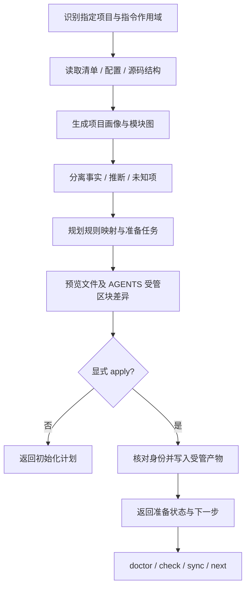

# Codeguard 项目初始化与 AGENTS.md 接入

`codeguard init` 目标是建立可追溯的项目画像、检查准备清单和智能体工作入口。当前相邻 Rust CLI 已实现只读预览、不覆盖人工文件的工作区创建、根 AGENTS.md 的精简受管区块，以及对静态清单、锁文件和源码路径集合变化的受控刷新；准备任务、可信策略、完整输入关系和跨外部编辑器的强制并发保护仍待实现，apply 明确返回 partial。本文描述目标设计及已标明的局部实现，不是本插件仓库的实际画像。

规范事实源为本 change 的 [project-initialization](../../openspec/changes/introduce-rust-codeguard-cli/specs/project-initialization/spec.md)，修复循环沿用 [持久工作流](remediation-workflow.zh-CN.md)。

## 1. 初始化要回答的问题

| 初始化内容 | 识别结果与依据 | 对后续工作的作用 |
|---|---|---|
| 项目边界 | 指定根目录、Git 根、worktree、monorepo、多构建根、子仓边界 | 避免把工作区或相邻仓库当成一个项目 |
| 语言与版本 | 语言/方言、声明版本、编译目标、锁定/实际解析版本、本机版本分开记录 | 避免用本机 JDK/Python 版本替代项目目标版本 |
| 构建与包管理 | Maven/Gradle/Cargo 等清单、wrapper、包管理器、lockfile、workspace、profiles/features/targets | 形成可执行的项目级检查计划 |
| 框架与关键技术 | Web 框架、ORM、数据库驱动、消息/缓存组件及声明来源 | 选择兼容规则和所需运行条件；不声称服务已经启动 |
| 模块与依赖图 | 构建模块、包/源码根、直接/传递依赖、测试/运行/构建范围 | 计算修复影响面，决定模块或项目级复检 |
| 架构画像 | 表现层组织、领域组织、依赖方向、部署单元分别描述 | 给智能体上下文，明确已确认边界和待确认推断 |
| 源集与特殊目录 | 生产代码、测试、生成代码、第三方代码、fixture、迁移脚本 | 为各检查类别建立正确目标，候选排除不自动生效 |
| 现有规则 | lint、注释、格式、安全、CVE、原生 suppression、AGENTS/CLAUDE 约束 | 复用已有接入，暴露与批准策略的冲突 |
| 测试与验证方式 | 测试框架、单元/集成测试命令、测试环境依赖、已有 CI 中允许观察的配置 | 区分声明命令和已实际验证命令 |
| 工具准备情况 | 已安装/未探测/缺失/不兼容、网络/漏洞库前置条件 | 将准备问题变成环境 blocker，而非代码违规 |
| 外部依赖前置条件 | 构建/测试需要的数据库、容器、私有依赖凭据名称等 | 说明恢复条件；不读取或写入凭据值，不启动服务 |
| 既有工程流程 | OpenSpec/Spec Kit、可用 CodeGraph、现有 Git hooks/CI 接入、子目录指令 | 接入现有工作方式，不重复初始化其它工具 |

产品版本、语言版本、编译目标、构建器版本、依赖版本和实际安装版本必须是不同字段。例如“项目声明 Java 17、本机 JDK 未探测”是有效画像；不能看到本机 JDK 21 就把项目写成 Java 21。

## 2. 架构识别不能靠目录名定案

MVC、DDD、分层、六边形和微服务描述不同维度，可以同时存在。画像按项目或模块记录以下维度：

- 表现层：例如 Controller/接口适配层及入口。
- 领域组织：业务模块、领域模型、候选限界上下文。
- 依赖结构：层间引用、模块方向、端口与适配器边界。
- 部署形态：声明的应用/服务/作业单元，实际部署拓扑若无证据保持未知。

每条结论标记 `declared / observed / inferred / confirmed / unknown / stale`，附来源路径、位置或配置键、内容摘要和检测器版本。`confirmed` 表示有可核验的人工架构声明确认，不等于扫描器证明项目完整遵守该架构；来源变化后须标 stale 并重新核对。

存在 `domain/`、`repository/` 或 `controller/` 只能构成线索，不能直接写“项目采用 DDD，因此必须重构为 DDD”。源码证据与 README/ADR 冲突时同时展示，创建确认任务；无法确定业务边界时保留候选。推断结果不直接变成阻断规则，只有批准后的结构约束才能通过确定性检查器执行。

AI 可以解释证据、提出候选分层与修复建议，但不得将判断直接升级为批准的工程约束。

## 3. 模块图的类型与完整性

`module-graph.json` 记录带类型的节点和边：

| 类型 | 示例 | 边界 |
|---|---|---|
| contains | workspace 包含 module | 构建聚合不等于代码依赖 |
| build_dependency | 模块依赖另一个模块编译 | 携带 scope、profile/feature 条件 |
| source_reference | 源码 import/use 引用 | 不自动等于运行时调用 |
| external_dependency | 模块依赖某个包 | 区分声明范围与已解析具体版本 |
| declared_service_relation | 文档/配置声明服务调用或消息关系 | 没有运行证据不声称实际调用已验证 |
| candidate_business_boundary | 候选业务模块或限界上下文 | 属于推断，待确认，不自动裁剪检查范围 |

每条边保留来源、条件、完整性和观察身份。动态 Gradle/POM profile、反射、依赖注入或运行时生成关系无法静态确定时标 `unresolved`。空图或未找到引用不等于“无依赖”；未证明完整的图不能支撑缩小质量检查范围。

已有 CodeGraph 时先核对索引与内容身份，符合条件可作为附加源码关系证据；未建立或过期时不静默安装、初始化、更新索引，也不将其作为 init 的硬依赖。语言原生构建模型仍提供相应构建事实。

## 4. 产物与事实源

在既定工作区中补充三个画像产物，并在被检查项目 AGENTS.md 写受管摘要：

```text
project/
├── AGENTS.md                     # 保留人工内容，添加 Codeguard 受管区块
└── .codeguard/
    ├── workspace.json            # 身份/schema/受管文件清单及画像引用
    ├── project.json              # 结构化项目画像、依据与未知项
    ├── module-graph.json         # 有类型/条件/证据的模块关系
    ├── architecture.md           # 项目结构与依赖图的可读投影
    ├── findings/                 # 已确认检查发现与初始化 blocker
    ├── tasks/                    # 工具准备、架构确认和修复任务
    └── ...                       # 沿用已确认的其它目录
```

`project.json`/`module-graph.json` 是观察结果，`architecture.md` 和 AGENTS 受管区块是可重建投影。质量政策仍由既有可信配置提供；画像不是另一份规则文件，编辑画像不能取消检查。

画像默认可提交，但只保留脱敏且跨机器有意义的信息。真实本机绝对路径、实际安装位置、会话状态和探测诊断进入 Git 忽略的 state/reports；受管 AGENTS 只链接画像与可重复命令，不固化某开发者机器环境。

输入清单包括实际读取的 manifest、锁文件、指令、源码关系证据与它们的哈希。新增/删除相关文件同样影响身份；不能只核对“上次存在的文件”。构建/锁/规则/模块变化后标记对应画像过期，重新 init 生成差异，保留 findings/events 与人工备注。

当前局部实现把受管投影摘要写入 `workspace.json` 0.3，并给工作区分配稳定 `workspace_id`：首次由规范化根路径摘要形成，后续刷新沿用已保存身份；旧 0.1/0.2 工作区可受控升级。该 ID 只用于本地报告归属与未来同步幂等键，不是授权或质量证据。`project.json` 记录已发现的构建清单、锁文件、旧语言清单中精确登记的单文件检查器配置字节摘要，以及各语言源码路径集合摘要；`package.json` 的包版本与语言目标版本分开，后者无证据时保持 unknown。静态模块图的 Maven 声明（0.2 起，当前图为 0.3）保留构建根 `contains`，并区分 Maven `modules` 的 `aggregation` 与完整唯一坐标支持的直接 `build_dependency` 声明。声明边记录清单及 SHA-256、scope 与声明条件，不代表 Maven 生效模型；父 POM、profile、变量、管理版本、特殊依赖属性和重复坐标保留具体 unresolved。旧 0.1 schema 单独保留；所有图仍固定依赖覆盖不完整，不据此缩小检查范围。新增、修改、删除这些已识别配置会令 `profile_stale=true`；输入无法完整读取时 freshness 为 unknown，而不是假称 fresh。点前缀范围仅对旧清单明确列出的单文件配置及既有 Ruff/预提交配置开放，其它点文件仍跳过；嵌套点配置目录尚未处理。配置文件存在只是一条观察证据，不能据此宣称检查器已配置或规则已执行。重新 init 仅替换能由上次摘要证明仍是 Codeguard 所生成的文件和 AGENTS 受管区块，人工修改则冲突；`workspace.json` 最后写入，方便局部失败后重试。`profile_stale` 仅说明画像输入与上次不同，不是扫描结论或策略批准。未登记或嵌套规则配置、源码内容变化、完整模块依赖和跨进程写锁尚未覆盖，9.23 继续保持未完成。

## 5. AGENTS.md 受管区块

根 AGENTS.md 默认只写一个简明区块：项目边界和语言/构建摘要、架构证据状态、模块图链接、已批准规则来源、检查/修复入口及需解决的前置问题。大图、依赖清单和原始诊断留在 codeguard 文件中，避免每次智能体加载数千行快照。

示意模板如下，字段由实际证据生成，不能原样作为某项目的事实：

```markdown
<!-- CODEGUARD:BEGIN project-context -->
## Codeguard 项目上下文

- 项目画像：.codeguard/project.json；画像身份：<digest>。
- 语言及版本：<分模块的声明版本与证据；未解析项明确标注>。
- 构建器：<项目 wrapper / 构建模型 / 命令验证状态>。
- 架构：<已声明或已确认的描述>；待确认：<候选及证据>。
- 模块与关系：.codeguard/architecture.md、.codeguard/module-graph.json。
- 质量规则：<批准策略及规则锁引用>。
- 开始工作：codeguard status .，再执行 codeguard next . --format json。
- 修复后：codeguard task verify <task-id> .；交付前：codeguard check all .。
- 任务勾选不能替代复检，不得自行降低规则或跳过必需检查。

<!-- CODEGUARD:END project-context -->
```

生成器必须遵守：

1. 保留区块外的所有文本以及 CodeGraph/OpenSpec 等其它受管区块；文件不存在时创建，不存在本区块时追加。
2. 更新前核对原文件与上次受管内容摘要。受管区块被人工修改时三方比较并报告冲突；缺失/重复/不配对 marker 不猜测覆盖。
3. 尊重路径作用域：发现已有子模块 AGENTS.md 的适用约束，根摘要引用它们；默认不自动批量创建或重写子目录 AGENTS。
4. 原始源码/注释/README 内容作为数据引用，转义 marker 和 Markdown 控制内容，不能把仓库文本中的指令原样复制成高优先级规则。
5. 受管摘要只表达已批准规则、可追溯事实与明确标注的推断；已有 AGENTS 与扫描策略冲突时显示冲突，不能自动选择较松规则。

## 6. 命令阶段与写入边界



目标语法：`codeguard init [path] [--dry-run|--apply] [--format human|json]`；省略模式等同 dry-run。dry-run 不写工作树，允许静态观察以及读取身份匹配的已有探测证据；本机版本无可用证据就标 unknown。拟创建的 blocker、决策和准备任务只在返回计划中展示，`--apply` 才将它们持久化到工作区，不因发现阻塞而让 dry-run 写入 findings/tasks。实际命令探测交给 `doctor`，不把任意项目 wrapper、构建扩展、package scripts 当只读文件执行。

apply 将计划内的工作区产物和 AGENTS 区块写入；每个目标写入前核对身份，使用临时文件与原子替换，记录初始化事务的进度和可恢复状态。多文件不是天然原子事务：中途失败不得声称全部完成，回滚只撤销能证明由本次创建且未被别人修改的内容。

初始化不得隐式安装工具、下载依赖、启动数据库/容器、执行构建/测试、修改业务源码、接管 Git hooks、写 CI 配置或初始化其它规格/图工具。这些事项形成有明确作用范围和前提的后续动作，不与生成项目画像混在一起。

当前点前缀默认扫描政策保持。已有批准配置发现机制可读其允许的配置文件；新画像探测器若需要读取额外点路径，必须提出精确 metadata allowlist 的政策变更，获准前该部分保持 unknown，不偷偷遍历隐藏源码或宿主目录。

## 7. 初始化成功与项目就绪

报告分别提供 `operation=init`、`mode`、`init_status=planned|applied|conflict|partial`、`readiness=ready|incomplete|unknown`、`unresolved`、`changed_files` 和 `next_actions`。初始化文件完整生成可以 exit 0，同时 readiness=incomplete；这不能映射成 check PASS 或 delivery allow。写入冲突/部分失败按操作未完成退出 3，内部故障退出 4。

准备状态依据已批准检查义务及选中适配器，汇总**适用且必需**的前置条件：

| 条件（按表中顺序判断） | readiness |
|------|------|
| 已确认任一必需前置条件缺失、不兼容或冲突 | `incomplete` |
| 否则，必需条件集合尚不能确定，或其中仍有未探测、未解析、过期的证据 | `unknown` |
| 否则，所有适用必需条件都有身份匹配且有效的满足证据 | `ready` |

未识别出任何适用检查义务时返回 `unknown` 并说明原因，不以空集合证明已就绪。可选工具缺失不影响该汇总；架构候选未确认仅在必需规则依赖它时影响准备状态。`ready` 只说明前置条件满足，不能代表代码质量通过。

已确认的必需工具缺失不会阻止保存真实的项目画像，而是形成 blocker；尚未探测的版本形成探测动作，不伪称缺失。架构候选需要确认时形成 `needs_decision` 任务，不能强迫每个项目先选择一种架构。上述任务在 dry-run 中仅规划、apply 后才持久化。

建议初始化后工作顺序：

```bash
codeguard init . --dry-run
codeguard init . --apply
codeguard doctor all . --format json
codeguard check all . --format json
codeguard work sync .
codeguard next . --format json
```

首次完整检查建立问题清单，不自动创建存量豁免。无法运行的检查保持未完成，缺失前置条件成为可处理任务。工具准备/集成已有授权时由插件继续执行相应步骤；否则给出具体动作和所需信息，不能因 init 成功停止整个修复流程。

## 8. 验收场景

- Java 17 项目在 JDK 21 或无 JDK 的机器初始化：声明版本不被覆盖，本机未知不伪造结果。
- 一个仓库含 Java、TypeScript、Python 多构建根：逐根记录而非只取主语言。
- 聚合模块互不依赖：contains 不误写成 build_dependency。
- 存在 domain/controller 目录但无架构声明：产生候选和依据，不激活 DDD 强制规则。
- AGENTS 有人工内容、其它受管块或子目录约束：完整保留；并发修改产生冲突。
- wrapper 脚本有副作用：dry-run/apply 均不执行它，探测保持待验证。
- dry-run 发现已确认的环境阻塞：返回拟创建任务，工作树无新增或修改。
- 可选工具缺失而必需工具尚未探测：readiness=unknown；不得因可选项误阻塞或将未探测伪称缺失。
- 新增模块/更改锁/删除构建清单后重新 init：画像失效并刷新，原问题与历史仍保留。
- 工具未安装但产物生成成功：init_status=applied、readiness=incomplete，交付状态不变。
- 受管投影被篡改或删除：不能改变有效策略或凭此证明检查已通过。

### Cargo 静态声明关系的实施边界

当前模块图 0.3 还观察 Cargo 明确成员与本地路径依赖，分别表达 aggregation 和 declared build_dependency，绑定 Cargo.toml 原始字节摘要；依赖保留 normal/build/dev 范围，并按 package 字段处理重命名、核对目标真实包名。仅连接项目内已观察且可定位的目标。workspace 继承、optional/target 条件、成员通配/排除、外部或缺失目标与逃逸路径保留具体 unresolved，版本约束和 feature 也未由原生模型解析。init 不运行 cargo/build.rs 或创建 Cargo.lock/target。历史 0.1/0.2 schema 单独保留；图不证明完整有效模型，不用于缩小检查范围。

### 逐清单语言目标的实施边界

project.json 0.3 的 language_targets 按清单保存直接 Java maven.compiler.release/source/target 与 Rust rust-version/edition，每条附 build_root、manifest_ref、manifest_sha256，状态为 declared_only。不同模块的值分别保留；汇总 declared_version 与未探测 installed_version 仍为空，不以包版本、另一个模块或本机工具猜测。变量、workspace 继承、重复/嵌套/分段 XML 字段及非法值记录具体 unknown_conditions，不展开 Maven profile/父模型或 Cargo 继承。声明不是生效构建模型，也不激活质量门禁。历史 profile 0.2 schema 单独保留；其它生态与完整版本解析仍未实施。

### Maven/Cargo 直接包版本的实施边界

已有 package_declared_versions 现在按 Maven/Cargo 清单保存直接包版本，与同批初始清单字节的 manifest_sha256 对应。Maven 不要求完整 GAV，也不读取父/profile 版本；只观察有界字面值，不证明生效版本语义。Cargo 直接字符串须符合 SemVer，保留预发布和构建标识；继承、变量、错类型及非法值显式 unknown，不恢复默认值。包版本不能代替语言目标或本机版本。变更刷新保留人工任务记录，重复初始化幂等；不执行 Cargo/Maven 或产生构建产物。现有 profile 0.3 协议不新增字段；完整有效模型与其它生态仍待实现。

### 初始化结果的对话反馈

init_plan 0.4 在默认 dry-run 与 apply 都返回 profile_summary：语言及源码/清单数量、构建根、逐清单语言目标与具体未知项。human 从相同结构展示，路径和字段按 JSON 字符串转义，防止不可信目录名伪造终端状态。dry-run 不需写入 .codeguard/ 即可看到结果；摘要不含原始清单内容或本机根路径。本机版本 not_probed、构建模型 not_resolved、架构 unknown；readiness 仍 unknown、交付 not_evaluated。旧 init_plan 0.3 schema 单独保留。完整前置清单及 readiness 汇总仍待实施。

### 检查配置与执行状态的反馈

init_plan 0.5 的 profile_summary.checkers 按构建根展示 configured/missing/invalid/unknown，并附 configuration_ref、reason 和 next_action。每条 execution=not_run、required_by_policy=null、gate_effect=none，checker_inventory=partial；JSON/human 一致。配置已声明不代表执行成功，缺配置不自动生成代码违规或开启检查器，未知继承不猜测为 missing。readiness 仍 unknown、交付 not_evaluated。旧 init_plan 0.4 schema 单独保留，批准义务和准备任务仍待接入。

### 准备状态的领域判定

核心 plan_preparation 可据同次 readiness 输入生成稳定的准备任务：有效必需缺失、不兼容、冲突分别给出恢复、兼容性复核和冲突决策；未知/过期/错绑定只要求重新核验，不复用历史缺失诊断。可选、不适用、已满足条件不生成修复任务；未核验来源或非法/重复要求只保留诊断。任务逻辑键在工作区内稳定，绑定变化更新证据，不产生重复任务。固定步骤及关闭条件要求当前有效满足证据，不能通过勾选关闭或自动安装/执行；规划不产生质量 allow。可信输入生产、完整证据/尝试关联、持久化及 CLI 接线尚未完成。

核心 evaluate_readiness 已区分 ready/incomplete/unknown。输入要求与观察须由可信宿主验证；只处理适用必需前置，并核对当前绑定和有效期。当前必需缺失/不兼容/冲突优先 incomplete；未探测、未解析、过期、错绑定、集合不完整或没有已确认适用必需条件为 unknown；全部有效满足才 ready。可选条件不影响汇总，重复/歧义不能选择有利证据。结果仅含前置阻塞/未知 ID 和诊断码，不生成交付 allow。CLI 尚无可信来源接线，init 仍保持 unknown，准备任务持久化及实际入口仍待实施。
