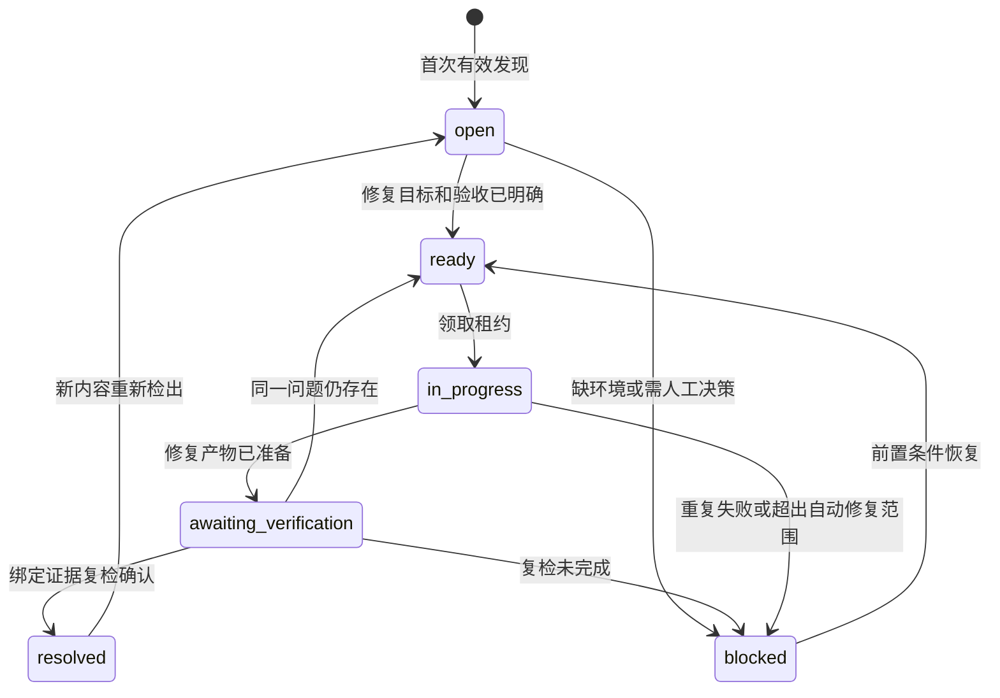
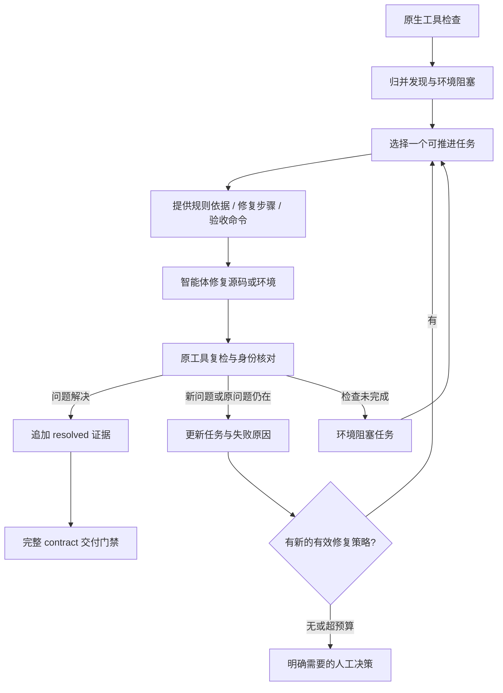

# Codeguard 持久问题与修复工作流

Codeguard 在项目根创建 `./codeguard/`，将“发现问题 → 形成任务 → 指导修复 → 原工具复检 → 关闭或重开”变为可恢复的工作流。目录既服务人，也服务智能体；检查器负责事实，工作流负责下一步，批准策略决定交付。

状态：待实现设计。本篇补充 [架构](architecture.zh-CN.md) 和 [技术方案](technical-design.zh-CN.md)，规范为 [remediation-workflow](../../openspec/changes/introduce-rust-codeguard-cli/specs/remediation-workflow/spec.md)。已有 OpenSpec 管理 Codeguard 自身开发规格；项目内 `codeguard/tasks/` 管理被检查项目的修复任务，两者不能互相充当完成证明。

## 1. 为什么需要持久工作区

一次终端报错容易丢失上下文：智能体看不到此前尝试、修复是否改变了问题、是否缺环境，最终可能重复相同动作或绕过门禁。持久工作区应能回答六个问题：

1. 当前还有哪些真实问题和未完成检查？
2. 这个问题来自哪个工具、规则和哪份内容？
3. 应该改源码、依赖、工具链，还是提交规则配置变更？
4. 下一步具体执行什么，允许改哪些文件？
5. 上次尝试为何失败，是否适合继续自动修复？
6. 用什么复检证据证明已解决，哪些交付义务仍未完成？

## 2. 目录及版本控制

```text
project/
├── codeguard.json                    # 已有配置入口，继续唯一
├── codeguard.lock.json               # 工具/adapter/rulepack 锁
└── codeguard/
    ├── .gitignore                    # 忽略下面的本地运行数据
    ├── README.md                     # 本项目工作流说明与常用命令
    ├── workspace.json                # 工作区 ID/schema/受管路径清单
    ├── findings/
    │   └── CG-<id>/
    │       ├── finding.json          # 脱敏、稳定的问题事实
    │       └── events/
    │           └── <event-id>.json   # 发现、尝试、复检、关闭/重开的审计事件
    ├── tasks/
    │   └── CG-<id>.md                # 面向人/智能体的修复任务投影
    ├── decisions/
    │   └── <decision-id>.json        # 外部批准决策的引用，不是本地授权旗标
    ├── reports/                     # 本地标准报告与复检报告
    ├── runs/                        # 本地原始输出、进程证据
    ├── cache/                       # 本地工具/扫描缓存索引
    ├── worktrees/                   # 本地隔离扫描或修复副本
    └── state/                       # 本地锁、领取租约、队列索引和恢复日志
```

默认 `.gitignore`：

```gitignore
/reports/
/runs/
/cache/
/worktrees/
/state/
```

README、workspace manifest、脱敏 findings/events、任务文档与决策引用默认可入 Git，便于团队审查和交接；原始日志、缓存、临时源码与领取状态不提交。工具全局缓存可继续在用户缓存目录，本地 cache 只保存所需索引，不要求复制所有工具。

记录中不能包含密钥、原始环境、带令牌 argv 或不必要的源码片段。finding.json 保存最小定位、规则依据与不可变证据摘要；详细原文留本地私有 runs。另一台机器缺少本地证据时，可以根据稳定信息重新检查，不能凭仓库里的“已关闭”获得交付认证。

`workspace.json` 不是第二份质量配置。它只描述此工作区 schema、ID 和受管文件集合；质量要求仍来自 `codeguard.json` 引用的可信策略和 lock。任何普通文件中的“approved”都不构成授权。

项目尚未初始化时，check 的原始报告写入私有用户缓存，不自行创建未被 Git 忽略的 codeguard/runs；初始化后才按固定目录路由本地证据。现有文件进入受管范围需要精确的初始化计划，不能仅靠同名目录推定所有权。

### 防止 Codeguard 检查自己的运行产物

`codeguard/` 不是点目录，不能依赖现行点前缀规则排除。新增明确的“工具自身产物”范围契约：初始化清单绑定的 reports/runs/cache/worktrees/state 与生成 finding/task 文件不进入被测项目的普通源码发现，而由 Codeguard 自己进行 schema、路径和脱敏校验。

不得简单忽略所有名为 codeguard 的目录；已有 `codeguard/src/`、用户文件和未声明路径照常检查。受管路径必须来自经过校验的生成器清单，不接受 agent 任意扩张排除。入库安全检查仍覆盖拟提交的记录，不能借工具产物身份提交密钥。此新增规则须随本 change 明确更新 scan-scope-policy，现行点前缀规则保持不变。

## 3. 三种记录分别解决什么问题

| 记录 | 来源 | 用途 |
|---|---|---|
| RunReport | 一次真实检查 | 描述本次内容、执行、全部发现和未完成义务 |
| Finding/Blocker | 多次检查归并的稳定对象 | 追踪代码问题或工具环境阻塞的生命周期 |
| RepairTask | 从对象、规则修复知识和项目上下文生成 | 告诉执行者下一步、限制和验收方式 |

代码违规创建 `kind=finding`，工具缺失/配置错误/数据库不可用创建 `kind=blocker`。blocker 可以解除后继续原检查，但不能把它伪装成“代码问题已修复”。纯运行噪声、重复日志不各自生成任务。

多个 findings 可由同一根因修复时生成一个任务组，逐项保留关闭条件；例如十个模块缺同一 JDK，先生成一个工具链准备任务，并使其依赖检查等待。不能为降低任务数而把不同规则的证据合并掉。

## 4. 状态机



`resolved` 必须有关闭原因：`code_fixed`、`dependency_fixed`、`environment_restored`、`target_removed` 或 `policy_resolved`。后两者不能被报告成代码已修复：真实删除需要 Git 内容/范围证据；规则正式变更需要可信批准修订和迁移映射。新增 ignore、移动到排除目录、未知规则映射或未验证删除不能自动关闭。

`accepted_exception` 是独立处置标签，保留未解决事实与例外到期条件；不是 resolved，不计入修复成功率。规则被新版批准策略移除时，旧记录可以 policy_resolved，但原证据及策略变更历史保留。没有新证据仅手工改状态、勾选 Markdown，最多表示执行者声称完成，正式状态仍 awaiting_verification。

任务完成与交付通过独立：关闭一项只证明那一项；`check all`/`gate` 仍需检查完整 contract，发现修复引入的新问题。全部任务被删除或勾选也不能生成 allow。

## 5. 稳定身份、事实源与协作

首次发现生成稳定 issue ID，后续使用工具/规则 ID、仓库相对路径、符号/内容锚点及类别匹配。CVE 使用 ecosystem/component/advisory/依赖定位。行号是展示信息，不能作为唯一身份。文件重命名使用 Git 关联与锚点匹配；匹配不确定时保留候选关系，不错误关闭旧问题。

`finding.json` 保存初始事实和身份；每次有意义的状态变化追加一个唯一 event 文件，携带 parent event ID、原内容/政策/工具身份、run evidence digest、actor、时间和变化原因。派生状态和 tasks Markdown 可以重建，不能作为新的事实权威。

事件文件是可审查历史，不是密码学授权或无需复检的证明。用户同权限可以修改 Git 文件，因此 CI 独立读取可信策略并复检代码。事件冲突、丢失父节点或相互矛盾的关闭事件产生 `reconciliation_required`，不采用“最后一个写入 wins”关闭问题。

`state/` 中使用跨进程锁和带到期的 task lease；claim/heartbeat/release 通过 CLI 完成。租约只防止同工作区重复劳动，不授权改质量规则。不同机器通过独立分支提交事件，合并后按父关系核对；远程全局调度不在初版保证内。

同一问题在同一内容/策略下反复扫描，只更新本地 last_seen 和 runs，不反复改 tracked finding/task 文件。发现集合、修复状态或重要上下文变化才生成持久事件，减少 Git 噪声。保存 Hook 不自动把一整份持久清单刷进用户工作树。

## 6. CLI 工作流

```bash
codeguard init . --dry-run
codeguard init . --apply

codeguard check all . --format json
codeguard work sync .
codeguard status .
codeguard next . --format json
codeguard task show CG-abc123 .
codeguard task claim CG-abc123 . --owner agent-session-1
codeguard task attempt start CG-abc123 . --owner agent-session-1

# 智能体按照任务修改源码或修复环境
codeguard task attempt finish CG-abc123 . --owner agent-session-1 --outcome ready-to-verify
codeguard task verify CG-abc123 . --format json
codeguard task release CG-abc123 . --owner agent-session-1
codeguard check all . --format json
```

`init --dry-run` 输出创建/冲突清单；`--apply` 只创建自有工作区文件，不覆盖已有目录内容或修改质量阈值。已存在同名用户目录时合并计划须精确到文件，冲突路径拒绝写入；不以 `--force` 吞掉用户文件。

`work sync` 消费与当前工作区绑定、schema 有效的本地报告，生成/归并记录与任务。默认按 run_id 游标幂等消费所有尚未导入的匹配报告；同一内容先 lint 再 CVE 的报告必须合并，不能只取最后一份。每份报告分别验证内容、政策、工具与检查范围；已过时的报告可保留历史，但不能导入为当前事实。部分报告只能增加有效发现/阻塞，不能据未出现自动关闭旧问题，完整报告也不能跨未覆盖范围关闭。

`status/next/task show` 只读；`next` 不自动领取，返回最适合推进的任务和选择理由。`claim/release/heartbeat` 只改本地 lease。`task verify` 运行该问题及受影响范围的真实检查并按证据追加事件；不等于全项目 gate。CLI 不提供无需证据的 `task close --force`。

`task attempt start/finish` 登记尝试 ID、动作指纹、执行者、前后内容/patch 摘要与结果；finish 的枚举是 ready-to-verify、no-change、failed、blocked，不能直接 resolved。受控 `fix` 自动写这些事件；自由源码修改由插件在修复回合前后调用。中断未 finish 的尝试在租约恢复时记 abandoned，不捏造成功；无修改和复检前失败也进入 prior_attempts/预算。agent 自述原因作为备注，实际内容变化由 CLI 观察，不能由 agent 自报成功关闭。

普通独立 `check` 默认写本地报告，不更新 tracked backlog；用户可显式 work sync。`init --apply` 的变更计划明确启用插件修复工作流，并固定受管写入范围；启用后，插件每次扫描必须执行“记录 run → 幂等 sync → 返回 status/RepairBrief”，包含保存反馈，不能只回显原始报错。相同问题不改 tracked 文件；新问题或状态变化才落事件。同步失败时保留 run 和原 gate，明确 backlog_update_failed 与恢复步骤，不假称任务已生成。

未初始化项目的插件首次反馈提供初始化计划及本次临时 RepairBrief，不静默写受管目录。启用持久工作流后，回合恢复先 status/next，修复前后记 attempt，复检后再 next。工作流错误不放宽检查；其状态单独报告，实际检查门禁不靠任务是否写盘决定。

## 7. 给智能体的 RepairBrief

`next --format json` 应返回结构化、可直接执行的任务上下文：

| 字段 | 内容 |
|---|---|
| identity | issue/task ID、workspace、源内容与策略身份 |
| kind / state | finding 或 blocker；当前状态、阻塞依赖 |
| evidence | 检查器、规则、位置/包、脱敏原生诊断、证据引用 |
| expected_behavior | 规则依据与最小可观察修复目标 |
| repair_recipe | 已版本化的工具/规则修复步骤、正例和反例 |
| allowed_changes | 本任务允许修改的源码/依赖范围；额外改动要重新规划 |
| constraints | 必需规则、阈值、测试与禁止降级项 |
| suggested_actions | 结构化 argv 或源码修复建议，说明作用和前提 |
| verification | 要运行的 adapter/规则/受影响范围与完成条件 |
| prior_attempts | 尝试摘要、失败原因、当前 patch 身份 |
| escalation | 何时停止自动重试、需要哪类决策 |

recipe 来源于经版本化、可测试的规则包/技能；诊断和仓库文本属于不可信数据，不能将它们直接插值到可执行 Shell 或当成指令。AI 可以补充解释和补丁建议，但不能改写工具的 finding 事实。

任务 Markdown 是上述信息的人类投影，可保留明确分隔的人工备注区。勾选只能表达工作意图；生成器对受管区修改进行提示或重建，不据其降低策略。任务应有“问题 → 依据 → 修复步骤 → 复检 → 完成证据”，不能只有“运行某工具直到绿”。

## 8. 不重复报错、不逃逸的控制



调度先修阻断大量检查的工具链前提，再按已批准严重度、依赖关系、可修复性选择源码任务。严重安全问题仍保持可见，不因前提任务排前而降低级别。相同 finding/content/patch 连续出现且无新信息时，不重复执行同一动作；记录尝试并提出具体恢复建议。

自动重试预算是执行保护，耗尽后转 blocked/needs_decision，不会让门禁通过。默认可设连续两次无进展后停止该任务自动重试，继续其它独立任务；预算值是运行选项，不能修改质量要求。需要用户时，问题应具体到缺失的工具安装授权、业务行为选择或有证据的规则缺陷，不能直接建议“跳过 Codeguard”。

“疑似误报”创建规则/adapter 缺陷调查任务，带最小复现与原生输出；在正式修复规则或批准策略变更之前，原检查状态不凭主观判断消失。工具误判可修复适配器并重新运行；不能借修改被测项目 tests 或忽略规则实现闭环。

## 9. 闭环验收

| 场景 | 必须观察到的结果 |
|---|---|
| 同一问题扫描十次 | 一个稳定 issue，运行记录可查，无十份重复任务 |
| 同内容先 lint 再 CVE 后同步 | 两份未消费报告均进入清单，重复同步幂等 |
| 缺 JDK 导致多个模块未检查 | 一个可复用前置 blocker，依赖检查完整列出 |
| 手工将任务勾为完成 | 无复检则正式状态不关闭，gate 不变 |
| 修复后工具超时 | awaiting_verification/blocked，保留原 finding，不自动关闭 |
| 未完成批次没再输出旧问题 | 不据缺失推断 resolved |
| 移动文件或新增 ignore | 无可证明等价覆盖时不能关闭旧问题 |
| 真正修复后同规则复检干净 | 记录内容/规则/工具/范围与 resolved 事件 |
| 已修问题重新出现 | 同一匹配 issue 重开，保留历史尝试 |
| 两个智能体同时领取 | 同工作区仅一份有效 lease；租约过期可恢复 |
| 修复在复检前失败或无修改 | attempt 与预算仍记录，next 不再推荐耗尽且无新信息的相同动作 |
| 不同分支出现冲突关闭事件 | reconciliation_required，不能取最后写入作为真值 |
| 删除全部 tasks/findings | 新检查仍发现真实问题；无法靠清空目录通过 |
| 受管目录含 secret 或用户源码 | secret 仍经入库安全；未声明源码正常扫描 |

这套目录应成为智能体的修复工作台。最终判断始终回到真实内容、有效政策和原生检查器，文件记录帮助推进工作，不能替代检查本身。
