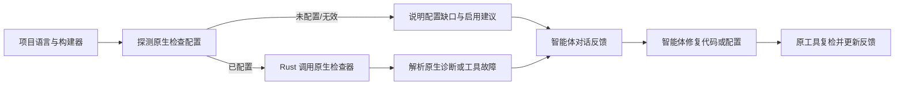

# Codeguard 静态检查配置与对话反馈

下表是**候选检查目录**，不是每个项目必须执行的清单，也不是已实现能力表。`codeguard capabilities` 说明发行版能适配什么；项目配置探测说明本项目启用了什么；本次检查结果说明原生工具返回了什么。这三者分别反馈。当前 57 种语言在五个候选平台上的六类别单元仍为 `gap`。Rust 负责配置发现、受控调用和结果整理，P3C、Maven、Javadoc 等继续运行各自原生检查器。



| 类别 | 候选检测族 | 可识别的检查示例 |
|---|---|---|
| `lint` | `syntax`, `style`, `type`, `dataflow`, `complexity`, `duplication`, `dead_code`, `architecture`, `api_compatibility`, `schema` | 语法、代码规范、类型、数据流、复杂度、重复代码、死代码、模块边界、公开 API 兼容性、数据模式 |
| `comments` | `api_docs`, `comment_policy`, `doc_links` | Javadoc/rustdoc/KDoc 等 API 文档、注释规则、文档链接 |
| `dependencies` | `graph`, `versions`, `licenses`, `sbom`, `provenance` | 实际解析图、版本冲突和过期、许可证政策、SBOM 完整性、组件来源 |
| `cve` | `advisory` | 组件身份与版本匹配、advisory、数据库身份和时效、严重度 |
| `security` | `sast`, `secrets`, `iac`, `container`, `config`, `policy` | 源码漏洞、秘密内容、基础设施配置、镜像/Dockerfile、运行配置、禁止入库策略 |
| `build` | `compile`, `reproducibility`, `manifest` | 编译/静态构建、可复现性、构建清单一致性 |

检测族完整标识是“类别.族名”，如 `comments.api_docs`。它用于给已配置的检查器归类，而不要求所有项目逐族启用。`dependencies.graph` 可为 CVE 匹配提供输入，但图解析成功不能宣称没有漏洞；CVE 无命中也不能证明许可证或版本治理合格。Javadoc 检查应按项目已配置的规则解释公共 API、参数/返回、继承文档等诊断，formatter 不算注释检查。

项目配置探测返回 `configured / missing / invalid / unknown`，并指出检查器、配置文件/规则来源和具体处理建议。`configured` 时运行原生命令，把本次诊断、位置或组件、规则依据、工具错误及复检命令直接反馈到智能体对话。`missing` 不等于源码违规，`unknown` 不等于通过；只有批准策略明确要求的缺项影响交付门禁。工具故障、坏报告或数据库过期反馈为未完成，不冒充代码问题。修复后重跑相同原生检查器，依据新结果更新任务。

对话反馈示例（说明格式，不代表当前 CLI 已支持）：

```text
CodeGuard · Java
Javadoc：已配置（pom.xml），检查发现 2 项；Foo.java:42 缺少 @return。
CVE：未配置；可在项目依赖审计配置中启用受支持的原生检查器。
下一步：补全 Foo.java 的返回值说明，再运行 codeguard comments java . 复检。
```

检测族可在后续协议版本中扩展。候选目录、项目是否配置、工具是否可用、本次运行结果和交付策略必须分开表述；目录登记不意味着已有适配器，也不自动生成项目义务。

### 字段 Javadoc 局部适配状态

Checkstyle 10.21.4 的原生 JavadocVariable 已接入显式原配置、稳定问题/修复任务与 task verify，支持本版 scope/excludeScope/ignoreNamePattern 参数。public 字段及指定忽略、serialVersionUID、局部变量边界经过原工具回放；public/protected/package/private、excludeScope 与枚举 token 的七组原生边界已补充验收；10.21.4 的 VARIABLE_DEF 是必需 token，仅选择枚举 token 仍包含字段检查。其它语法与完整配置模型仍待验收。字段文档修复后的零诊断只为局部候选观察，不证明完整项目通过。验收见相邻 codeguard-cli/tests/acceptance/checkstyle-field-javadoc.md。

既有五类 Javadoc 静态模块已支持官方短名、带 Check 后缀短名和官方完整类名，Checker/TreeWalker 完整名也保留原生配置；只按固定版本精确映射，不猜测自定义包名。字段规则的三种写法已用原工具验证共享同一任务，其余模块名称已有纯绑定回归，完整项目配置仍待接通。

MissingJavadocMethod 静态适配增加范围、allowedAnnotations、allowMissingPropertyJavadoc、minLineCount 与 ignoreMethodNamesRegex；四组固定原工具配置回放已验证筛选实际结果，原 XML 不重写。10.21.4 对单行非空体的方法行数边界须按原工具复现，不能据有 getter/setter 名称便推断豁免。METHOD_DEF、CTOR_DEF、ANNOTATION_FIELD_DEF、COMPACT_CTOR_DEF 五组原生选择及紧凑构造器文档修复复检已补充局部验收；完整构造器语法、项目模型及受批准规则覆盖仍待完成。


JavadocMethod 已保留固定 10.21.4 的 accessModifiers、allowMissingParamTags、allowMissingReturnTag、validateThrows、allowedAnnotations 和四类方法/构造器 token。六组原生配置证明允许缺标签、公开范围及注解例外不会被 Rust 额外补报，throws 选项增加原生异常标签诊断；恢复首次配置后的实际文档修复经复检仅形成局部候选。原生配置不等于白名单批准或必需覆盖证明，完整项目模型仍未完成，见相邻 tests/acceptance/checkstyle-method-tag-options.md。


类型文档静态适配保留 MissingJavadocType/JavadocType 的 scope/excludeScope 与五类类型 token、各自注解例外、JavadocType 的参数/未知标签以及作者/版本格式参数。十组原生配置与一次真实文档修复复检验证访问范围、注解、record 选择及参数/未知标签边界；作者/版本格式仅有静态绑定证据，完整项目与批准覆盖仍待完成。验收见相邻 tests/acceptance/checkstyle-type-options.md。


作者/版本格式局部原生正反例已补充：缺失与不符均报告原诊断，真实补齐后原配置复检只给候选；无效正则为配置准备阻塞，重复失败复用任务。类型修复指引涵盖 @author/@version 与项目事实依据，不编造作者或版本。任意格式与标签变体、有效项目模型及批准覆盖仍待完成，见相邻 tests/acceptance/checkstyle-type-formats.md。


### JavaScript/TypeScript 报告协议局部状态

相邻 Rust adapter 提供 ESLint 10 JSON 纯解析原型，核对预期版本、显式文件集合、原生计数和 exit/max-warnings 关系。退出零的 warning 保留，fatal 或缺规则身份消息要求调查，抑制不算白名单；尚未执行原生 ESLint、解析生效 flat config/TS parser 或接通项目 CLI/依赖/工作台，不能把此原型标为 JavaScript/TypeScript 已支持。依据及夹具验收见相邻 tests/acceptance/eslint-json-observation.md。


ESLint 原生命令计划已可由 Rust 固定构造：显式 Node/JS 入口、原 flat config、完整源集和 JSON 槽位，禁用配置自动查找、不隐式 fix/cache/quiet/install。真实 Node 的字面参数转发已验收，但仅执行观察脚本；ESLint 原生及项目配置/CLI/依赖接线仍未运行，不能据此宣称 JavaScript/TypeScript 检查已启用。见相邻 tests/acceptance/eslint-native-command-plan.md。


### npm审计适配基础实施进展

相邻Rust工程已加入npm11机器报告观察、只读审计脚本声明识别和显式离线原生命令计划。原生advisory/间接关系保留，错误、缺锁、计数和严重度矛盾均未完成；不会将advisory数字当CVE、范围当解析版本。配置识别尚未接入detect/init，公开CVE/依赖命令及完整锁图/数据库时效/任务门禁仍待实现；真实空锁及缺锁与协议正反例见相邻 `codeguard-cli/tests/acceptance/npm-audit-observation.md`。

### Python 依赖与 CVE 输入的只读发现

相邻 Rust `detect` 按 Python 构建根记录 `requirements.txt` 的简单逐行固定版本、动态/未锁声明、`uv.lock`/`poetry.lock` 存在但未解析、以及没有依赖输入等状态；`plan cve python` 和 `check all` 将缺口反馈给智能体。它只检查可见输入的语法与归属，不解析传递依赖闭包，也不调用 pip-audit 或查询漏洞库。即使所有可见行都精确固定版本，或已有锁文件，检查器配置仍为 `unknown`，交付仍未评估。多构建根反例与具体输出见相邻 `codeguard-cli/tests/acceptance/python-dependency-input-discovery.md`。

标准 `pylock.toml`/单段命名 `pylock.<name>.toml` 现与 uv/Poetry 专用锁分开记录；同根多锁要求先确认实际输入。依据 [pip-audit 官方项目模式](https://github.com/pypa/pip-audit/blob/main/README.md?plain=1)和 [PyPA pylock 命名规范](https://packaging.python.org/en/latest/specifications/pylock-toml/)，不能把 uv/Poetry 专用锁直接作为 pip-audit `--locked` 输入。标准锁仍需解析 PEP 751 环境/依赖组和原生报告，发现器不会仅凭文件名给出漏洞结论。

pip-audit 的 Rust adapter 另有固定只读 `--locked` 参数计划和 JSON 纯解析：有效组件版本、advisory 与别名可保留为局部观察，跳过组件、错误退出和报告矛盾均使观察未完成。该 API 尚未调用本机原生工具，也未与标准锁字节、漏洞库或 `check all` 绑定；零项观察固定 `advisory_coverage=not_evaluated`。协议及反例见相邻 `codeguard-cli/tests/acceptance/pip-audit-protocol.md`。

公开 `cve python PATH --pip-audit-tool ABS_PATH --pip-audit-version VERSION` 已用受控进程和私有标准锁快照接通该协议。它前后核对项目 pyproject、单份 pylock、私有副本与工具字节；human/JSON 显示原生 advisory、缺锁、工具故障或输入变化，固定交付未评估。本机尚无 pip-audit 的真实运行证据，PEP 751 环境/依赖组、数据库时效和项目全覆盖仍不能声明已验证。局部验收见相邻 `codeguard-cli/tests/acceptance/python-cve-cli.md`。

为降低归属误报，该入口仅在整组原生组件名/解析版本与本轮标准锁的显式版本集合一致时显示项目局部 advisory；缺包、错版本、无版本源码包或锁模型损坏都保留阻塞，不拿原生 JSON 直接指控当前项目。此比较尚未解释 PEP 751 的环境选择与哈希，匹配也不构成完整图或数据库覆盖证明。
