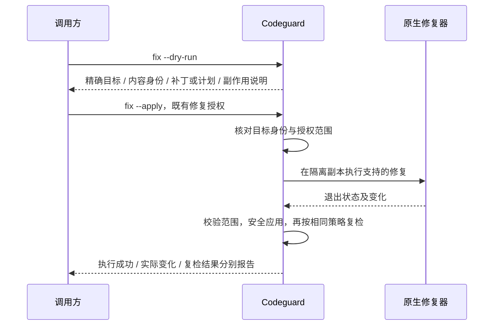

# Codeguard Rust CLI 技术方案

状态：待实现；命令、字段与文件布局是目标协议，不代表当前 Python CLI 已支持。规范性事实源为 [本次 OpenSpec](../../openspec/changes/introduce-rust-codeguard-cli/proposal.md)。

## 1. 命令模型

```text
codeguard <lint|comments|cve|security|build|check> <language|all> [path]
          [--format human|json|sarif] [--output PATH]
          [--jobs N] [--timeout DURATION] [--offline]
codeguard plan <lint|comments|cve|security|build|check> <language|all> [path]
codeguard detect [path] [--format human|json]
codeguard capabilities [language] [--format human|json]
codeguard doctor [language|all] [path] [--format human|json]
codeguard rules list <language|all> [--format human|json]
codeguard config <validate|explain> [path] [--format human|json]
codeguard fix <language|all> [path] --category <lint|comments|security|cve>
          <--dry-run|--apply> [--format human|json]
codeguard gate <pre-commit|pre-push|ci> [path] [--format human|json]
codeguard tools <list|verify> [--format human|json]
codeguard tools install --lock PATH
codeguard init [path] <--dry-run|--apply>
codeguard work sync [path]
codeguard status [path]
codeguard next [path] [--format human|json]
codeguard task <show|verify> <task-id> [path] [--format human|json]
codeguard task <claim|heartbeat|release> <task-id> [path] --owner ID
codeguard task attempt <start|finish> <task-id> [path] --owner ID [--outcome VALUE]
codeguard mcp serve
codeguard compat legacy-v1 <旧子命令与参数>
```

检查命令的 language 必填，path 默认当前目录。canonical ID 沿用现有注册表，别名由同一注册表解析；`all` 是发现所有适用语言及类别，不是对所有注册语言强制安装工具。未知语言在执行前返回用法错误。

`gate pre-push` 接受 Git hook 的 remote 参数与 stdin ref/OID 元组；`gate ci` 接收 CI 明确提供的不可变 commit/ref 集合。实际参数 schema 在 S02 固化，禁止通过默认 HEAD 推测所有推送目标。

```bash
codeguard lint java . --format json
codeguard comments java .
codeguard cve all . --offline
codeguard check all . --format json --output codeguard-report.json
codeguard plan check all .
codeguard doctor java .
codeguard fix java . --category lint --dry-run
```

检查命令默认不修改源码、配置、Git index，也不自动修复；构建产物和工具缓存写入隔离运行区。`plan` 不执行构建、扫描、下载或安装，只读取计划所需信息；无法静态确定的部分记为待解析。`doctor` 可执行有界版本探测，但不执行安装。`tools install` 是独立显式动作，不由扫描隐式触发。

`check` 的类别是 lint、comments、cve、security、build；项目不适用的类别须有结构性依据。build 的测试执行是独立参数：沿用现有 Java 静态构建默认不运行测试；报告必须写明 test_execution=false，不能声称测试通过。若批准策略要求测试，必须运行，CLI 不提供自动跳过路径。

持久修复工作区及新增命令的写入边界见 [修复工作流](remediation-workflow.zh-CN.md)。check 写本地报告，work sync 显式更新脱敏问题/任务；next 只读并返回 RepairBrief，task verify 依据复检追加状态事件，不能手工强制关闭。

## 2. 退出码、请求通过与交付通过

| 新 CLI 退出码 | 条件 |
|---|---|
| 0 | 请求选中的全部适用义务已完成且无阻断违规 |
| 1 | 请求已完成，存在阻断违规 |
| 2 | 参数语法、未知子命令/语言等用法错误；未启动检查 |
| 3 | 必需义务未完成：缺工具、无能力、坏配置、超时、无效报告、覆盖不全等 |
| 4 | Codeguard 内部故障或无法建立可信结果 |
| 130 | 用户取消；已有结果保留为部分结果 |

聚合优先级：取消 > 内部故障 > 未完成 > 违规 > 请求通过；用法错误只在执行前产生。单检查执行故障不等于进程原生 exit=3；`raw_exit_code` 单独保存，进程未启动或由 signal 终止时可为 null，并有 `termination_reason`。

`lint java` 可以 exit 0，但报告 `delivery_gate.decision=not_evaluated`、`eligible=false`。只有 `check all` 或交付入口完成整份质量 contract，且内容与可信策略匹配时才可 `allow`。完整扫描无适用对象时可以 exit 0，但结果为 `not_applicable`，不能显示“全部已验证”，也不能用空输入签发交付认证。显式 `lint java` 找不到任何 Java 目标则 exit 3，避免目录选错变绿。

`check java` 完成全部 Java 义务；除非计划已证明该项目整份 contract 只含 Java 且所有跨语言依赖义务也覆盖，否则不签发全项目通过。实现初版可统一限制为 `check all`/`gate` 才计算交付 allow。

## 3. 数据模型与协议

`schema_version` 使用 major.minor 字符串，初始目标为 `1.0`；二进制版本、adapter 版本、rulepack 版本分别记录。消费者必须拒绝未知 major，允许兼容 minor 的可选扩展；禁止宽松读取未知枚举后按通过处理。

| 对象 | 关键字段 | 不变量 |
|---|---|---|
| CheckRequest | command、selection、root、content_source、operational_options | 用户选择与批准策略分开 |
| PolicyIdentity | source、revision、digest、authority | digest 证明一致性，不单独证明授权 |
| ContentIdentity | source_kind、repository/worktree identity、commit/index/tree digest、manifest digest | 不能仅用路径/mtime/size |
| CheckObligation | id、module、language、category、required、targets、rule_ids | 先有义务，再选择工具，缺工具不能删除义务 |
| CheckPlan | obligations、tasks、dependency_edges、resource_keys、scope_digest | DAG 无环；未执行任务有解释 |
| ToolExecution | executable identity、argv、cwd、env fingerprint、times、raw rc、artifacts | 原始敏感参数只进私有证据 |
| CheckResult | obligation_id、completion、reason、findings、execution_refs、coverage | findings 与 completion 正交 |
| Finding | id、native_rule_id、category、severity、message、location、evidence_refs、baseline_state | 保留原生严重度；不能由自然语言反推规则 |
| Coverage | expected、observed、unresolved、excluded_policy_digest、proof_kind | 数量相等不等于集合相等 |
| GateDecision | decision、eligible、blocking_finding_ids、incomplete_obligation_ids、policy_digest | 未完成不能 allow |
| RunReport | version、run_id、request、policy/content identity、results、gate、summary | human/json/sarif 派生自同一对象 |

状态域：`completion=complete|incomplete|not_applicable`；`delivery_gate.decision=allow|deny|incomplete|not_applicable|not_evaluated`。内部故障另置 `run_status=internal_error`，交付决策保持 incomplete。

输出示意（**字段节选，不是可直接通过 schema 的完整样本**）：

```json
{
  "schema_version": "1.0",
  "request": {"command": "check", "selection": "all"},
  "results": [
    {
      "obligation_id": "java:app:lint:p3c",
      "completion": "complete",
      "findings": [{"id": "f-1", "native_rule_id": "native-rule-id", "severity": "error"}]
    },
    {
      "obligation_id": "maven:app:cve",
      "completion": "incomplete",
      "reason": "advisory_database_unavailable",
      "findings": []
    }
  ],
  "delivery_gate": {
    "decision": "incomplete",
    "eligible": false,
    "blocking_finding_ids": ["f-1"],
    "incomplete_obligation_ids": ["maven:app:cve"]
  },
  "exit_code": 3
}
```

结构化 stdout 只能有一个 JSON 文档；进度、下载提示、工具输出写 stderr 或私有日志。`--output` 成功时将相同序列化报告原子写入目标文件，stdout 仍遵守所选格式；写入失败返回 3，保留已有结果。SARIF 转换保留 tool/rule/location，并用运行通知与 invocation 成功状态表达 incomplete，禁止导出零 findings 就隐去未完成；标准 JSON 始终是完整协议。

源位置使用仓库相对路径；文件名含非 UTF-8 字节时保留可逆编码标识和展示名，不用有损字符串进行身份比较。多位置、跨文件数据流或依赖发现允许 primary location 缺省，但必须存在包/模块定位。归并只对同工具或经过显式规则映射的等价发现进行，保留原始记录和次数；不同工具不能只按文案去重。

## 4. 核心类型、接口与依赖

建议技术栈为 clap、Tokio、serde/serde_json、thiserror；Git 初版使用受控 argv 调用已安装 Git 并校验字节协议。依赖版本与 MSRV 在建仓时实测固定到 Cargo.lock，不在设计文档引用浮动 latest 作为构建锁。

领域类型放 `codeguard-core/src/model/`，每个主要类型单文件；计划、门禁、策略为纯逻辑。核心协调器通过 ports 请求 I/O。接口设计示意：

```text
Adapter.descriptor()                         -> CapabilityDescriptor
Adapter.discover(observations)               -> ApplicabilityEvidence
Adapter.resolve(context, policy, toolchain)  -> ResolvedCheck
Adapter.plan(resolved_check)                 -> AdapterPlan
Adapter.parse(raw_artifacts, termination)   -> ParsedEvidence
Adapter.verify_coverage(plan, evidence)      -> CoverageAssessment
Adapter.plan_fix(finding_set, context)       -> FixPlan

ExecutionPort.run(process_spec, cancellation) -> ToolExecution
SnapshotPort.capture(content_request)         -> SnapshotLease
EvidenceStore.persist(raw_evidence)           -> EvidenceRef
CachePort.lookup(validated_identity)          -> VerifiedCacheEntry | Miss
```

这些是逻辑签名，不是待拷贝编译的 Rust stub。runtime 做观察和执行；适配器只能解释注入的数据、提出命令，不私下 `spawn`、联网或修改文件。core 根据计划协调任务，CLI 负责依赖注入。MCP 放在 cli 的入口模块，复用同一核心 API；不得通过调用自身命令拼另一套 verdict。

## 5. 工具适配器协议

每个适配器发布描述包含：adapter ID/version、语言及方言、检查类别、平台/运行时版本范围、所需配置、输入单位、报告格式版本、原生退出语义、缓存前提、修复能力、网络要求和资源锁。

稳定 ID 如 `java.p3c`、`java.checkstyle`、`java.javadoc`、`rust.clippy`、`python.ruff`、`typescript.eslint`。Node 工具可复用实现，但 Vue/Svelte/Astro/GraphQL 的 parser/plugin/context 必须分别验证，不能靠同一个 eslint 二进制宣布所有能力可用。

优先 JSON/XML/SARIF 等结构化报告。只提供文本的工具必须固定兼容版本、locale、语法及 golden fixtures；解析失败保留原文和未完成状态。禁止通用“包含 error 就失败”或“exit 1 就违规”的策略。比如 ESLint 的退出 1 与退出 2 表达不同类别结果，适配器必须按它的契约解释。[ESLint CLI](https://eslint.org/docs/latest/use/command-line-interface#exit-codes)

有效 findings 与环境故障可能同时存在：保留已验证 findings，completion=incomplete。工具 exit 0 也必须核对报告、执行义务、被扫描对象与 freshness；有副作用的检查器不得把改写后的通过当作原始内容通过。

注册表只登记有证据的能力。`format` 存在但没有只读检查能力时，不能自动算作 lint；有原生 check/diff 模式时需证明无修改且报告可解释。无成熟注释检查器的语言可实现确定性 AST 规则，但需独立 capability/正反例验收；否则明确缺口。

## 6. Java 专项

Java 是第一条端到端实现线，不代表只支持 Java。适配计划必须区分以下义务：

| 类别 | 工具/机制候选 | 验证要点 |
|---|---|---|
| 阿里规范 | 官方 P3C PMD 规则实现 | P3C/PMD/JDK 的兼容组合和实际规则加载 |
| 格式与通用规范 | Checkstyle；项目已有格式检查目标 | XML 结构、规则版本、源码级别、只读模式 |
| 注释规范 | Checkstyle Javadoc 规则、Javadoc/doclint | 公共 API 范围、参数返回、继承文档、Lombok/record/生成代码 |
| 安全静态分析 | 项目已接入并经验证的安全分析器，例如 SpotBugs 安全规则或规则扫描器 | 所需字节码、classpath、规则清单与报告完整性 |
| CVE | 经验证的 Maven 依赖扫描适配器 | 解析实际依赖图与版本，漏洞库身份和匹配证据 |
| 构建 | Maven/Gradle 的批准生命周期和目标 | 编译及必要质量任务是否真的执行；测试执行单独声明 |

官方 P3C 包含 PMD 实现；本仓 Checkstyle XML 不应被重命名或包装成“官方 P3C 已通过”。具体兼容版本在真实样本矩阵中确定。[P3C 官方仓库](https://github.com/alibaba/p3c)

Java 解析顺序：项目 wrapper 与声明运行时 → effective model/启用 profile → 模块图/源集/依赖 → 已绑定质量任务 → 缺失义务的受控适配计划。读取 effective model 可能执行构建扩展，因此不是纯静态 `plan` 的隐式行为，需进入执行阶段并留证据。

对于未配置质量工具的项目，使用已批准、已锁定的 rulepack 构造隔离执行配置；不改用户 POM/Gradle 文件。必要集成不能可靠构造时返回 `configuration_required`，提供具体补丁建议，不能自动永久加入或删去质量插件。`java.commands` 只能提供实际命令，仍需覆盖映射，不能以 `echo ok` 满足 P3C。

Maven 父子模块、dependencyManagement、profile、toolchains、annotation processor、测试源集和 Gradle 动态脚本都影响结论。静态模型不完整时保守扩大范围；扩大后仍不能证明规则执行，则未完成。已有 Java 影响闭包可迁移，但版本变动不得自动以 validate/help 替代未证明等价的 lint/CVE 义务。

## 7. CVE、注释、安全类别

CVE 的单位是依赖生态和解析后的组件图，不是源码后缀。Maven/Node/Python/Rust/Go 与通用扫描器按清单能力选择；原生缺失不得偷偷 fallback 成不同覆盖的通过。多个语言共享同一依赖图可以共享证据，但每份义务必须可追溯。

漏洞记录保留 CVE/GHSA/OSV 等原标识、别名、包坐标或 purl、版本、传递依赖路径、匹配方式、受影响区间、修复版本、严重度来源和漏洞库时间/摘要。只有模糊 CPE 匹配时，不伪装成精确包证据；待复核项仍可导致完整性不足，不静默丢弃。

缺 lockfile 不必一律失败：适配器若能解析并固化实际依赖图可继续，否则未完成。漏洞库过期、网络断开或数据库未验证不能产生安全 PASS；离线只使用满足批准 freshness 的本地库。未知严重度不能映射为 LOW 或删除：若策略无法比较则未完成；批准“所有已知漏洞阻断”时可直接判违规。

注释规则绑定语言语法及 API 范围。规则包应明确是否允许继承文档、接口/实现重复说明、生成代码排除和 test fixture 的专用规则；这些是预先确认的语义，不是扫描失败后的临时豁免。

安全分为源代码规则、配置/IaC、敏感内容及入库路径策略。`.env`/`*.pem` 等命中现行禁止入库模式时报告 `repository_policy_violation`，不得仅凭文件名宣称发现私钥；内容扫描的 secret finding 另有规则和脱敏证据。公共证书等例外需要正式策略变更，AI 不可自动放行。

## 8. 配置、规则包和工具链锁

保留 `codeguard.json` 作为项目入口，通过显式 schema migration 导入新协议。新增 `codeguard.lock.json` 绑定工具、适配器与规则摘要；不读取旧字段后静默丢弃。

| 配置平面 | 内容 | 覆盖规则 |
|---|---|---|
| 运行参数 | jobs、终端格式、日志位置、预算 | CLI > 环境变量 > 项目默认；不足只产生未完成 |
| 质量策略 | required、rulepack、severity、源集、批准排除、freshness、测试要求 | 可信组织策略及已批准项目修订；运行参数不可弱化 |
| 工具锁 | 工具版本/摘要、JDK、adapter、rulepack、下载来源 | 按 lock 验证；不使用 latest 自动升级 |
| 项目原生配置 | eslint/ruff/checkstyle 等 | 作为实际规则输入；必须与批准策略要求对齐 |

`config explain` 显示每一有效值的来源与覆盖原因。原生配置中已有 disable/suppressions 必须列入策略解释和数量/摘要审计；不能把原生配置当作不可审查的隐藏降级入口。PR 同时修改代码与检查配置时，CI 使用可信基线策略评估政策差异；未经批准的新策略不能给本 PR 自行签发通过。

规则包目录设计：

```text
rulepacks/<pack-id>/<version>/
  manifest.json
  rules.json
  tool-configs/
  compatibility.json
  fixtures/
```

manifest 记录来源、许可、分类、规则严重度、工具兼容约束、内容摘要和变更说明。每个 native rule ID 映射稳定的 Codeguard rule ID；删除、改义或改变默认阻断级别属于可审查规则迁移，不靠扫描时随机选择。

默认选择“已存在且匹配锁的项目工具 → 已验证的受管缓存 → 匹配锁的系统工具”；版本不匹配即未完成。安装需要独立 `tools install`，提供下载清单、校验和与安装范围；扫描期间不能用 npx/pip/curl 偷偷安装。可能下载依赖的构建命令须在计划中说明网络模式与锁约束，`--offline` 不得联网；在线模式也不得自动升级规则或工具。

`--offline` 是执行约束，不能只转发工具的 offline flag。adapter 声明可验证的离线条件，运行时使用经平台验证的网络禁止环境执行可能联网的 wrapper/扩展；无法保证时在启动前返回 `offline_isolation_unavailable`，不声称已离线。安装沙箱或容器工具仍是独立准备动作，扫描不得隐式安装。验收必须包含会主动联网的真实子进程。

## 9. 执行器与资源控制

`ProcessSpec` 包含 executable、argv、cwd、受控 env overlay、stdin 模式、deadline、输出预算、资源键、网络策略声明和预期产物。默认 stdin=null；pre-push 输入先由 CLI 读取为结构化请求，不把宿主 stdin 交给扫描器。

Tokio 并发读取 stdout/stderr，有界缓冲加私有文件记录；超限必须标识不完整。取消或超时先请求停止，再终止进程组/Windows Job Object 并 wait/reap；只丢弃 Child 不等于可靠结束进程。[Tokio process 文档](https://docs.rs/tokio/latest/tokio/process/)

任务 DAG 中相互独立的检查继续收集证据；同一模块构建目录、数据库更新或非并发扫描器通过 resource key 互斥。deadline 是整次请求预算，包含排队/探测/执行/解析/清理；子进程不能各自重置全部预算。

检查计划只读源码：准确内容物化到隔离目录，生成产物写独立区域；执行前后检查源码身份，意外变更导致未完成。禁止跟随路径逃逸 symlink；Git symlink/gitlink/LFS 对象按类型记录，无法获得所需真实源码时不当作普通文件通过。日志私有、原子写，证据索引保留摘要与保留期限；MCP/终端不默认输出密钥或原始环境。

受保护 CI 的可信协调/验证进程、策略、工具锁和最终状态凭据与被测脚本执行域隔离，采用只读挂载、独立身份或等效平台机制，不把签发凭据传入构建进程。执行区仅可写临时构建输出及待核验产物；可信端重新校验内容、报告来源、执行范围和规则覆盖后生成最终结果。单纯不同目录不能满足这个保证；不具备隔离能力时报告能力限制，不宣传抗任意脚本篡改。该要求不会将普通本地模式虚构成安全沙箱。

重试只限可识别的瞬时 I/O 故障，固定次数并保留全部尝试；不重试真实违规以期待随机变绿，不在重试中换规则、目录或工具版本。工具内部编程错误不无限重试。

## 10. 内容快照、缓存及增量证明

| 入口 | 权威内容 |
|---|---|
| 显式 check | 本次请求冻结的工作树清单和内容，检查后复核身份 |
| Git pre-commit | Git 实际传入环境下的 index，尊重 GIT_INDEX_FILE，包括部分提交 |
| Git pre-push | stdin 各 local ref/OID 与 remote ref/OID，支持多 ref、删除 ref、非 HEAD ref |
| CI | 调用方明示且解析为不可变 OID 的待交付内容；合并结果与分支头不能混用 |
| 宿主 PreToolUse | 有边界的预测内容；不声称等价于完整 Shell 执行 |

Git 原始路径使用 NUL 协议，校验对象数量、类型、长度、模式和哈希；SHA-1/SHA-256 按仓库对象格式处理。index 冲突、多仓、初始提交、worktree、submodule、删除/重命名以及输入并发变化均有 fixtures。预测失败阻止认证并提示真实 Git 接入或拆分动作，不扫描另一个仓库充数。

缓存键至少包含：协议/adapter 版本、工具二进制与运行时、规则包、有效配置、目标内容与完整依赖输入集合、模块图、content_source、任务参数、平台、locale、CVE 库身份和 freshness。字节相同但 source kind/授权上下文不同也不得直接复用交付收据。

只缓存完整可验证结果，PASS 和真实违规都可缓存；incomplete/取消/内部故障不提供完成证据。完整缓存记录包含报告摘要和覆盖证明；缓存损坏视为 miss。交付入口不得消费软反馈缓存，可复用满足相同严格身份和可信来源的检查结果，再独立重算交付 gate。本地可写缓存不能作为受保护 CI 的可信外部证据。

增量算法先生成全量义务，再为每项选择执行或复用。无依赖隔离证明的 AST/类型/构建检查扩大到模块或项目；改变规则、编译选项、锁文件或父配置使相关闭包失效。不能以“文件未变”证明依赖它的检查结果未变。

## 11. 修复协议



`fixed=true` 需要证明目标变化与该修复有关并完成复检；formatter exit 0 不够。应用 patch 前比较前置内容哈希；并发编辑时停止应用，不能覆盖用户修改。失败有部分变化时保留补丁及真实状态；只回滚自己可证明拥有且未被后续改动的部分。

不自动修改 lint 配置、阈值、忽略、测试或基线来修复 finding；CVE 升级引入行为变化时将依赖变更作为独立修复计划，完整复扫和受影响验证后才声明解决。

## 12. 插件、MCP 与分发

插件 lock 绑定 CLI version、target triple、artifact digest、协议 major、rulepack lock；安装时和运行前验证绑定。原生二进制是统一入口，但 Java/Node/Python 等扫描工具仍需要各自运行时，`doctor` 必须说明。

初始发布候选目标：macOS arm64/x86_64、Linux x86_64/aarch64、Windows x86_64；Linux libc/最低系统版本和每工具平台能力在 S10 实测固化。未验证组合不标稳定。下载原子落盘后切换；校验失败不得使用随机 PATH 版本或静默回退 Python，报告未完成。

MCP 工具参数映射到相同 CheckRequest，保留旧工具名时通过显式协议适配。宿主 Hook exit=2 可能表示阻断，而新 CLI exit=2 是用法错误，必须按报告语义映射，不透传数字。取消、超时、二进制不可用也要有宿主特定测试。

旧通道 `compat legacy-v1` 保持各旧子命令自己的退出协议：常见 check/CVE 为通过0、未验证1、违规2、用法3；混合优先级按旧入口原约定，不把 Dockerfile/CVE/check 的历史差异硬套成一张表。新报告与旧字段同时出现时以明确 protocol 标签解释，保留所有发现。兼容通道不能被新交付 CI 当作等价认证。

切换流程：协议与适配器测试 → 真实仓对照 → 显式指定新二进制 → 宿主/CI 按语义接入 → 全语言与平台验收 → 旧入口弃用。回滚只能回到满足相同严格契约的已验证 Rust 版本；若只能运行旧 fail-open 通道，则交付状态保持未认证，不能为恢复可用性伪造通过。

## 13. 可观测性与度量

每次 run/obligation/task/attempt 使用关联 ID，记录工具耗时、启动/解析/快照耗时、扫描范围、缓存原因、原始退出和未完成原因。日志默认本地，不收集源码遥测；如需远程统计需单独明确采集内容。

低误报评价至少同时展示：finding precision、漏报率、工具故障误判率、必需义务完成率、被排除/豁免比例、各类别覆盖、p50/p95 耗时及样本数。把规则关闭后 precision 变高视为覆盖退化。指标定义和真实验收见 [coverage-and-acceptance](coverage-and-acceptance.zh-CN.md)。

本技术方案没有声称已达到某个误报率或性能增益；这些必须由任务中的固定语料、人工裁定与真实工具运行证明。
