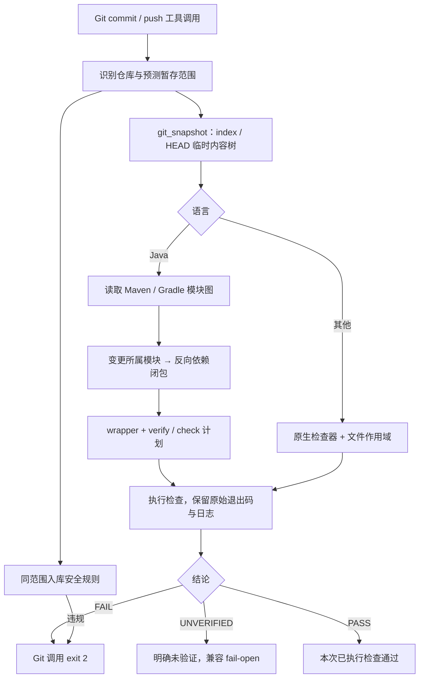
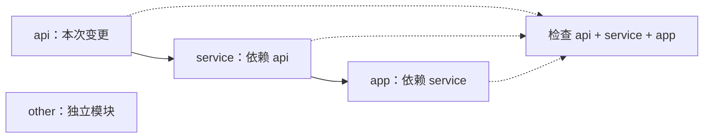

# 判定可信度与 Java 项目感知

版本：0.12.0（本地开发态）。规格事实源：`openspec/specs/`；实施记录归档为 `openspec/changes/archive/2026-09-22-converge-verdicts-java-impact/`。本轮不增加技能，不改外部受管技能。

## 1. 可执行链路

这不是安全沙箱，也不是完整 Git 事务模拟器。检查器继承当前用户权限；普通临时目录只保证不以原工作树作为检查内容。

## 2. 责任分配

| 模块 | 责任 | 禁止冒充的结论 |
|---|---|---|
| `scripts/verdict.py` | 状态、原始退出码、原因分离 | UNVERIFIED 不可变成 passed=true |
| `scripts/git_snapshot.py` | index/HEAD blobs、预测覆盖、删除范围、临时树 | 不 stash、不改真实 index、不拿工作树修复替代提交 |
| `scripts/java_project.py` | 只读图、影响闭包、命令规划 | 计划不是检查结果，模块图不是调用图 |
| `scripts/run_per_language.py` | 顺序执行计划、作用域、输出日志 | 第二文件失败不能被第一文件成功覆盖 |
| `scripts/run_check.py` | CLI 聚合、4 个 MCP 工具 | MCP 转换不能丢失不确定性 |
| `hooks/gate_lib.py` | 门禁并行编排、失败反馈 | 未修改诊断位置不能自动当历史债 |
| `scripts/cve_check.py` | 结构化漏洞报告、严重度阈值、复扫 | 网络/配置故障不能当漏洞或通过 |

保留旧 `passed` 字段兼容消费者；新消费者应使用 `status` 与 `reason`，并区分原始工具退出码与 CLI 聚合退出码。hook 的 exit 0 仅说明未阻断，不等于 PASS。

## 3. Java 影响分析

Maven 静态读取模块、坐标、属性及模块直接依赖，按反向传递闭包选目标，`-am` 补足其构建前置依赖；默认 `verify` 不主动跳过测试。Gradle 读取常见静态 include 与 project 依赖，默认 `check`；识别到动态 include、复合构建、projectDir、buildSrc、allprojects 等则回退根检查。

删除源码和资源变化保留所属模块；构建描述或 wrapper 变化扩大范围。无法解析的 XML/路径越界/非可执行 wrapper 返回 UNVERIFIED。`codeguard.json` 可声明权威 argv 列表替代默认命令，调用者对项目命令的信任仍不可省略。

边界：不能完整求值 Gradle 程序、Maven effective-POM、所有父 POM/插件注入依赖；也未实现符号级调用图、测试方法选择或数据流分析。动态逻辑可能超出当前识别模式，高风险项目应用 `gate_scope=repo` 或明确权威命令，并使用独立 CI。静态插件存在不证明已绑定生命周期，计划始终保留覆盖缺口说明。

## 4. 快照与修复安全

- 纯 commit 从 index 取内容；预测 add 从相应工作树覆盖；纯 push 从 HEAD 取内容。重命名按删除+新增保留影响范围。
- 入库安全仍是路径/目录规则，不是 secret 内容扫描或 SAST。删除敏感文件不会误算为新增泄漏。
- 快照拒绝符号链接、子模块、冲突和超限；不复制 ignored 的 node_modules 等依赖。缺依赖返回未验证。
- 单文件保存不触发项目级 formatter。MCP auto_fix 默认只改 Git 改动文件，并报告实际变化；无法确定 Git 范围不写入。
- 不提供复杂 shell 写入、任意 refspec、动态 alias、并发 index 更新的原子保障。临时内容检查完成到真实 Git 操作之间仍有时间窗口。

## 5. CVE 证据

扫描器输出必须是有效结构化报告。npm 按统计和阈值判定，`moderate` 对齐 MEDIUM；Maven 使用一次性目录接收 aggregate JSON，避免旧报告或多模块单模块报告覆盖；Trivy 请求 JSON 与独立漏洞退出码。Python 指定项目 requirements/pyproject，Rust 读取 cargo-audit JSON。

Python/Rust 报告中的发现若无法比较严重度，在高于 LOW 阈值时返回未验证并保留漏洞列表，不能猜为高危或通过。npm 修复后以复扫决定最终状态。本轮未实际访问 CVE 数据库进行扫描。

官方契约核对：[Dependency-Check aggregate 和 odc.outputDirectory](https://dependency-check.github.io/DependencyCheck/dependency-check-maven/aggregate-mojo.html)、[pip-audit 项目输入和 JSON](https://github.com/pypa/pip-audit)、[RustSec Report](https://docs.rs/rustsec/latest/rustsec/report/struct.Report.html)。

## 6. 下一阶段，不计入本次完成

1. 选真实 Maven reactor 与 Gradle 多模块仓，在受控环境跑集成验收；记录成本、工具版本、执行范围和检出结果。
2. 建立缺陷种子集，分别统计假通过、误报、未验证率；不能拿结构测试数量代替准确率。
3. 增加经授权的 effective model / 已有 CodeGraph 证据，推进符号级反向影响与测试选择；不静默初始化索引。
4. 做同环境基线/变更双跑，再讨论历史债抑制；先证明诊断指纹一致，再豁免。
5. 修复走建议补丁、变更范围审计、复检、人工采纳；高风险业务语义修复不自动执行。
6. 另行讨论可配置 fail-closed 和 CI 接管策略；当前 hook 保留兼容 fail-open，不能声称所有未验证变更都会被阻断。
