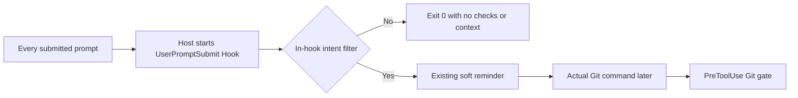

# Trigger boundary

The host cannot filter `UserPromptSubmit` by prompt text. `hooks/hooks.json` and the Copilot/OpenHands mirrors therefore declare one matcherless handler. The existing `user_prompt_validator.py` performs the first-stage text check before session/worktree scoping, `ensure_user_path` and `prompt_application.evaluate_prompt`. The latter remains the existing soft-gate implementation for matching prompts; PreToolUse remains the real command-time gate.

The regression fixture checks all three manifests and calls the Hook with an ordinary prompt while replacing the path-probe function with a failure sentinel. It also confirms the existing positive intent route remains covered by the protocol suite. A real installed-host invocation is still needed before claiming host timing or overhead measurements.
