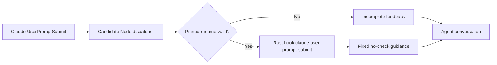

## Context

See [proposal.md](proposal.md). The current plugin default uses five Python Hooks. The separate Rust candidate resolves only a locally installed, digest-pinned 0.1.1 binary and maps four Claude lifecycle events. Rust CLI 0.1.2 adds `UserPromptSubmit` as a no-check event; this plugin change exposes that candidate without changing default Hook behavior.

## Goals / Non-Goals

**Goals:** Keep the candidate's package identity exact, preserve a useful incomplete response when unavailable, and prove that prompt content cannot start lint or assert delivery success.

**Non-Goals:** Enabling the Rust adapter in default `hooks/hooks.json`, removing legacy Python, declaring a strict Git/CI gate, or broadening the npm package beyond its verified macOS arm64 host.

## Decisions

1. **Use the existing runtime lock and dispatcher.** The dispatcher adds one event mapping and continues to resolve the binary through the lock-aware runtime manager. This avoids a second binary selection path and keeps runtime installation explicit.
2. **Forward host JSON unchanged to Rust.** The dispatcher validates only the returned host event and message shape. Rust validates the prompt field and produces fixed guidance; neither layer derives checker scope from prompt text.
3. **Keep this Hook opt-in.** The Python default soft gate currently has different behavior. Changing it before a full strict-delivery migration would create an unverified mixed gate; this release only makes the candidate callable and documents the distinction.
4. **Release version through the generator.** The plugin's catalog and four manifests, then the separate marketplace metadata, must agree on the new version. Runtime hashes come only from the registry-verified 0.1.2 archive and binary.

## Risks / Trade-offs

- [Default Python prompt Hook remains expensive] → Keep the candidate clearly opt-in and retain the default-migration task in Rust OpenSpec 11.17.
- [One-platform npm artifact] → Lock only macOS arm64 and report unsupported platforms as incomplete.
- [Package metadata appears before tarball replication] → Verify actual archive download and fresh-cache execution before updating the plugin lock.
- [Host JSON or tool output attempts instruction injection] → Do not echo the prompt; compare valid and adversarial prompt outputs in tests.

## Migration Plan

Publish and verify the Rust 0.1.2 package, update the exact lock, test offline installation and prompt dispatch, bump the plugin version, publish the plugin and marketplace metadata, and leave default Hooks unchanged. Rollback restores the previous pinned plugin release; local runtime receipts remain content-addressed and are revalidated on every call.
