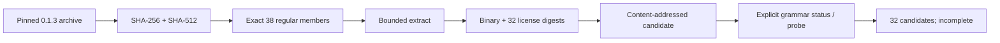

## Context

The published `@partme.ai/codeguard@0.1.3` archive and binary match the local release bytes from CodeGuard source commit `7900a1a8ccd5b4f5b54de8b5db3ccba16a356d3b`. The npm archive has 38 regular members: the previous six plus 32 license files. The existing installer pins archive and binary digests, but its old member and size limits reject the new package.

## Decisions

1. Keep a single exact package lock. Add a sorted map of 32 license paths and SHA-256 digests from the pinned grammar manifest. Validate names as relative `LICENSE.codegraph` or `<language>/LICENSE` only; derive the exact archive allowlist from those validated names plus the six fixed package members.
2. Set explicit 16 MiB compressed and 128 MiB binary ceilings, above the measured 12.1 MB and 100.1 MB artifact. Validate the full archive digest before listing/extracting; require regular archive members; verify binary and license digests after extraction and whenever the active candidate is used.
3. Keep installation explicit and content-addressed. Do not start parsing during install, switch default Hooks, or treat `candidate_count=32` as qualified lint. After installation, a separate test invokes `grammar status` and a real Zig probe through the installed binary; both must retain incomplete semantics.
4. Release the plugin through its version generator and update only CodeGuard metadata in the separate marketplace repository after tests. If a host installation cannot be verified, report that gap without claiming installed-host acceptance.

## Risks

- Larger binary increases per-Hook re-verification cost. Measure the local candidate and keep the default Hook unchanged until host latency is accepted.
- Expanded size limits could admit a larger malicious archive if identity checks are weakened. Preserve exact archive digest and member checks before extraction; test mutation failures.
- npm availability is platform-specific. Retain `macos_arm64` pin and explicit incomplete feedback elsewhere.
