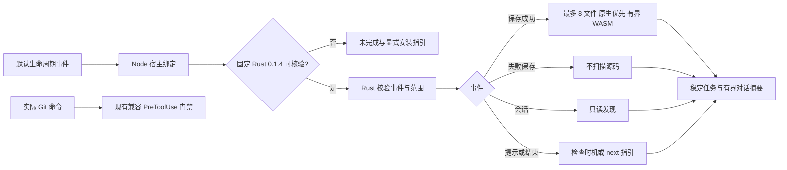

# Default lifecycle binding

该变更延续 CLI `introduce-rust-codeguard-cli` 的 S11.17/S14 规格，不建立第二份 CLI 规格。`2026-10-03-rust-wasm-runtime-candidate` 仍记录 0.1.3 显式候选历史。

普通生命周期退出 0 是宿主反馈，不是质量通过。运行时须显式安装到内容寻址缓存；每次调用复核程序与许可证摘要。5 秒内部原生/WASM 预算、8 秒子进程、10 秒宿主预算；文件系统 I/O 全硬截止尚未验收，超时不签发 clean。任务必须通过 CLI 原生确认与可信政策关闭；插件不读取项目自选密钥或自批准名单。真实宿主安装、逐语言精度、所有原生工具自动选择、跨平台、Git/MCP Rust 迁移保持开放。

Canonical `hooks/hooks.json` 与分发镜像保持一致，实际宿主验收分开登记，不能因 Claude 形状事件重放就勾选 Codex/ZCode/Kimi/Claude 自动触发验收。原先 auto_fix_on_save 仅保留兼容配置，Rust 事件不静默应用修复。
