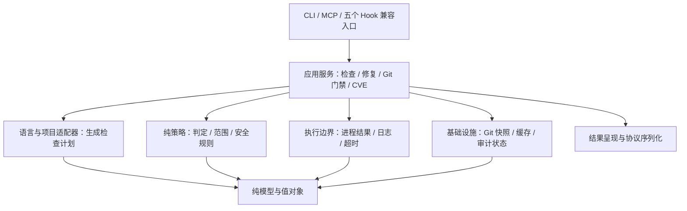
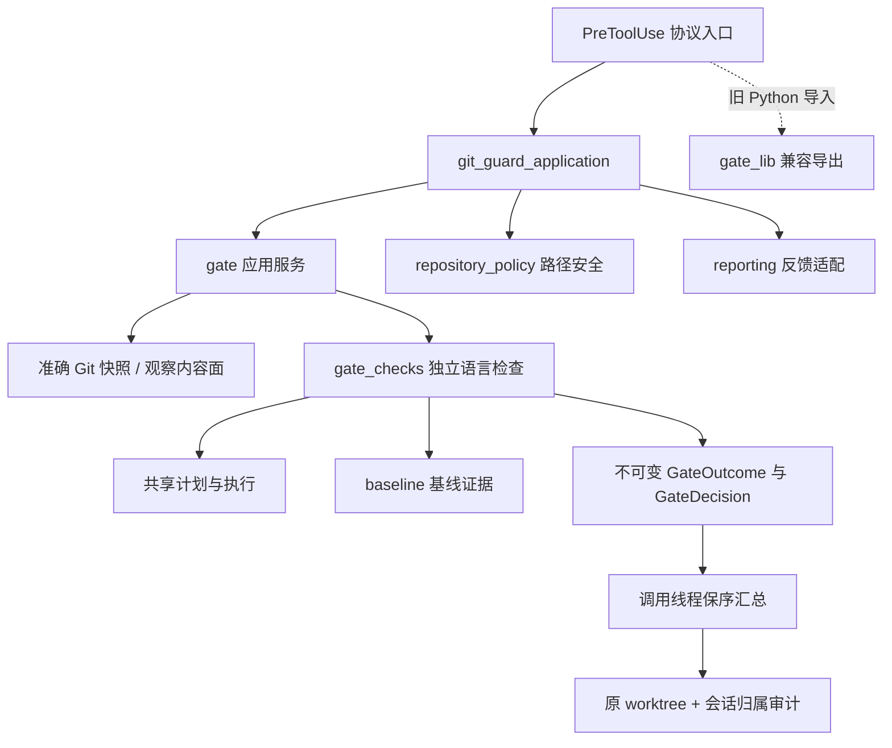
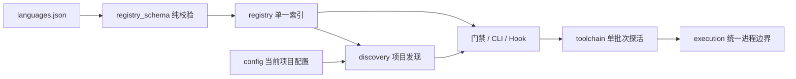
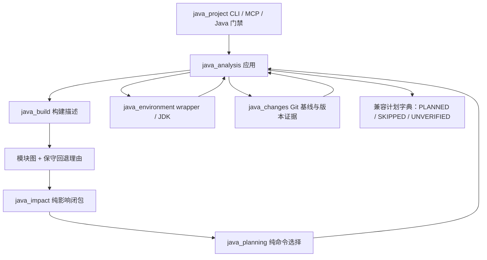
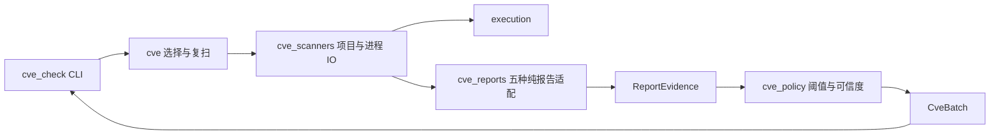

# Design

## Context

基线 `61e2592`，工作树开始时干净，远端 main 一致。源码约 5,500 行（不计 vendor 与注册表）。`hooks/gate_lib.py` 999 行、`pre_tool_git_guard.py` 711 行。275 项 unittest 执行成功但 4 项历史 skip；ruff 通过。不是通过行数评价质量，而是用实际职责和失败传播路径定位问题。

已确认的结构性问题：

| 现象 | 影响 | 改造落点 |
|---|---|---|
| CLI、保存 hook、Git gate、CVE 各自捕获进程异常 | 相同工具故障可能丢日志或直接抛出异常 | 一个带类型的执行边界，调用方只做领域解释 |
| gate_lib 混合快照、执行、缓存、文件规则、审计、报告 | 无法独立测试策略；任一修改牵连多入口 | 领域策略/应用编排/基础设施/报告分离 |
| Java 提前 return 后还有第二个 Java 分支 | 后一分支事实上不执行，维护者误以为已生效 | 统一语言计划；兼容行为由真实调用测试覆盖 |
| `_worktree_fingerprint` 对未跟踪文件 stat 两次 | 重复开销且掩盖边界 | 单源指纹与缓存契约 |
| JSON 状态裸读改写，多 hook 共享全局文件 | 并发丢计数、去重混用墙钟与 monotonic | 原子状态存储与清晰身份边界 |
| CLI/MCP、hook 对结果使用 dict/tuple/string 混合表达 | 每层靠字符串猜语义 | 内核类型化、仅在外部边界序列化 |
| README 仍称 0.12.0，旧架构声称 Java 默认执行测试 | 文档不能作为可靠执行指南 | 当前架构与历史证据分开、版本来源收敛 |

未初始化 CodeGraph 前不将这些源码事实表述为图谱结论。已有其它 change 保持原状；其任务完成度不是本次实现证据。

## Goals / Non-Goals

目标是让新的语言/入口只需实现其契约，不复制执行与判定；让代码能独立测试而不需 patch 半个 hook 模块。项目仍是小型 Python 插件，避免依赖注入容器、框架基类和额外服务。

不改产品分工：CodeGuard 产出确定性检查证据，不取代 FlowGuard 的 SDD 治理或 CodeReview 的语义审查。不扩张技能数量，不静默改变 fail-open、Java 默认跳过测试执行、Markdown 告警等政策。不承诺完整 shell 解释、安全沙箱、全语言真实工具链验收。

## Decisions

### 1. 渐进替换，不并存两套业务实现

保留 `bin/codeguard`、现有脚本/钩子路径与 manifest；增加 `scripts/codeguard/` 内核包，兼容导出显式列出。选择目录内包而非立刻要求 pip install：已安装插件直接执行脚本的方式不能被打破。最终应以职责划分，而不是把原脚本原封不动搬成一个新巨型文件。

内核不得导入 hooks/CLI/MCP；框架注册和 stdout 输出只存在于适配入口。Python 标准库优先，MCP SDK仍是 MCP 入口的可选依赖。

### 2. 进程结果与代码判定分离

不可变执行结果记录 argv、cwd、退出码、stdout、stderr、启动/超时/输出超限故障。执行器不把 rc=1 判断成代码违规、不跑安装、不隐式 shell。`lint_verdict` 和 CVE 报告解析负责各工具语义。保留旧 tuple 包装以兼容已有消费者，但真实执行逻辑仅一份。

超时保留部分输出；使用 UTF-8 替换无法解码的字节，防止 decode error 把整个门禁变成未知异常。缺命令=127、超时=124、其他启动 OS 错误=126；与已有 UNVERIFIED 语义一致。执行器不将非预期程序错误吞成正常进程结果；并行门禁在每个语言任务的应用边界把未预期异常显式标为 UNVERIFIED，继续保留其它语言已确认的结论，且不把异常原文注入宿主。

第二十八批审计确认 `subprocess.run(capture_output=True)` 会先无界收集检查器输出，应用层截断不能保护进程内存。统一执行器改为两流并发读取，默认合计最多保留 16 MiB；输出超限时停止进程，返回独立 `output_limit` 故障与退出码 125，保留预算内的诊断前缀，不声称存在完整日志。POSIX 上使用独立进程组终止子进程；Windows 仍只终止直接进程，子孙生命周期需实机验证。调用方可以为确定性测试传入更小预算，但正常预算内的 argv、cwd、输出和退出契约不变。这是外部工具资源护栏，不是执行沙箱。后续快照审计将同一有界捕获分成文本与原始字节两种结果：Git `cat-file` 保留完整二进制协议，先按数量限制大小响应，再用经验证的 blob 大小分配内容预算，任何超限都抛出快照未验证，不交付部分内容。

### 3. 策略差异必须显式，不能强行拉平

保存只检查单文件；CLI 仓检查可全量；Git 精确检查必须基于 index/HEAD；软提醒可缓存工作树结果。共用执行和计划基础，不将这些差异藏在一个越来越长的布尔参数列表中。已存在的基线比较能力保留，证据质量问题另做缺陷场景，不能把整条能力删除来换取测试通过。

当前已落地 `Command` / `CheckPlan` / `ProcessResult` / `PlanExecution` 四种不可变值对象；不引入服务基类或依赖注入容器。`scoped_plan` 将已选命令物化为 repo/delta/save 范围（复用现有 scope 的配置、排除规则），Java 适配器把原生 argv/env 转成同一计划。`execute_plan` 顺序执行至首个非零返回，保留已执行项；修复后复用相同计划。它不拥有 Git 基线豁免、Markdown advisory 或通知权限，门禁与保存应用继续显式执行这些策略。

三个通过真实进程复现的缺口同时收敛：Java 计划的 JAVA_HOME 不再被调用方丢弃；混合 shell/zsh 的第一项跳过不会掩盖 formatter 成功并阻止复检；delta >50 回退全量却无项目命令时明确 UNVERIFIED，不把 `{file}` 替换为空执行。以上遵循原来的范围和可信度契约，不扩大自动修复权限。

`run_fix` 的兼容 `fixed` 字段历史上是 formatter 成功退出标志，`run_check(fix=True)` 仍据此决定是否复检；它不是内容差异。CLI 展示层不改写这一兼容字段，但只报告 formatter 已执行成功、内容变化未验证，不把进程退出码包装为文件已修复。MCP 顶层的 `fixed` 另由有界文件身份比较证明；内层旧字段的最终迁移需单独处理兼容性。

### 4. 标准化由自动化约束维持

真实进程测试覆盖超时/非零/编码/路径与副作用；真实 Git 测试覆盖内容快照；原生 stdio MCP 测试覆盖协议。架构门禁检查依赖方向和循环依赖，不以文件行数或类数量作为合格标准。所有既有测试保留行为断言；若私有导入变化，更新测试必须说明原契约对应的新边界。

`scripts/check_architecture.py` 仅解析第一方 scripts/hooks 的 AST，不执行被检查源码；检查所有静态导入（含函数内导入）、内核模块显式依赖白名单、相对导入与导入环。新增内核模块必须登记政策；不是 CodeGraph 的语义调用图替代，也不能保证运行时计算出来的动态加载关系。reporting 当前仍负责诊断日志落盘，所以只把 models/verdict 称为纯内核，不把整个包夸大为无 IO。CI 已配置独立检查步骤；真实远端运行留到发布验收。

本轮审计发现 CLI/MCP、Git 门禁与 PostToolUse 保存检查均直接写原始诊断日志：前者位于项目 `out`，后两者使用可预测的临时文件名。保留各自的日志路径和呈现职责，但由 `storage` 的统一私有原子文本写入负责落盘；应用不得再用普通 `write_text` 跟随预置链接或留下默认可读权限。日志故障只影响日志证据的可用性，不得覆盖检查结论；这不是完整的对抗性文件系统沙箱。

MCP 的 `auto_fix` 还必须在应用层单独投影公开结果：`run_fix` 保留执行所需的原始命令与 stderr，内部 `fixed` 维持退出码成功的兼容语义；JSON 用 `formatter_succeeded` 表示这个事实，逐项 `fixed` 只表示唯一可归因且复检后稳定的内容变化。多 formatter 执行时可以保留顶层观察到的变化，但逐项不猜测归属；失败命令后的部分改写整体转 UNVERIFIED。公开面只允许修复状态、退出码及收敛后的执行元数据。formatter 的 stderr 尾部写入项目 `out/.codeguard-fix.log`，成功落盘才公开私有日志路径；日志不可写时不回退输出原文。此边界不修改 CLI 的本地诊断契约，也不把私有日志路径当成宿主已读取的证明。
修复范围的前后观察复用 `fingerprint.file_content` 的流式散列和 64 MiB/10,000 文件预算；应用层先确认路径在根内、拒绝直接符号链接、设备和循环路径，再允许 `run_fix`。读取故障或身份超限不会靠整份 `read_bytes` 兜底。身份分别在修复前、formatter 返回后、检查器返回后采集：`fixed` 只来自 formatter 阶段且在复检后仍保留的变化；检查器改写目标文件或任一后续身份不可靠时，顶层 UNVERIFIED 且不宣称已确认修复，同时保留实际修复与复检证据。架构依赖门禁显式允许应用服务依赖 fingerprint 基础设施，不增加反向依赖。

### 5. 命令语法、仓库观察与路径政策分离

`git_syntax` 只解释已支持的静态命令形态，不查文件、不起进程；`git_context` 负责仓库探测、读取一层解释器脚本和映射提交面，仓库探测复用执行内核。`PreToolUse` 入口保留宿主 JSON、绕过审计、门禁调用及报告输出，旧 Python helper 导入继续可用。间接脚本读取只保留一个实现，主入口不再重复读取脚本来判定模式。

`path_policy` 是扫描排除表、产物识别与拟入库路径规则的单一来源；`scope` 和 `gate_lib` 只兼容导出/调用。策略接收已经确定的路径，不读取 Git，更不会执行建议中的移除操作。Git 快照采集仍在 git_snapshot，反馈格式仍在 reporting。

`git_snapshot` 保持二进制 Git 基础设施边界，复用统一执行器的原始字节模式而不解码 blob。对象列举之后，
同一个 Git 字节执行入口读取 `cat-file --batch-check` 和 `--batch`；逐项确认对象 ID、类型、
大小、数量、顺序、终止分隔符与尾部边界，并以 SHA-1/SHA-256 Git blob 对象格式重新计算
payload 哈希。任一不一致转为 `SnapshotError`，准确门禁沿既有策略显示 UNVERIFIED；不把
错误对象或同长度但被替换的内容交给语言检查器。256 MiB 预算按已核对的对象大小累计，
读取与写入保留原始二进制字节且不改真实 index。这仍非恶意文件系统或 Git 进程沙箱。
对象列举自身也必须视为协议输入：`ls-files --stage` / `ls-tree -r` 的 NUL 帧、模式、
对象格式对应 ID、阶段/类型、非空且唯一的路径统一解析。再用独立的 `ls-files --cached`
或 `ls-tree --name-only` 路径面交叉核对，防止单个响应在完整记录边界被截断后仍交付
部分树。通用 `-z` 路径列举同样拒绝未终止或空记录；并发 index/HEAD 变化宁可转
UNVERIFIED，不把两个时点拼成一次确定快照。这不是对恶意 Git 进程的完整双源证明。
对象列表在构建临时树后、交给检查器前，以及检查器正常返回时重新观察路径、模式和 blob ID；
提交与推送面同时复核 HEAD 提交 ID：前者以 HEAD 为暂存差异基线，后者据此确定待推送范围；
无 HEAD 的首次提交前状态可存在，但检查期间创建首个提交同样令结论失效。
任一变化都令整次准确检查 UNVERIFIED。这样同名文件重新暂存不会让旧 blob 的结论冒充当前 index，
推送检查期间 HEAD 内容变化亦同。两次复核仍有观察间隙，不构成 Git 引用与工作树的原子事务。
工作树预测暂存覆盖层与 Git blob 是两种不同来源：前者不是 `cat-file` 的预算一部分，故另限 20,000 路径、单文件 32 MiB、实际复制总量 256 MiB，并通过有界块读取避免 `read_bytes()` 的整文件内存副本。覆盖路径仅列举一次，原样传给 changed 路径计算与临时树物化，避免两次 Git 查询之间集合变化造成“报告 A、检查 B”。源文件打开在支持的平台上使用 `O_NOFOLLOW | O_NONBLOCK`，类型检查与打开之间即使变成 FIFO 也不阻塞；源描述符在复制前后核对类型、大小与时间戳。超限、特殊文件和读取故障均拒绝交付。临时树按路径深度处理覆盖项，允许文件转目录；目录转文件时只清理一次性临时树中的旧子项，不改原仓。这个机制仍不承诺对抗父目录并发替换或同内容同元数据伪装的完整文件系统快照隔离。

直接命令链的拟暂存分析分成静态事件观察与按提交时间投影：先把同仓 `add`/`commit` 及其调用目录记录为不可变事件，再只将最后一个 commit 及以前的 add 送往 Git pathspec 查询和内容快照。这样后续 add 不会回溯污染已完成提交，也不跳过两个 commit 之间的 add。旧的独立 `staging_intent` 调用默认仍返回整条链的暂存意图；硬门禁只在没有一层间接脚本或 Shell 命令替换时启用按提交投影。`$(...)`/反引号的内层实际先执行，而旧静态展开把它附在文本尾部；间接脚本与外层 add 的跨层顺序也尚无统一事件时钟。这两类命令继续采用保守并集，不能以局部排序缩小检查面。

这不是完整 Shell 解释器：分隔符/引用/动态拼接和复杂相对 cd 仍有既有边界。显式 `cd` 或
`git -C` 指向非 Git 目标时，解析器现在返回独立的目标故障，硬门禁阻断而不回退调用者仓；
无显式目标且 cwd 非仓时继续保留 workspace 一层子仓兜底。仓库定位和拟暂存解析共用入口
传入的 cwd，不再分别读取进程全局工作目录。Git 根查询故障也保留阻断结论；这些只覆盖
支持的静态命令形态，不能宣称模拟完整 Shell 控制流。

后续收敛一层 Shell 间接执行：从外层命令链提取解释器调用及其调用目录，静态读取
`bash`/`sh`/`zsh` 的 `-c` 文本或脚本正文。内层 Git 操作携带来源命令与调用目录，
供仓库归属、豁免和拟暂存分析复用；外层与内层操作按目标仓聚合。不把 Python/Node
源码误当 Shell 执行计划：它们若被保守静态扫描命中但无法证明行为，返回明确的 Git
意图未验证，不能用外层仓库检查结果代替。仍只支持一层、静态可读的脚本，不推断任意
控制流、动态脚本生成或解释器在运行时调用的 subprocess。
`git_syntax` 的命令前缀归一化同时供直接 Git 命令、解释器入口与仓库级/内联豁免解析使用：裸 `env`、环境赋值、
`command`、无参数 `sudo` 不再遮蔽后面的静态 Shell 正文或 skipGate 状态变化。带值 wrapper 选项仍属明确边界，
不能把它们当成已完全求值的 Shell。

参考：pre-commit 的 [Language Protocol 与通用执行](https://github.com/pre-commit/pre-commit/blob/main/pre_commit/lang_base.py)、[Python 适配器](https://github.com/pre-commit/pre-commit/blob/main/pre_commit/languages/python.py)。只借鉴边界设计，不复制安装环境逻辑或新增插件生态协议。

### 6. 状态基础设施与已完成事件分开

`storage` 只提供带进程锁的原子读改写、消费和有界 JSONL；`hook_state` 保存归属与业务字段，
hooks 只负责取得 payload、进入会话作用域和输出。使用稳定旁路锁文件，避免替换数据 inode 后
两个进程各锁不同文件。统计、冷却和绕过明细使用同一事务边界；Stop 只处理当前作用域，
不会在确认输出后删除另一进程刚写入的计数。无 session_id 继续旧共享状态，明确不保证会话隔离。

Stop 的宿主入口先准备原子可读的状态快照，成功写入并刷新 stdout 后，在同一旁路锁内仅当状态
仍等于该快照时删除。输出失败保留统计供重试；并发新写入时保留整份状态而不冒险相减，
后续 Stop 可能重复展示旧统计，但不会丢掉未展示的新统计。旧直接消费接口继续兼容，
不用于宿主 Stop 交付路径。

同一交付规则也适用于 UserPromptSubmit 和 PostToolUse：入口完成 stdout 刷新后才确认
已完成事件、保存去重和会话统计。PreToolUse 的已知拦截先保留退出码；写入、编码或刷新
故障时不缓存未交付结果，不能通过通用 fail-open 异常处理把明确的拦截改成放行。
这只证明本进程写入管道成功，不能证明宿主最终消费；因此重试允许重复反馈。

事件去重不等于权限缓存。观察 Hook 成功返回后才登记完成，异常允许重试；UPS 有 skipped 时
保守地不登记。硬门禁只重放已完成拒绝，放行、未验证和执行中一律不复用；并发副本允许
重复检查而不能预占后直接放行。保存检查只有已获得结论才记去重，未知可立即重试。
文件内容/配置身份与检查期间变更由下一节的缓存策略负责。Windows 有锁分支但尚无实机证据。

### 7. 软结果缓存由输入身份与存储两层组成

`fingerprint` 使用 Git 的 NUL 路径列表及 index 内容条目，不读猜测的 `.git/index` 路径；
文件内容散列与 HEAD/upstream、worktree、配置、命令及工具身份共同构成输入摘要。
`cache` 只接受版本明确、字段有效、时间未倒退、无 skipped 的完整结果，并复用 storage 的原子写入。
门禁应用显式比较检查前后的输入身份，只有相同才写缓存；exact 路径不经过缓存。
UPS 的文本去重也必须带输入身份，否则底层缓存正确而上层仍可能吞掉新代码失败。
PostToolUse 在修复后重新捕获输入、复检后再决定是否可去重，不将修复前证据归给新内容。

内容散列会增加 IO，因此有 10,000 文件名/64 MiB 预算；超过预算或无法可靠读取时关闭缓存而不是
截断身份或跳过检查。文件权限也进入内容身份。配置小文件直接重新读取，避免再维护容易漂移的
进程内副本。缓存格式升级后不读取旧临时目录条目，但不删除用户旧缓存。

此设计不是任意工具输入的完备建模：忽略目录下的动态依赖、任意外部配置和远程状态可能不在
显式输入集合中。缓存仅用于软提示；硬门禁/CI 的准确快照验证不能复用它。非 Git 保存继续检查但
不做仓库身份缓存；Windows、多网络文件系统和超大型仓库的真实性能仍待独立验证。

### 8. 门禁应用与单语言检查分开

`gate` 负责准确/观察内容面、软缓存和保序汇总；`gate_checks.check_language` 接收明确输入并返回
不可变 `GateOutcome`/`GateDecision`，不写全局备注或审计。`repository_policy` 拥有路径安全和
显式豁免读取；`baseline` 拥有双跑基线；`spec_validation` 是可选外部规格校验适配器。
`gate_lib` 只做旧入口导出，保留历史 helper 的兼容调用，不作为第二份应用服务。

语言 worker 的故障隔离只在 `gate` 的任务边界：每个输入语言仍恰好产生一条独立结果；异常产生 UNVERIFIED 备注，不授予 PASS、豁免或软缓存，并且其余 worker 的失败及审计不丢失。Git 安全路径扫描的 `SnapshotError` 属可预期的观察失败，由 `git_guard_application` 转为宿主可见的未验证上下文；若此前已有真实 lint 违规，仍保持 exit 2。没有已确认拦截时沿用 Hook 既有的未验证放行，不把这项隔离误称为 fail-closed。

这不仅改变文件位置：并发 worker 不再共享备注列表，也不依赖 ContextVar 隐式跨线程传播；审计在
调用线程记录原 worktree、实际 execution_root 与 argv。基线工具或当前结果为未知时不进入豁免，
避免文本相似覆盖执行失败。逐条基线诊断比较保留文件归属、描述与出现次数，只忽略同文件的
行列号漂移；基线临时文件路径映射回原仓相对路径，不得用另一文件的同文本违规抵扣当前文件。
Java 原有项目感知计划继续复用，详细解析/规划分离留到 task 3.4。

迁移测试时发现旧 fixture 修改模块全局函数且不恢复，造成后续语言检测污染；改为显式语言参数和
有作用域的注册表覆盖。低层 timeout 故障仍在实际进程边界注入。真实替换测试还暴露了 scope 对
任意包含 `find ` 的 argv 注入 shell 排除表达式的缺陷；现限定到已识别 Shell 的 `-c` 命令体，
Python/其它 argv 保持字面值，已有 find 型排除回归继续保留。

### 9. 语言服务与探活生命周期

`registry_schema` 只验证注册表结构和一致性；`registry` 校验后加载单一 JSON 并派生兼容表，
MCP 的语言枚举不再自行重新解析一份注册表。`config` 负责用户设置/项目覆盖，`discovery`
负责项目根、语言和接入条件发现；两者不加载执行器或 Hook。`detect_lang` / `user_config`
保留公开导入和 CLI 路径，不保留第二份实现。Java 专属配置继续由 Java 适配器解释。

不再维护 `_TOOL_CACHE` 这种生命周期等于 Python 进程的全局表。每轮门禁或环境盘点创建一个
`ToolchainProbe`，绑定目标根；只记成功，同命令加锁去重，不同工具并行，失败可立即重试。
单次兼容函数每次新建实例。下一轮从零探活，避免在长驻 MCP 中发明复杂而不完备的永久缓存
失效规则。运行目录与 stdin 规则显式传给统一执行器；探活通过不是代码 PASS。

项目扫描保留原有常见源码目录的递归覆盖，去掉重复 src/main 遍历，一轮只读一次项目覆盖；
嵌套构建标记不改变显式根，根发现不再截断于十层。坏配置不能当默认值：抛出明确配置异常，
应用/协议边界转为 UNVERIFIED，自动修复不执行；Hook 仍 fail-open 并告警，不升级为 exit 2。
原用户设置解析器仍是既有有限 YAML 子集，不借此批次宣称支持完整 YAML。

### 10. Java 的观察、影响和命令策略分离

Java 保留模块级分析，不引入完整 JVM/Gradle 解释器。`java_build` 只读 Maven/Gradle 描述，
`java_impact` 在显式输入图上构建反向邻接表并遍历闭包，`java_planning` 只选择 argv；两项
纯策略不读磁盘、不加载执行器，也不修改输入图。循环依赖通过访问集合有限终止。

应用层统一规范化 root 与变更路径，避免 `api/../service` 被词法前缀归到错误模块，也避免
macOS `/var` 与 `/private/var` 别名误报仓外。删除文件继续参与影响分析；动态构建仍扩大范围。
`java_environment` 与 `java_changes` 的外部观察通过统一 execution，stdin 不消费宿主输入。
根 POM 的 Java `1.8` 与普通属性引用可解析，但不声称是完整 Maven effective POM 或 Gradle toolchain。

纯版本轻量检查不再依靠“变更行没出现 dependency”等负面关键词。它读取当前文件与正确
Git 相对位置的 HEAD blob，比较完整 XML 或受限的 Gradle 顶层字面版本赋值；只剥离可确认
的项目版本字段。依赖/插件版本、其它配置、插件脚本文本空白和外部用途的 revision 不获豁免。
项目在 Git 仓内的子目录时使用 `HEAD:./path`，不能比较父仓的同名 POM。无法取基线、动态
表达式、复杂多行语法或不能证明的关联版本修改继续 verify/check，而不是删除轻量检查能力。
这是有边界的优化，不是任意构建脚本语义等价证明。

默认 Maven `-DskipTests verify`、Gradle `check -x test` 保持，显式命令优先并原样保留；
先检查显式声明再决定默认级别，不为权威命令额外查询版本降级。JDK 环境仍逐命令注入。
`java_project.py` 保留公开 analyze、已有测试使用的两项兼容 helper 和 CLI；不再承载业务实现。
实现参考边界：[Maven POM 关系](https://maven.apache.org/pom.html)、
[Maven reactor](https://maven.apache.org/guides/mini/guide-multiple-modules.html)、
[Gradle multi-project](https://docs.gradle.org/current/userguide/multi_project_builds.html)。
并未复制这些工具的完整模型，真实大型项目与跨平台仍需独立验收。

### 11. CVE 的报告、判定、执行与编排分离

`cve_reports` 将五种 JSON 协议转换为 `ReportEvidence`；`cve_policy` 统一阈值、未知和聚合
退出码，不读取磁盘或启动进程。`cve_scanners` 拥有命令、项目输入和 Maven 的一次性报告目录；
`cve` 拥有唯一生态目录、选择、配置校验和显式 npm 修复/复扫；原 `cve_check.py` 只保留公开
导入兼容及 argparse/文本/JSON 呈现。不引入扫描器基类或插件注册框架，也不靠重定向 stdout
来模拟协议隔离。CLI 两种输出消费同一个 CveBatch。

报告必须有符合协议的容器、发现标识和可解释数值；拒绝 CVSS bool/NaN/Infinity/越界值、
npm 档位缺失或明细/统计冲突、Cargo found/count/list 冲突、Trivy 非列表 Results。
pip-audit 的 skipped dependency 和 Dependency-Check 的 analysisExceptions 是扫描未完成
证据，不是零漏洞。非零退出、网络失败、坏 JSON 和探活失败不能根据 stdout 片段猜为通过。
Maven/Trivy 已在调用时设阈值，其非零结果必须有匹配发现；npm 返回全档位统计，只有其有效
低级别发现允许在更高阈值下 PASS。该差异是工具契约，不由通用执行器解释。

Trivy 的请求级别包含 UNKNOWN，防止未知发现先被外部过滤而丢失；LOW 纳入所有已知漏洞，
更高阈值保留缺严重度的发现并返回 UNVERIFIED。Cargo 的 CVSS 向量尚未实现分数计算，
沿用明确的未验证行为，不猜严重度。Trivy 省略/为空的结果需要区分：缺 Results 无可确认
扫描证据，返回未验证；显式空列表且 exit 0 保留原有效空报告行为，不宣称项目依赖覆盖完备。

自动修复只接受本次有效 FAIL 和显式 --fix；保留 before_fix 与实际 fix_execution，即使修复
失败仍复扫，最终判定来自复扫而非命令成功。坏配置及坏报告不启动修复。所有调用以 argv、
目标 cwd、stdin=DEVNULL 执行；JSON 保留原退出码、argv/cwd/stdout/stderr 与发现。

报告边界核对官方实现：[npm audit JSON](https://github.com/npm/cli/blob/latest/workspaces/arborist/lib/audit-report.js)、
[pip-audit JSON](https://github.com/pypa/pip-audit/blob/main/pip_audit/_format/json.py)、
[RustSec report](https://github.com/RustSec/rustsec/blob/main/rustsec/src/report.rs)、
[Trivy report](https://github.com/aquasecurity/trivy/blob/main/pkg/types/report.go)、
[Dependency-Check JSON](https://github.com/dependency-check/DependencyCheck/blob/main/core/src/main/resources/templates/jsonReport.vsl)。
本地可执行夹具验证协议、调用和副作用，不代表真实工具版本、联网漏洞服务或全依赖覆盖验收。

### 12. 暂存路径语义与仓库身份绑定

`git_staging` 是只读仓库观察适配器：每个 add 保留当时 cd/-C 工作目录，再查询真实 worktree
根；`staging_intent` 保留旧导入面，硬门禁增加显式 project_root 以过滤其它仓库的操作。
不再把整条链的最终 cd 和全局 add 标记应用到所有仓库。参数分词使用 shlex，原归一化继续
共享控制词/前缀/-C 识别；一层解释器的引号文本相应解包，保留既有间接命令覆盖。

路径匹配由 [git ls-files](https://git-scm.com/docs/git-ls-files) 的 --full-name/-z 完成，一次
传入同一 add 的全部 pathspec，排除表达式必须与包含表达式共同求值。`git add -u` 查询
tracked，`-f` 保留指定忽略文件；无显式路径的 -A/-u 仍按 [git add](https://git-scm.com/docs/git-add)
选择全仓相应内容面。输出是字面相对文件名，快照不得再次展开星号；字面目录仍可递归读取。
`resolve_project_roots` 统一到真实仓根，避免从子目录调用时把仓内相对路径重复拼接。

范围解析不执行 git add、不创建临时 index、不改真实 index。测试直接比较 index 字节与
快照文件内容，并从真实 PreToolUse JSON 入口验证敏感文件阻断及另一仓 WIP 不被误纳入。
旧三项 skipped 测试改为命令→暂存意图→真实快照，而非创建从未存在的 match_pathspec API。
没有文件的 src 路径假测试改用真实 src 与兄弟文件，断言范围行为而不是旧 helper 返回形状。

动态参数、交互式暂存和 pathspec-from-file 不在此静态模型内；返回既有 JSON 未验证协议，
不假装成功。Shell 控制流、带分隔符的引号、链中任意写入、特殊索引环境、非 HEAD refspec
及并发修改仍不等于完整 Shell/Git 执行模拟，继续保留独立 CI 验证边界。

## Risks / Trade-offs

- CLI `fix` 的结果条数不保证等于语言条数：一个 shell 语言可同时产生 zsh 跳过和 shfmt 执行结果。呈现及退出码须遍历每条实际结果，并使用结果自身的 `language`，不能按输入语言列表 `zip` 截断；真实 Git 工作树与失败 formatter 的黑盒测试防止假成功回归。

- 私有 monkeypatch 测试耦合旧模块 → 保留公开兼容面，新增黑盒行为测试先行；不以删除测试解决失败。
- 改造过程中两条路径暂时并存 → tasks 明确每个调用点迁移，最终审计重复实现是否消失。
- 主干还有其他会话开发 → 每批改动前核对 status；不覆盖未认领修改、不自动切分支。
- 缓存/状态并发复杂 → 真实多进程测试；不将单进程测试当作并发验收。
- 源码工作正常不代表宿主加载成功 → 发布与宿主验收分别记证据；未经授权不安装或更新宿主。

## Migration Plan

先内核与兼容入口，再应用服务/语言适配器，再 hooks、状态和报告，最后文档/CI/发布。每批跑目标与全量回归，保持可执行状态。完成后一次发布完整版本，不移动旧标签；回退用前一不可变发布版本，不破坏本地源码。未完成 tasks 必须保留，不把阶段交付宣称为全项目优化完成。
