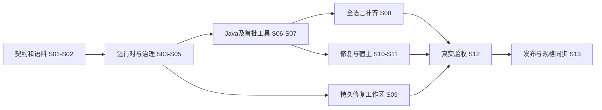

# Design：统一 Rust Codeguard CLI

## Context

动机见 [proposal](proposal.md)。当前运行时是 Bash/Python、57 个语言注册条目、独立技能 vendor 与多宿主 Hook。源码基线 `03ebb24`；现有 OpenSpec 仍描述旧 fail-open、skipGate、基线豁免与旧退出码。本 change 是显式契约升级，不是对旧策略做行为保持的逐行翻译。

完整设计见 [架构文档](../../../docs/rust-cli/architecture.zh-CN.md)、[技术方案](../../../docs/rust-cli/technical-design.zh-CN.md)；覆盖和指标见 [迁移验收](../../../docs/rust-cli/coverage-and-acceptance.zh-CN.md)。这些文档展开设计，本目录 `specs/` 是规范性事实源，`tasks.md` 是唯一任务状态。

## Goals / Non-Goals

**Goals**：单一二进制与领域内核；独立的执行完整性和违规证据；不可由 AI 自行降级的质量 contract；全语言逐类别覆盖；可测试的工具适配与准确内容身份；渐进替换宿主入口。

**Non-Goals**：本次文档交付不建立 Rust 源码仓或发布产物；不重写所有原生分析工具；不采用 LLM 作为最终裁判；不承诺本地同权限环境不可绕过；不把动态 Shell 全解析作为交付正确性的基础。

## Decisions

| 决策 | 选择及理由 | 考虑过的替代 |
|---|---|---|
| D01 workspace | 使用用户确定的四 crate，core 定义 ports，runtime/adapters 单向依赖 core | 单 crate 易混职责；每工具独立 crate 初期增加发布成本 |
| D02 执行权威 | Rust 统一编排，工具提供 finding，受控策略决定 gate | AI 重判缺可复现证据；通用 rc/文本判定丢语义 |
| D03 结果模型 | findings 与 completion 正交，混合结果全部保留 | 单 PASS/FAIL/UNKNOWN 枚举容易吞掉部分真实发现 |
| D04 完整性门禁 | 必需检查未完成不能交付；基线只分类 | fail-open/默认存量豁免延续用户明确否定的方向 |
| D05 覆盖 | 先建立完整义务，再选择执行/缓存；语言 × 类别 × 工具验收 | 按文件后缀或已注册命令计数无法证明能力 |
| D06 工具管理 | 显式 provision、固定锁、兼容组合测试 | 扫描时自动安装 latest 导致不可复现与运行副作用 |
| D07 配置权威 | 运行参数与质量策略分离；CI 使用可信已批准政策 | CLI/env 覆盖一切使智能体可自行关闭门禁 |
| D08 Git | 真正 Git 事件绑定 index/ref；宿主预测有明确边界 | 继续扩充 Shell 模拟仍不能覆盖任意程序间接调用 |
| D09 发布兼容 | 新协议明确版本，旧入口具名兼容且不作为新认证 | 同一个 rc 静默改义会破坏 CI/宿主 |
| D10 初版扩展 | 编译期适配器，版本化数据规则包 | 动态任意脚本插件会扩大信任和测试边界 |
| D11 测试执行 | 保留静态构建默认等级并明确报告，策略要求时执行测试 | 自动替用户将所有 verify 改为跑测试，超出已确认范围 |
| D12 修复工作区 | `./codeguard/` 持久存储脱敏问题、事件与任务，本地日志/缓存 Git 忽略，原工具复检关闭 | 仅终端报错缺少恢复上下文；自由 Markdown 勾选会制造无证据完成 |

修复工作区详见 [持久修复设计](../../../docs/rust-cli/remediation-workflow.zh-CN.md)。状态、任务和历史帮助执行者推进，但最终 gate 独立检查源码与可信政策；任务记录不能成为新的跳过开关。

## Risks / Trade-offs

- [严格门禁暴露工具环境欠账] → `doctor` 给出具体恢复路径，先完成工具链准备；不能通过 fail-open 消除欠账。
- [官方 P3C、PMD、JDK 版本兼容] → 固定组合并运行真实样本；不把同名 Checkstyle 配置视为替代。
- [跨语言 comments/security 能力差异] → 缺口显式记录；可新增确定性规则，不能把缺能力标成不适用。
- [构建脚本和原生配置可执行/可降级] → 隔离运行、身份核对、可信策略 diff；快照不等于恶意代码沙箱。
- [全量检查较慢] → 基于等价证明缓存和增量，不改变义务；性能预算以实测设定。
- [同一 change 涉及未来多个仓] → 当前规格暂驻插件仓；未来 CLI 仓引用此事实源，迁移事实源须独立批准，禁止双写冲突任务。
- [已有规格很多旧行为要求] → 在 delta 中给旧运行时明确协议范围；迁移后入口受 Rust 契约管辖，并更新宿主协议说明。

## Migration Plan

对照运行保留旧/新报告与差异原因，不直接将旧结论作为真值。已确认的历史错误行为需要新规范的正反例替代旧期望，其它兼容性用具名 legacy 测试保留。切换后不因 Rust 未完成自动回落旧 Python 放行。

回滚以满足相同严格契约的上一 Rust release 为目标；没有这种版本时保持交付未认证，反馈入口可恢复旧工具但不得显示新门禁通过。市场、安装和真实运行证据分层记录。

## Open Questions

以下是实施阶段必须验证的技术参数，不改变上述需求与任务范围：P3C/PMD/JDK 兼容版本；各罕见语言可用的只读诊断工具；平台最低 ABI/MSRV；签名发布身份和新仓远程地址；代表性语料的确切项目清单及脱敏方式；逐工具性能基线。对应任务未完成前，不将候选参数写成发布承诺。

## Completion Boundary

本次完成标准仅为架构、技术方案、覆盖验收设计、OpenSpec proposal/design/specs/tasks 的一致性和校验。所有代码、真实工具、宿主、发布任务保持未完成；不执行 apply/sync/archive。
