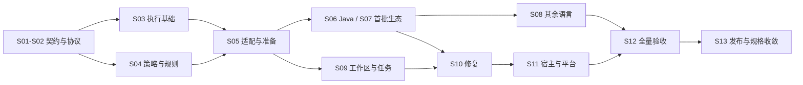

# 实施覆盖索引与执行顺序

状态：覆盖关系基于 2026-09-24 审计，实施状态更新至 2026-09-28。相邻独立 `codeguard-cli/` 已有 Rust 工程、局部原生适配器、CLI 反馈及部分持久任务/原工具复检：包括 Ruff、Clippy、Rustdoc、Rust 构建类型检查和部分 Java/Node 检查。Rustdoc 已接入 `check all` 的独立调度与同步；Rust 构建仅接通公开局部探针和工作台同步，正式复检与完整检查调度仍缺。上述能力不代表所有语言类别、完整项目配置/构建组合、可信策略、正式任务关闭重开或宿主闭环完成；各项证据与限制见 [verification.md](verification.md)。此前源码的全目标 Clippy 与全工作区测试通过（154组/910通过/0失败/93忽略）；新增构建接线后只完成受影响验证，尚无当前源码的全工作区终态。此文件是导航和覆盖关系，规范仍在 specs/，唯一勾选状态仍在 [tasks.md](tasks.md)。不能以本索引有行、有映射或 OpenSpec planning complete 证明功能已实现。

## 1. 审计结论与补齐范围

此前大部分设计已有规格和任务，但 detect/capabilities 仅有汇总注册任务；同步/接管恢复和环境任务复检缺明确故障验收；运行追踪、证据保留和评测门槛尚未充分进入正式规范；平台与宿主验收缺独立条目。现已补齐这些条目，已有清晰任务不重复拆分。

本索引覆盖36项命令、全部规格requirement、57个语言条目、5个候选平台、3个宿主，以及技术设计中的横向职责。每个requirement下全部Scenario属于该行验收范围；真正验收时必须提供逐Scenario证据，不能只挑其中一个通过样本。

## 2. 分阶段执行与责任边界

| 里程碑 | 输入和可执行范围 | 退出证据 | 责任归属 |
|---|---|---|---|
| M0 契约基线 | S01、S02；在获准仓位建立四crate、schema和统一命令注册 | 协议正反例、依赖方向、命令帮助；只证明契约，不证明扫描器可用 | CLI/core维护者 |
| M1 运行内核 | M0之后S03、S04，再S05 | 进程、快照、政策、工具准备与静态查询；模拟工具和真实工具证据分开 | runtime/core/adapters维护者 |
| M2 第一条真实闭环 | Java S06，加S09已具备的sync/next/attempt/verify、S10修复与必要S11入口 | 真实Java检查→任务→修复→复检→准确内容gate；其它语言不得随之标完成 | adapters与插件接入维护者 |
| M3 能力补齐 | S07/S08逐语言，S09初始化全量场景，S11逐平台/宿主 | 下表每行独立证据，54个旧stable六槽位齐备；3个planned明确gap | 语言、平台与宿主维护者 |
| M4 产品验收 | S12；12.2先冻结oracle/阈值，再12.10计算器、12.11执行独立评测 | 真实工具、分层质量、完整性、故障恢复、性能和端到端证据 | 评测/验收维护者 |
| M5 发布收敛 | 全部实施验收满足后S13，按授权发布 | source/tag/artifact/lock/market/installed/runtime逐层证据，最后sync/archive | 发布维护者 |

责任是模块职责，不虚构已分配人员。M2是可提前运行的集成切片，不代表整个S09/S11已完成；完整阶段依赖仍以tasks.md为准。CI调度时应使用任务实际前置产物，不能因为同属阶段而提前勾选。

Rust实现归未来独立CLI仓；宿主Hooks/commands/runtime lock归当前插件仓；受管技能修改归独立codeguard-skills源仓，经vendor引入。本change暂为三方唯一规格事实源，未批准前不复制成第二套可独立勾选的任务。

## 3. Requirement → 实施任务

追踪ID只是本索引的稳定引用，完整Requirement标题与spec文件才是规范定位；MODIFIED旧标题保持不变。任务区间包含端点。

| 追踪ID | 规格 / Requirement原名 | 实施任务ID |
|---|---|---|
| BD01 | [binary-distribution](specs/binary-distribution/spec.md) / Plugin execution SHALL bind a verified runtime artifact | 11.1,11.2,11.8-11.12 |
| BD02 | [binary-distribution](specs/binary-distribution/spec.md) / Compatibility SHALL be explicit and versioned | 2.6,11.7 |
| BD03 | [binary-distribution](specs/binary-distribution/spec.md) / Release claims SHALL require layered evidence | 11.8-11.15,13.1-13.7 |
| BD04 | [binary-distribution](specs/binary-distribution/spec.md) / Quality claims SHALL use independently labelled stratified evidence | 1.4,12.2-12.4,12.10,12.11 |
| EK01 | [execution-kernel](specs/execution-kernel/spec.md) / Existing entry points SHALL remain compatible | 1.1,1.3,2.6,4.2,11.6,11.7 |
| EK02 | [execution-kernel](specs/execution-kernel/spec.md) / Rust execution SHALL bound and close process lifecycles | 3.1-3.4 |
| EK03 | [execution-kernel](specs/execution-kernel/spec.md) / Rust snapshots SHALL bind the actual delivery input | 3.5-3.7,11.5 |
| EK04 | [execution-kernel](specs/execution-kernel/spec.md) / Rust cache reuse SHALL prove obligation equivalence | 3.8,12.5 |
| EK05 | [execution-kernel](specs/execution-kernel/spec.md) / Rust fixes SHALL preserve ownership and verify outcomes | 10.1-10.5 |
| EK06 | [execution-kernel](specs/execution-kernel/spec.md) / Offline and trusted CI execution SHALL enforce their declared boundaries | 3.11,5.3,11.5,12.5 |
| EK07 | [execution-kernel](specs/execution-kernel/spec.md) / Execution observability SHALL correlate evidence without changing verdicts | 3.9,12.4,12.11 |
| EK08 | [execution-kernel](specs/execution-kernel/spec.md) / Evidence storage SHALL preserve ownership and active references | 3.2,3.10,9.14 |
| HP01 | [hook-protocol](specs/hook-protocol/spec.md) / The cheat-sheet SHALL document fail-open for uncaught exceptions | 2.6,11.4 |
| HP02 | [hook-protocol](specs/hook-protocol/spec.md) / Soft and hard gates SHALL share the skipGate escape and neither may fall back to scanning outside a git repository | 2.6,4.5,11.4,11.5 |
| HP03 | [hook-protocol](specs/hook-protocol/spec.md) / Fail-open uncertainty SHALL be visible | 2.6,11.3-11.5 |
| HP04 | [hook-protocol](specs/hook-protocol/spec.md) / Skip-gate bypass values SHALL be parsed strictly | 2.6,4.5,11.4 |
| HP05 | [hook-protocol](specs/hook-protocol/spec.md) / Migrated host surfaces SHALL share the same report semantics | 11.3-11.6,11.13-11.15,12.6 |
| LG01 | [language-gate-commands](specs/language-gate-commands/spec.md) / Languages may declare a configuration prerequisite | 2.6,5.1,5.2 |
| LG02 | [language-gate-commands](specs/language-gate-commands/spec.md) / Gates in git repositories SHALL default to changed-file scope | 2.6,3.5-3.8,6.6 |
| LG03 | [language-gate-commands](specs/language-gate-commands/spec.md) / A toolchain crash SHALL be recorded as unverified, not as a lint failure | 2.3,5.4,5.5 |
| LG04 | [language-gate-commands](specs/language-gate-commands/spec.md) / Rust command plans SHALL preserve explicit build levels | 6.5,6.6,12.1 |
| NA01 | [native-tool-adapters](specs/native-tool-adapters/spec.md) / Adapters SHALL publish verifiable capability contracts | 1.5,5.1,5.5,5.8 |
| NA02 | [native-tool-adapters](specs/native-tool-adapters/spec.md) / Native evidence SHALL be interpreted per tool contract | 5.4,5.5 |
| NA08 | [native-tool-adapters](specs/native-tool-adapters/spec.md) / Static detection families SHALL remain explicit and extensible | 5.10,6.3,6.8,7.6,8.1-8.148 |
| NA03 | [native-tool-adapters](specs/native-tool-adapters/spec.md) / Java checks SHALL prove each required native obligation | 6.1-6.7 |
| NA04 | [native-tool-adapters](specs/native-tool-adapters/spec.md) / Comment and security categories SHALL retain their own evidence | 6.3,6.4,7.1-7.4,8.1-8.144 |
| NA05 | [native-tool-adapters](specs/native-tool-adapters/spec.md) / CVE checks SHALL bind actual dependency and database identity | 6.4,7.5 |
| NA06 | [native-tool-adapters](specs/native-tool-adapters/spec.md) / Migration SHALL account for every legacy language entry | 1.1,1.5,6.1-6.7,7.1-7.5,8.1-8.148 |
| NA07 | [native-tool-adapters](specs/native-tool-adapters/spec.md) / Adapters SHALL separate static observation from executable resolution | 1.3,1.6,5.1,5.7,5.9 |
| PI01 | [project-initialization](specs/project-initialization/spec.md) / Initialization SHALL build an evidence bound project profile | 9.15-9.17 |
| PI02 | [project-initialization](specs/project-initialization/spec.md) / Architecture observations SHALL not become unapproved rules | 9.19 |
| PI03 | [project-initialization](specs/project-initialization/spec.md) / Module graphs SHALL preserve relation types and uncertainty | 9.18 |
| PI04 | [project-initialization](specs/project-initialization/spec.md) / AGENTS generation SHALL preserve scope and human ownership | 9.20,9.21 |
| PI05 | [project-initialization](specs/project-initialization/spec.md) / Init SHALL plan and apply without hidden execution | 9.1,9.22,9.24 |
| PI06 | [project-initialization](specs/project-initialization/spec.md) / Profile refresh SHALL preserve findings and detect stale inputs | 9.16,9.23 |
| PI07 | [project-initialization](specs/project-initialization/spec.md) / Initialization status SHALL be separate from quality readiness | 9.24,9.25,12.8 |
| RW01 | [remediation-workflow](specs/remediation-workflow/spec.md) / Projects SHALL have an explicitly initialized remediation workspace | 9.1,9.2 |
| RW02 | [remediation-workflow](specs/remediation-workflow/spec.md) / Findings and environment blockers SHALL produce distinct actionable tasks | 9.3,9.4,9.6 |
| RW03 | [remediation-workflow](specs/remediation-workflow/spec.md) / Closing a task SHALL require verified resolution evidence | 9.10,9.11,9.28,10.3,10.5 |
| RW04 | [remediation-workflow](specs/remediation-workflow/spec.md) / Repair briefs SHALL guide bounded progress without changing authority | 9.7,9.9,9.26 |
| RW05 | [remediation-workflow](specs/remediation-workflow/spec.md) / Enabled plugin workflows SHALL connect scans to actionable briefs | 9.13,11.13-11.15,12.7 |
| RW08 | [remediation-workflow](specs/remediation-workflow/spec.md) / Check results SHALL be returned in the agent conversation | 5.10,9.13,11.16,12.7 |
| RW06 | [remediation-workflow](specs/remediation-workflow/spec.md) / Workflow persistence SHALL preserve collaboration and gate independence | 9.5,9.8,9.14,9.27 |
| RW07 | [remediation-workflow](specs/remediation-workflow/spec.md) / Repair command handoffs SHALL bind attempts and leases explicitly | 9.9,9.12,9.27,10.5 |
| RG01 | [rulepack-governance](specs/rulepack-governance/spec.md) / Quality policy SHALL be independent from operational options | 4.1,4.2,4.7 |
| RG02 | [rulepack-governance](specs/rulepack-governance/spec.md) / Rulepacks and toolchains SHALL be versioned and locked | 4.3,5.2,5.3 |
| RG03 | [rulepack-governance](specs/rulepack-governance/spec.md) / Historical findings SHALL remain findings | 4.4 |
| RG04 | [rulepack-governance](specs/rulepack-governance/spec.md) / Exceptions SHALL require independently verifiable authority | 4.5,9.11,12.5 |
| RG05 | [rulepack-governance](specs/rulepack-governance/spec.md) / Existing dot-prefix scope SHALL remain explicit | 4.6 |
| RG06 | [rulepack-governance](specs/rulepack-governance/spec.md) / False-positive allowlists SHALL be exact, authorized dispositions | 4.5,4.8,4.9,4.10,9.28,12.12 |
| SS01 | [scan-scope-policy](specs/scan-scope-policy/spec.md) / Managed remediation artifacts SHALL have a bounded self-scan policy | 4.6,9.2,9.14 |
| UC01 | [unified-cli-contract](specs/unified-cli-contract/spec.md) / Unified commands SHALL select explicit check obligations | 2.1,2.4 |
| UC02 | [unified-cli-contract](specs/unified-cli-contract/spec.md) / Rust CLI SHALL expose a versioned exit contract | 2.3 |
| UC03 | [unified-cli-contract](specs/unified-cli-contract/spec.md) / Reports SHALL preserve semantics across public formats | 2.2,2.5,2.10,12.12 |
| UC04 | [unified-cli-contract](specs/unified-cli-contract/spec.md) / Empty selection SHALL NOT certify delivery | 2.4 |
| UC05 | [unified-cli-contract](specs/unified-cli-contract/spec.md) / Public commands SHALL have distinct operation contracts | 1.2,1.6,2.7,4.9,5.7,5.8,12.9 |
| UC06 | [unified-cli-contract](specs/unified-cli-contract/spec.md) / Operation success SHALL remain separate from quality certification | 2.2,2.3,2.7,2.10,4.9,9.26,11.3 |
| UC07 | [unified-cli-contract](specs/unified-cli-contract/spec.md) / Preparation commands SHALL preserve observation and mutation boundaries | 4.7,5.2,5.6-5.8 |
| UC08 | [unified-cli-contract](specs/unified-cli-contract/spec.md) / Tool installation SHALL use a bounded explicit plan and apply | 5.3,5.6 |
| UC09 | [unified-cli-contract](specs/unified-cli-contract/spec.md) / Gate commands SHALL receive explicit delivery content | 3.6,11.5 |
| UC10 | [unified-cli-contract](specs/unified-cli-contract/spec.md) / Execution budgets SHALL have explicit defaults and a shared deadline | 2.8,3.1-3.4 |
| UC11 | [unified-cli-contract](specs/unified-cli-contract/spec.md) / Report export SHALL preserve identity and persistence failures | 2.2,2.5,2.9 |
| VI01 | [verdict-integrity](specs/verdict-integrity/spec.md) / Verdicts SHALL preserve uncertainty across interfaces | 2.3,2.6,11.4 |
| VI02 | [verdict-integrity](specs/verdict-integrity/spec.md) / Required completeness SHALL gate Rust delivery | 2.4,2.10,4.8,12.1,12.5,12.12 |
| VI03 | [verdict-integrity](specs/verdict-integrity/spec.md) / Coverage SHALL not change with scheduling strategy | 3.4,3.8,6.6,12.4 |

## 4. 36项命令 → 规格与任务

每行除列出的专项验收，还执行12.9统一参数/格式/退出码/副作用/取消矩阵。检查入口连接共同CheckService，不能把“命令可解析”当作原生适配器已经完成。

| ID | 命令 | 规格追踪ID | 实施任务ID | 专项验收 |
|---|---|---|---|---|
| C01 | `help / --help` | UC05 | 2.7 | 无项目仍返回帮助，不扫描或安装 |
| C02 | `--version` | UC05,BD01 | 1.2,2.7 | 嵌入元数据和实际runtime绑定可核对 |
| C03 | `detect` | UC07,NA07 | 5.7 | 完整unknown为0，必要输入不可读为3，不写画像 |
| C04 | `capabilities` | UC05,UC07,NA01 | 1.5,5.8 | planned/未知ID/坏注册表分别解释 |
| C05 | `init` | PI01,PI02,PI03,PI04,PI05,PI06,PI07,RW01 | 9.1,9.15-9.25,12.8 | 静态预览、受管应用、冲突恢复、准备状态分离 |
| C06 | `plan` | UC01,NA07 | 2.1,3.4,5.9 | 义务/DAG/未解析项可见，不执行动态脚本 |
| C07 | `doctor` | UC07 | 5.2,5.6 | 制品匹配不代替运行条件，报告可同步 |
| C08 | `rules list/whitelist list/explain/propose` | RG01,RG02,RG06,UC07 | 4.3,4.7-4.10 | 规则与白名单候选/批准/失配及撤销修订链可追溯，propose不自批 |
| C09 | `config validate` | RG01,UC07 | 4.2,4.7 | 坏配置与未批准弱化为未完成 |
| C10 | `config explain` | RG01,UC07 | 4.1,4.7 | 来源/覆盖/拒绝原因可见且脱敏 |
| C11 | `tools list` | UC07 | 5.6 | 静态库存可含缺工具，不宣称已验证 |
| C12 | `tools verify` | RG02,UC07 | 5.2,5.6 | 摘要与锁不符不回退随机PATH |
| C13 | `tools install` | UC08,RG02 | 5.3,5.6 | 默认预览，显式应用可恢复，无静默安装 |
| C14 | `lint` | UC01,NA01,NA02,NA03 | 2.1,5.1,6.2 | 编码规则真实执行；其它语言见第5节逐行任务 |
| C15 | `comments` | NA04 | 2.1,5.1,6.3 | formatter不代替文档契约；其它语言见第5节 |
| C16 | `cve` | NA05 | 2.1,6.4,7.5 | 真实依赖/库身份/UNKNOWN保留；其它语言见第5节 |
| C17 | `security` | NA04,RG05,SS01 | 2.1,4.6,6.4,9.2 | 源码/配置/入库策略证据分离；其它语言见第5节 |
| C18 | `build` | LG04,NA03 | 2.1,6.5,6.6 | 构建等级/测试执行与规则覆盖分离；其它语言见第5节 |
| C19 | `check` | UC01,UC02,UC04,VI02,VI03 | 2.3,2.4,3.4,6.7 | 全义务聚合，部分成功不代表项目allow |
| C20 | `gate pre-commit` | UC09,EK03 | 3.5-3.7,11.5 | 实际index/alternate index/部分暂存 |
| C21 | `gate pre-push` | UC09,EK03 | 3.6,11.5 | remote/stdin/非HEAD/多ref，缺输入不回退 |
| C22 | `gate ci` | UC09,EK06 | 3.11,11.5,12.5 | 不可变OID与可信验证端隔离 |
| C23 | `work sync` | RW02 | 9.3,9.4,9.6 | 全部报告、单份失败、事件/游标中断恢复 |
| C24 | `status` | RW04,UC06 | 9.7,9.26 | 历史结果freshness与当前状态分离 |
| C25 | `next` | RW04 | 9.7,9.26 | 五种disposition，空待办不等于allow |
| C26 | `task show` | RW04,RW06 | 9.5,9.7 | 事件证据与人工勾选分离，坏ID/坏链可见 |
| C27 | `task claim` | RW06 | 9.8,9.27 | 到期接管先abandoned/预算，失败不授新租约 |
| C28 | `task heartbeat` | RW06 | 9.8,9.27 | 旧token不能复活，续租不重置预算 |
| C29 | `task release` | RW06 | 9.8,9.27 | 不释放新租约，未结束尝试不得遗弃 |
| C30 | `task attempt start` | RW04,RW07 | 9.9,9.27 | 受控动作/输入指纹，换名不重置预算 |
| C31 | `task attempt finish` | RW04,RW07 | 9.9,9.27 | 显式attempt，幂等结束，失败/noop也计数 |
| C32 | `fix` | EK05,RW07 | 9.12,10.1-10.5 | 预览不消耗尝试、应用保所有权、同策略复检 |
| C33 | `task verify` | RW03,RW06 | 9.10,9.11,10.5 | 环境恢复后重跑原义务，自有/借用租约区分 |
| C34 | `mcp serve` | UC06,HP05 | 11.3,11.13-11.15 | 请求失败和服务存活分离，共用核心API |
| C35 | `compat legacy-v1` | BD02,EK01 | 2.6,11.7 | 逐旧入口映射，不生成新认证 |
| C36 | `dependencies` | UC01,NA08 | 2.1,5.10,6.8,7.6 | 探测依赖检查配置，运行已配置工具并反馈结果，与 CVE 分开 |

## 5. 全语言迁移 → 实施任务

统一满足NA01/NA04/NA05/NA06；每个旧stable都有lint/comments/dependencies/cve/security/build六槽位，缺口不得静默当not_applicable。下表只定位任务，具体候选工具与差异见语言迁移文档。planned保留缺口是已确认范围，不把它当成新实现已完成。

| language ID | 基线状态 | 实施任务ID | 验收要求 |
|---|---|---|---|
| java | stable | 6.1-6.7 | 六槽位适用性+真实工具正反例+F01–F26适用场景 |
| rust | stable | 7.1 | 六槽位适用性+真实工具正反例+F01–F26适用场景 |
| typescript | stable | 7.3 | 六槽位适用性+真实工具正反例+F01–F26适用场景 |
| python | stable | 7.2 | 六槽位适用性+真实工具正反例+F01–F26适用场景 |
| go | stable | 8.1,8.2,8.3 | 六槽位适用性+真实工具正反例+F01–F26适用场景 |
| csharp | stable | 8.4,8.5,8.6 | 六槽位适用性+真实工具正反例+F01–F26适用场景 |
| kotlin | stable | 8.7,8.8,8.9 | 六槽位适用性+真实工具正反例+F01–F26适用场景 |
| swift | stable | 8.10,8.11,8.12 | 六槽位适用性+真实工具正反例+F01–F26适用场景 |
| php | stable | 8.13,8.14,8.15 | 六槽位适用性+真实工具正反例+F01–F26适用场景 |
| ruby | stable | 8.16,8.17,8.18 | 六槽位适用性+真实工具正反例+F01–F26适用场景 |
| scala | stable | 8.19,8.20,8.21 | 六槽位适用性+真实工具正反例+F01–F26适用场景 |
| shell | stable | 7.4 | 六槽位适用性+真实工具正反例+F01–F26适用场景 |
| dockerfile | stable | 7.4 | 六槽位适用性+真实工具正反例+F01–F26适用场景 |
| yaml | stable | 8.70,8.71,8.72 | 六槽位适用性+真实工具正反例+F01–F26适用场景 |
| elixir | stable | 8.22,8.23,8.24 | 六槽位适用性+真实工具正反例+F01–F26适用场景 |
| css | stable | 8.46,8.47,8.48 | 六槽位适用性+真实工具正反例+F01–F26适用场景 |
| c | stable | 8.25,8.26,8.27 | 六槽位适用性+真实工具正反例+F01–F26适用场景 |
| cpp | stable | 8.28,8.29,8.30 | 六槽位适用性+真实工具正反例+F01–F26适用场景 |
| objc | stable | 8.31,8.32,8.33 | 六槽位适用性+真实工具正反例+F01–F26适用场景 |
| dart | stable | 8.34,8.35,8.36 | 六槽位适用性+真实工具正反例+F01–F26适用场景 |
| vue | stable | 8.37,8.38,8.39 | 六槽位适用性+真实工具正反例+F01–F26适用场景 |
| svelte | stable | 8.40,8.41,8.42 | 六槽位适用性+真实工具正反例+F01–F26适用场景 |
| astro | stable | 8.43,8.44,8.45 | 六槽位适用性+真实工具正反例+F01–F26适用场景 |
| solidity | stable | 8.55,8.56,8.57 | 六槽位适用性+真实工具正反例+F01–F26适用场景 |
| terraform | stable | 8.58,8.59,8.60 | 六槽位适用性+真实工具正反例+F01–F26适用场景 |
| nix | stable | 8.61,8.62,8.63 | 六槽位适用性+真实工具正反例+F01–F26适用场景 |
| html | stable | 8.49,8.50,8.51 | 六槽位适用性+真实工具正反例+F01–F26适用场景 |
| sql | stable | 8.64,8.65,8.66 | 六槽位适用性+真实工具正反例+F01–F26适用场景 |
| graphql | stable | 8.52,8.53,8.54 | 六槽位适用性+真实工具正反例+F01–F26适用场景 |
| protobuf | stable | 8.67,8.68,8.69 | 六槽位适用性+真实工具正反例+F01–F26适用场景 |
| markdown | stable | 8.73,8.74,8.75 | 六槽位适用性+真实工具正反例+F01–F26适用场景 |
| toml | stable | 8.76,8.77,8.78 | 六槽位适用性+真实工具正反例+F01–F26适用场景 |
| haskell | stable | 8.79,8.80,8.81 | 六槽位适用性+真实工具正反例+F01–F26适用场景 |
| ocaml | stable | 8.82,8.83,8.84 | 六槽位适用性+真实工具正反例+F01–F26适用场景 |
| fsharp | stable | 8.85,8.86,8.87 | 六槽位适用性+真实工具正反例+F01–F26适用场景 |
| perl | stable | 8.88,8.89,8.90 | 六槽位适用性+真实工具正反例+F01–F26适用场景 |
| groovy | stable | 8.91,8.92,8.93 | 六槽位适用性+真实工具正反例+F01–F26适用场景 |
| clojure | stable | 8.94,8.95,8.96 | 六槽位适用性+真实工具正反例+F01–F26适用场景 |
| powershell | stable | 8.97,8.98,8.99 | 六槽位适用性+真实工具正反例+F01–F26适用场景 |
| zig | stable | 8.100,8.101,8.102 | 六槽位适用性+真实工具正反例+F01–F26适用场景 |
| nim | stable | 8.103,8.104,8.105 | 六槽位适用性+真实工具正反例+F01–F26适用场景 |
| crystal | stable | 8.106,8.107,8.108 | 六槽位适用性+真实工具正反例+F01–F26适用场景 |
| julia | stable | 8.109,8.110,8.111 | 六槽位适用性+真实工具正反例+F01–F26适用场景 |
| elm | stable | 8.112,8.113,8.114 | 六槽位适用性+真实工具正反例+F01–F26适用场景 |
| lua | stable | 8.115,8.116,8.117 | 六槽位适用性+真实工具正反例+F01–F26适用场景 |
| luau | stable | 8.118,8.119,8.120 | 六槽位适用性+真实工具正反例+F01–F26适用场景 |
| pascal | stable | 8.121,8.122,8.123 | 六槽位适用性+真实工具正反例+F01–F26适用场景 |
| r | stable | 8.124,8.125,8.126 | 六槽位适用性+真实工具正反例+F01–F26适用场景 |
| cfml | stable | 8.127,8.128,8.129 | 六槽位适用性+真实工具正反例+F01–F26适用场景 |
| cobol | planned | 8.145 | planned/gap清晰，项目必需时未完成，不能空实现充数 |
| vbnet | stable | 8.130,8.131,8.132 | 六槽位适用性+真实工具正反例+F01–F26适用场景 |
| erlang | stable | 8.133,8.134,8.135 | 六槽位适用性+真实工具正反例+F01–F26适用场景 |
| arkts | planned | 8.146 | planned/gap清晰，项目必需时未完成，不能空实现充数 |
| metal | planned | 8.147 | planned/gap清晰，项目必需时未完成，不能空实现充数 |
| liquid | stable | 8.136,8.137,8.138 | 六槽位适用性+真实工具正反例+F01–F26适用场景 |
| cuda | stable | 8.139,8.140,8.141 | 六槽位适用性+真实工具正反例+F01–F26适用场景 |
| ansible | stable | 8.142,8.143,8.144 | 六槽位适用性+真实工具正反例+F01–F26适用场景 |

## 6. 平台与宿主 → 独立证据

| 目标 | 规格追踪ID | 实施任务ID | 验收边界 |
|---|---|---|---|
| macOS arm64 | BD01,BD03,EK02,EK06,EK08 | 11.8 | 目标平台真实执行、进程回收、私有存储、离线能力 |
| macOS x86_64 | BD01,BD03,EK02,EK06,EK08 | 11.9 | 不用arm64或交叉编译替代 |
| Linux x86_64 | BD01,BD03,EK02,EK06,EK08 | 11.10 | 固定libc/最低系统/运行环境 |
| Linux aarch64 | BD01,BD03,EK02,EK06,EK08 | 11.11 | 本架构运行，不借x86证据 |
| Windows x86_64 | BD01,BD03,EK02,EK08 | 11.12 | Job Object/路径/权限/文件共享/取消；离线能力实测，不能保证则明确gap |
| Codex | HP05,BD03,RW05 | 11.13 | 安装身份+真实CLI/MCP/保存/Git与修复链 |
| ZCode | HP05,BD03,RW05 | 11.14 | 宿主协议与阻断能力，不透传新CLI数字 |
| Kimi | HP05,BD03,RW05 | 11.15 | 实际调用与失败恢复，不以别的宿主替代 |

## 7. 横向设计覆盖

| 设计范围 | 规格追踪ID | 任务定位 |
|---|---|---|
| 四crate与应用服务/ports、外部技能所有权 | EK01,NA07,UC05 | 1.1–1.6、11.6 |
| 参数、输出类型、退出码、格式与原子导出 | UC01–UC11,VI01,VI02 | 2.1–2.10、5.7–5.8 |
| 项目画像、架构推断、AGENTS受管合并、刷新 | PI01–PI07 | 9.15–9.25 |
| 策略/规则/配置/工具锁/例外/基线 | RG01–RG06 | 4.1–4.9、5.2–5.3、9.28、12.12 |
| 静态观察与动态解析、原生专用报告、共享扫描 | NA01–NA07 | 5.1–5.9、6/7/8各语言任务 |
| 进程生命周期、DAG、预算、网络与可信CI | EK02,EK06,UC10 | 3.1–3.4、3.11、11.5、12.5 |
| Git真实输入、内容身份、缓存等价与覆盖 | EK03,EK04,VI03 | 3.5–3.8、6.6、11.5 |
| 持久目录、隐私、自扫描与证据保留 | EK08,RW01,RW06,SS01 | 3.10、9.1–9.2、9.14 |
| 问题/阻塞归并、事件与投影、同步事务 | RW02,RW03,RW06 | 9.3–9.6、9.10–9.11、9.28 |
| RepairBrief、租约、尝试、无进展与失租恢复 | RW04,RW06,RW07 | 9.7–9.9、9.12、9.26–9.27 |
| 原生修复、补丁所有权、部分失败与复检 | EK05,RW07 | 10.1–10.5 |
| 插件自动scan→sync→brief、MCP/Hook映射 | HP01–HP05,RW05 | 9.13、11.3–11.6、11.13–11.15 |
| 制品绑定、显式legacy、迁移与回滚 | BD01–BD03 | 11.1–11.2、11.7–11.12、13.3–13.5 |
| 本地关联追踪、故障归因、隐私及无默认上传 | EK07,EK08 | 3.9–3.10、12.4、12.11 |
| 分层oracle、holdout、统计门槛、性能等价 | BD04 | 1.4、12.2–12.4、12.10–12.11 |
| 完整交付/语言平台证据及规范收敛 | BD03,NA06 | 12.1–12.11、13.1–13.7 |

## 8. 实施时待确定参数及关闭责任

这些不是遗漏任务，也不是已验证事实；必须在列出的任务取得证据，不能用待定作为跳过义务的理由。

| 待确定项 | 关闭任务 | 所需证据 |
|---|---|---|
| CLI独立仓位置、远程地址、MSRV和依赖锁 | 1.2、11.1、13.4 | 用户授权的仓位/发布身份与可复现构建 |
| 官方P3C/PMD/JDK精确兼容组合 | 6.2 | 固定版本与真实正反例 |
| 罕见语言工具、方言和不适用依据 | 8.1–8.148 | 每语言六槽位实际证据，未解决保持gap |
| 平台ABI/libc/最低系统、签名与网络隔离能力 | 11.1、11.8–11.12 | 各目标平台真实运行与能力报告 |
| 精确MCP工具schema和宿主事件映射 | 11.3–11.5、11.13–11.15 | 实际协议与三宿主验收 |
| 语料项目、oracle裁定和绝对性能预算 | 1.4、12.2、12.4、12.10–12.11 | 分层独立样本、冻结阈值及同覆盖基线 |

## 9. 覆盖审计口径

静态审计必须检查：每个Requirement恰有一行；每个task至少被一个Requirement关联；35个命令、57个语言、5个平台、3个宿主均可定位；所有任务引用存在；阶段依赖无循环，验收输入和实施产物分开。语义覆盖另由设计逐项对照和独立读者审查，不能用编号数量代替。

当前所有实现任务保持未勾选。索引通过只能声称“当前已确认设计已拆分并可追踪”，不能声称二进制、低误报指标、平台或宿主已可用。后续若新增设计，必须同轮更新规格、tasks与本索引。

## 2026-09-27 新增规格的任务映射补齐

以下补齐当前增量规格的追踪，不创建第二套任务、不改变验收标准。每行覆盖该Requirement下全部Scenario；任务ID已与现有tasks核对。部分Rust契约或原生用例通过不代表所列完整任务完成，状态仍以tasks为准。

| 追踪ID | 规格 / Requirement原名 | 实施任务ID |
|---|---|---|
| BD05 | [binary-distribution](specs/binary-distribution/spec.md) / Network installation SHALL verify signed selection and exact host permission before downloading | 5.3,11.2,12.5,13.4 |
| BD06 | [binary-distribution](specs/binary-distribution/spec.md) / Signed package publication SHALL bind source, content, clock and original locator | 11.1,11.2,12.5,13.4 |
| BD07 | [binary-distribution](specs/binary-distribution/spec.md) / Distribution signatures SHALL bind original manifest and lock bytes under independent host constraints | 11.1,11.2,12.5,13.4 |
| BD08 | [binary-distribution](specs/binary-distribution/spec.md) / Package HTTPS transport SHALL preserve frozen bytes under the shared budget | 3.2,3.3,11.2,12.5 |
| BD09 | [binary-distribution](specs/binary-distribution/spec.md) / Downloaded archives SHALL bind the complete tree before publication | 11.1,11.2,12.5,13.4 |
| BD10 | [binary-distribution](specs/binary-distribution/spec.md) / Archive bundle roots SHALL be projected explicitly without discarding other members | 11.1,11.2,12.5,13.4 |
| BD11 | [binary-distribution](specs/binary-distribution/spec.md) / Bundle directories SHALL publish without exposing partial trees or replacing existing content | 11.1,11.2,12.5,13.4 |
| EK09 | [execution-kernel](specs/execution-kernel/spec.md) / Static input inspection SHALL reject special files without waiting for peers | 3.2,3.5,3.7,5.2,12.5 |
| EK10 | [execution-kernel](specs/execution-kernel/spec.md) / Managed artifact publication SHALL preserve identity and ownership | 3.7,3.10,11.2,12.5 |
| EK11 | [execution-kernel](specs/execution-kernel/spec.md) / Distribution package streams SHALL be bounded and verified before extraction | 3.2,3.7,11.2,12.5 |
| EK12 | [execution-kernel](specs/execution-kernel/spec.md) / Archive expansion SHALL validate all members before publication | 3.2,3.7,11.2,12.5 |
| EK13 | [execution-kernel](specs/execution-kernel/spec.md) / Complete archive trees SHALL bind all bundle contents | 3.2,3.7,11.2,12.5 |
| NT01 | [native-tool-adapters](specs/native-tool-adapters/spec.md) / Explicit Maven Javadoc selection SHALL not fall back to isolated single-file diagnostics | 5.10,6.3,12.1,12.3 |
| NT02 | [native-tool-adapters](specs/native-tool-adapters/spec.md) / Checkstyle XML interpretation SHALL preserve native identity and distinguish processing failures | 5.10,6.3,12.1,12.3 |
| NT03 | [native-tool-adapters](specs/native-tool-adapters/spec.md) / Checkstyle repair feedback SHALL bind native sources to original configuration | 5.10,6.3,12.1,12.3 |
| NT04 | [native-tool-adapters](specs/native-tool-adapters/spec.md) / Field Javadoc checking SHALL use the native configured Checkstyle rule | 5.10,6.3,12.1,12.3 |
| NT05 | [native-tool-adapters](specs/native-tool-adapters/spec.md) / Official Checkstyle module names SHALL preserve native checker identity | 5.10,6.3,12.1,12.3 |
| NT06 | [native-tool-adapters](specs/native-tool-adapters/spec.md) / Missing method Javadoc configuration SHALL remain native and context-bound | 5.10,6.3,12.1,12.3 |
| NT07 | [native-tool-adapters](specs/native-tool-adapters/spec.md) / Method tag configuration SHALL preserve native option semantics | 5.10,6.3,12.1,12.3 |
| NT08 | [native-tool-adapters](specs/native-tool-adapters/spec.md) / Type documentation options SHALL retain their original checker context | 5.10,6.3,12.1,12.3 |
| NT09 | [native-tool-adapters](specs/native-tool-adapters/spec.md) / ESLint JSON reports SHALL separate rule findings from incomplete execution and suppression | 5.10,7.3,12.1 |
| NT10 | [native-tool-adapters](specs/native-tool-adapters/spec.md) / ESLint native command planning SHALL use explicit literal inputs | 3.1,7.3,12.1 |
| NT11 | [native-tool-adapters](specs/native-tool-adapters/spec.md) / ESLint controlled execution SHALL bind version and current inputs | 3.2,3.7,7.3,12.1 |
| NT12 | [native-tool-adapters](specs/native-tool-adapters/spec.md) / ESLint configuration discovery SHALL distinguish candidates from effective configuration | 5.10,7.3,12.1 |
| NT13 | [native-tool-adapters](specs/native-tool-adapters/spec.md) / npm native audit observation SHALL retain protocol and coverage boundaries | 5.10,7.3,7.5,12.1 |
| NT14 | [native-tool-adapters](specs/native-tool-adapters/spec.md) / ESLint task recheck SHALL observe the original effective rule | 7.3,9.7,12.7 |
| NT15 | [native-tool-adapters](specs/native-tool-adapters/spec.md) / Public ESLint local feedback SHALL retain uncertainty and explicit context | 7.3,9.13,11.16,12.9 |
| RW09 | [remediation-workflow](specs/remediation-workflow/spec.md) / npm remediation tasks SHALL recheck through their original native audit service | 7.3,9.7,9.13,12.7 |
| RW10 | [remediation-workflow](specs/remediation-workflow/spec.md) / npm child projects SHALL preserve explicit workspace ownership | 7.3,9.14,9.15,12.7 |
| RW11 | [remediation-workflow](specs/remediation-workflow/spec.md) / Local doctor observations SHALL enter the remediation queue without granting readiness | 5.2,9.3,9.24,9.25,12.7 |
| RW12 | [remediation-workflow](specs/remediation-workflow/spec.md) / Explicit Checkstyle workspace observations SHALL generate stable local repair tasks | 6.3,9.3,9.4,9.13,12.7 |
| RW13 | [remediation-workflow](specs/remediation-workflow/spec.md) / Checkstyle task verification SHALL replay the original native checker without automatic closure | 6.3,9.7,9.13,12.7 |
| RW14 | [remediation-workflow](specs/remediation-workflow/spec.md) / Checkstyle preparation failures SHALL create stable environment tasks | 6.3,9.3,9.24,12.7 |
| RW15 | [remediation-workflow](specs/remediation-workflow/spec.md) / Checkstyle preparation verification SHALL preserve the original blocked obligation | 6.3,9.7,9.13,12.7 |
| RW16 | [remediation-workflow](specs/remediation-workflow/spec.md) / ESLint task identity SHALL bind native rule and stable source anchor | 7.3,9.3,9.14,12.7 |
| RW17 | [remediation-workflow](specs/remediation-workflow/spec.md) / ESLint local observations SHALL feed stable repair records | 7.3,9.3,9.4,9.13,12.7 |
| RW18 | [remediation-workflow](specs/remediation-workflow/spec.md) / ESLint incomplete prerequisites SHALL create investigation tasks | 7.3,9.3,9.24,12.7 |
| RW19 | [remediation-workflow](specs/remediation-workflow/spec.md) / ESLint task verification SHALL retain native observations | 7.3,9.7,9.13,12.7 |
| RW20 | [remediation-workflow](specs/remediation-workflow/spec.md) / npm local audit observations SHALL enter persistent coverage repair tasks | 7.3,9.3,9.4,9.13,12.7 |
| UC12 | [unified-cli-contract](specs/unified-cli-contract/spec.md) / check all SHALL orchestrate npm roots through the shared native runtime | 2.3,3.4,7.3,7.5,9.13,12.9 |
| UC13 | [unified-cli-contract](specs/unified-cli-contract/spec.md) / Install previews SHALL distinguish bound layout declarations from verified package contents | 2.7,11.2,12.9 |
| UC14 | [unified-cli-contract](specs/unified-cli-contract/spec.md) / npm public CVE feedback SHALL preserve local observation boundaries | 2.5,7.3,7.5,11.16,12.9 |
| UC15 | [unified-cli-contract](specs/unified-cli-contract/spec.md) / npm public audit SHALL consume shared runtime timeout defaults | 2.8,3.2,7.3,12.9 |
